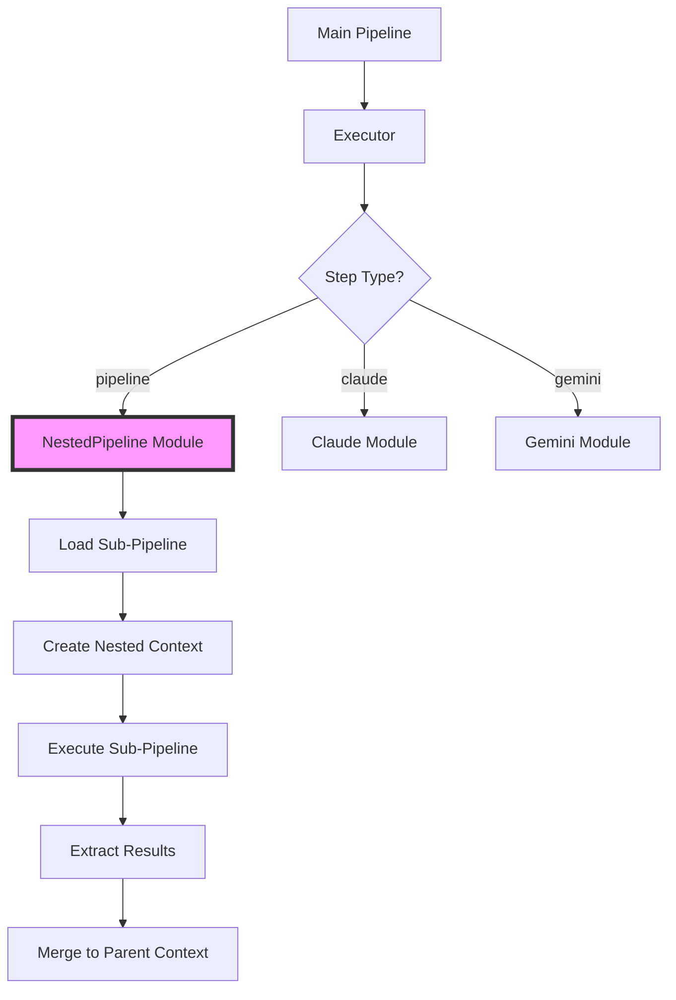

# Recursive Pipelines Guide

## Table of Contents

1. [Overview](#overview)
2. [Core Concepts](#core-concepts)
3. [Basic Usage](#basic-usage)
4. [Context Management](#context-management)
5. [Safety Features](#safety-features)
6. [Advanced Patterns](#advanced-patterns)
7. [Performance Considerations](#performance-considerations)
8. [Best Practices](#best-practices)
9. [Examples and Use Cases](#examples-and-use-cases)
10. [Troubleshooting](#troubleshooting)
11. [Implementation Status](#implementation-status)

## Overview

Recursive pipelines enable pipeline composition in pipeline_ex, where a pipeline step can execute another complete pipeline. This transforms pipeline_ex from a linear workflow engine into a compositional framework supporting complex, hierarchical AI engineering patterns.

### Key Benefits

- **Modularity**: Build complex workflows from simpler, tested components
- **Reusability**: Share common pipeline patterns across projects
- **Maintainability**: Update shared pipelines in one place
- **Scalability**: Compose arbitrarily complex workflows
- **Testing**: Test pipeline components in isolation

### Architecture



## Core Concepts

### Pipeline Composition

Recursive pipelines allow you to nest complete pipelines within other pipelines:

```yaml
# Instead of monolithic 50+ step pipelines
workflow:
  name: "complete_analysis"
  steps:
    # Compose from reusable components
    - name: "extract_data"
      type: "pipeline"
      pipeline_file: "./pipelines/data_extraction.yaml"
    
    - name: "clean_data"
      type: "pipeline"
      pipeline_file: "./pipelines/data_cleaning.yaml"
    
    - name: "analyze"
      type: "pipeline"
      pipeline_file: "./pipelines/analysis.yaml"
```

### Context Isolation

Each nested pipeline runs in its own isolated context:

- Separate workspace directories
- Independent checkpoint management
- Isolated error handling
- Controlled variable passing

### Nesting Depth Tracking

The system tracks nesting depth to prevent infinite recursion and resource exhaustion.

## Basic Usage

### Step Definition Schema

```yaml
- name: "sub_workflow"
  type: "pipeline"
  
  # Pipeline source (one required)
  pipeline_file: "./path/to/pipeline.yaml"  # External file
  pipeline_ref: "registered_pipeline_name"   # From registry (future)
  pipeline:                                  # Inline definition
    name: "inline_pipeline"
    steps:
      - name: "step1"
        type: "claude"
        prompt: "..."
  
  # Input mapping (optional)
  inputs:
    data: "{{steps.previous.result}}"
    config: "{{workflow.settings}}"
    mode: "production"  # Static values
  
  # Output extraction (optional)
  outputs:
    - "final"  # Simple extraction
    - path: "analysis.metrics.accuracy"
      as: "accuracy_score"  # With aliasing
  
  # Execution configuration (optional)
  config:
    inherit_context: true
    workspace_dir: "./nested/${step.name}"
    timeout_seconds: 300
    max_depth: 5
```

### Simple Example

```yaml
workflow:
  name: "data_processor"
  steps:
    - name: "prepare"
      type: "pipeline"
      pipeline:
        name: "data_prep"
        steps:
          - name: "validate"
            type: "claude"
            prompt: "Validate this data format"
          - name: "clean"
            type: "claude"
            prompt: "Clean and normalize the data"
    
    - name: "analyze"
      type: "pipeline"
      pipeline_file: "./analysis_pipeline.yaml"
```

## Context Management

### Context Inheritance

Control how much context is shared between parent and child pipelines:

```yaml
- name: "nested_step"
  type: "pipeline"
  pipeline_file: "./child.yaml"
  config:
    inherit_context: true      # Pass parent context vars
    inherit_providers: true    # Use parent provider configs
    inherit_functions: false   # Don't inherit function defs
```

### Input Mapping

Pass specific data from parent to child:

```yaml
- name: "process_data"
  type: "pipeline"
  pipeline_file: "./processor.yaml"
  inputs:
    # Variable references
    source_data: "{{steps.extract.result}}"
    user_config: "{{workflow.user_settings}}"
    
    # Static values
    processing_mode: "batch"
    max_items: 1000
    
    # Complex expressions
    threshold: "{{multiply(workflow.base_threshold, 1.5)}}"
```

### Output Extraction

Extract specific results from nested pipelines:

```yaml
outputs:
  # Simple extraction - gets steps.final.result
  - "final"
  
  # Nested extraction with path
  - path: "analysis.metrics.accuracy"
    as: "accuracy_score"
  
  # Multiple extractions from one step
  - path: "report"
    extract:
      - "summary"
      - "recommendations"
```

### Variable Resolution

Variables are resolved with nested context support:

1. Check current (child) context first
2. If not found and has parent, check parent context
3. Continue up the context chain
4. Return error if not found anywhere

## Safety Features

### Recursion Protection

The system implements multiple layers of protection:

#### Depth Limiting

```yaml
config:
  max_depth: 5  # Maximum nesting levels
```

Default configuration:
```elixir
# config/config.exs
config :pipeline,
  max_nesting_depth: 10,
  max_total_steps: 1000
```

#### Circular Dependency Detection

The system detects both direct and indirect circular dependencies:

```yaml
# This would be detected and prevented
# pipeline_a.yaml calls pipeline_b.yaml
# pipeline_b.yaml calls pipeline_a.yaml
```

### Resource Management

#### Memory Limits

```yaml
config:
  memory_limit_mb: 1024
```

#### Timeout Handling

```yaml
config:
  timeout_seconds: 300
  max_retries: 2
```

#### Resource Cleanup

Automatic cleanup on error:
- Workspace directories
- Large data structures
- Parent context references

## Advanced Patterns

### Progressive Enhancement

Build complexity gradually through connected prompts:

```yaml
workflow:
  name: "progressive_analysis"
  steps:
    - name: "basic_scan"
      type: "pipeline"
      pipeline_file: "./basic_analysis.yaml"
    
    - name: "detailed_analysis"
      type: "pipeline"
      pipeline_file: "./detailed_analysis.yaml"
      inputs:
        findings: "{{steps.basic_scan.concerns}}"
        source_data: "{{workflow.input_data}}"
    
    - name: "comprehensive_report"
      type: "pipeline"
      pipeline_file: "./report_generator.yaml"
      inputs:
        basic_results: "{{steps.basic_scan.result}}"
        detailed_results: "{{steps.detailed_analysis.result}}"
```

### Conditional Sub-Pipelines

Execute different pipelines based on conditions:

```yaml
workflow:
  name: "adaptive_processing"
  steps:
    - name: "detect_type"
      type: "claude"
      prompt: "Detect the data type: {{input}}"
    
    - name: "process_text"
      type: "pipeline"
      pipeline_file: "./text_processor.yaml"
      condition: "{{steps.detect_type.result.type == 'text'}}"
    
    - name: "process_structured"
      type: "pipeline"
      pipeline_file: "./structured_processor.yaml"
      condition: "{{steps.detect_type.result.type == 'structured'}}"
```

### Parallel Nested Execution

Run multiple sub-pipelines simultaneously:

```yaml
- name: "parallel_analysis"
  type: "parallel_claude"
  parallel_tasks:
    - id: "security_scan"
      type: "pipeline"
      pipeline_file: "./security_analysis.yaml"
      
    - id: "performance_scan"
      type: "pipeline"
      pipeline_file: "./performance_analysis.yaml"
      
    - id: "quality_scan"
      type: "pipeline"
      pipeline_file: "./quality_analysis.yaml"
```

### Self-Referential Pipelines

Pipelines that can call themselves (with proper depth limits):

```yaml
workflow:
  name: "recursive_analyzer"
  steps:
    - name: "analyze_item"
      type: "claude"
      prompt: "Analyze: {{inputs.item}}"
    
    - name: "process_children"
      type: "for_loop"
      over: "{{steps.analyze_item.result.sub_items}}"
      as: "child"
      steps:
        - name: "recurse"
          type: "pipeline"
          pipeline_ref: "recursive_analyzer"  # Self-reference
          inputs:
            item: "{{child}}"
          config:
            max_depth: 3  # Prevent infinite recursion
```

### Error Recovery Pattern

Handle failures gracefully with fallback pipelines:

```yaml
workflow:
  name: "resilient_processor"
  steps:
    - name: "primary_processing"
      type: "pipeline"
      pipeline_file: "./primary.yaml"
      config:
        continue_on_error: true
    
    - name: "fallback_processing"
      type: "pipeline"
      pipeline_file: "./fallback.yaml"
      condition: "{{steps.primary_processing.error != null}}"
      inputs:
        error: "{{steps.primary_processing.error}}"
        original_input: "{{inputs.data}}"
```

## Performance Considerations

### Pipeline Caching

The system caches loaded pipelines for performance:

```elixir
# Automatic caching with TTL
pipeline_cache_ttl: 3600  # 1 hour
```

### Optimization Strategies

1. **Lazy Loading**: Sub-pipelines are loaded only when needed
2. **Context Pooling**: Reuse context structures where safe
3. **Result Streaming**: Stream large results between pipelines
4. **Parallel Execution**: Run independent sub-pipelines concurrently

### Performance Metrics

Track execution metrics:

```yaml
# Prometheus metrics example
pipeline_nested_executions_total{pipeline="analysis", depth="2"} 42
pipeline_nested_duration_seconds{pipeline="analysis", depth="2"} 1.234
pipeline_nested_memory_bytes{pipeline="analysis"} 104857600
```

## Best Practices

### Organization

```
project/
├── pipelines/
│   ├── components/        # Reusable sub-pipelines
│   │   ├── data_prep.yaml
│   │   ├── analysis.yaml
│   │   └── reporting.yaml
│   ├── workflows/         # Main orchestration pipelines
│   │   ├── full_analysis.yaml
│   │   └── quick_scan.yaml
│   └── templates/         # Pipeline templates
└── shared/
    └── common_steps.yaml
```

### Design Principles

1. **Single Responsibility**: Each sub-pipeline should have one clear purpose
2. **Loose Coupling**: Minimize dependencies between pipelines
3. **Clear Interfaces**: Well-defined inputs and outputs
4. **Error Boundaries**: Proper error handling at each level

### Naming Conventions

- **Descriptive names**: `security_vulnerability_scan.yaml` not `scan.yaml`
- **Action-oriented**: `generate_api_tests.yaml` not `api_tests.yaml`
- **Domain prefixes**: `frontend_analysis.yaml`, `backend_review.yaml`
- **Version suffixes**: `data_processor_v2.yaml` for major updates

### Configuration Management

```yaml
# Use consistent configuration patterns
config:
  inherit_context: true
  workspace_dir: "./nested/${step.name}"
  timeout_seconds: 300
  max_depth: 5
```

## Examples and Use Cases

### Use Case 1: Multi-Stage Data Processing

```yaml
workflow:
  name: "data_pipeline"
  steps:
    - name: "ingestion"
      type: "pipeline"
      pipeline_file: "./stages/data_ingestion.yaml"
      inputs:
        source: "{{inputs.data_source}}"
        format: "{{inputs.format}}"
      outputs:
        - path: "raw_data"
          as: "ingested_data"
        - "metadata"
    
    - name: "validation"
      type: "pipeline"
      pipeline_file: "./stages/data_validation.yaml"
      inputs:
        data: "{{steps.ingestion.ingested_data}}"
        schema: "{{steps.ingestion.metadata.schema}}"
      outputs:
        - "validated_data"
        - "validation_report"
    
    - name: "transformation"
      type: "pipeline"
      pipeline_file: "./stages/data_transformation.yaml"
      inputs:
        data: "{{steps.validation.validated_data}}"
        rules: "{{workflow.transformation_rules}}"
      outputs:
        - "processed_data"
```

### Use Case 2: Code Generation Workflow

```yaml
workflow:
  name: "app_generator"
  steps:
    - name: "analyze_requirements"
      type: "pipeline"
      pipeline_file: "./generators/requirements_analysis.yaml"
      inputs:
        specs: "{{inputs.requirements}}"
    
    - name: "generate_backend"
      type: "pipeline"
      pipeline_file: "./generators/backend_generator.yaml"
      inputs:
        architecture: "{{steps.analyze_requirements.backend_spec}}"
        database: "{{steps.analyze_requirements.db_requirements}}"
    
    - name: "generate_frontend"
      type: "pipeline"
      pipeline_file: "./generators/frontend_generator.yaml"
      inputs:
        ui_spec: "{{steps.analyze_requirements.ui_requirements}}"
        api_spec: "{{steps.generate_backend.api_definition}}"
    
    - name: "integration_tests"
      type: "pipeline"
      pipeline_file: "./generators/test_generator.yaml"
      inputs:
        backend_code: "{{steps.generate_backend.result}}"
        frontend_code: "{{steps.generate_frontend.result}}"
```

### Use Case 3: Comprehensive Analysis Framework

```yaml
workflow:
  name: "security_audit"
  steps:
    - name: "static_analysis"
      type: "parallel_claude"
      parallel_tasks:
        - id: "code_security"
          type: "pipeline"
          pipeline_file: "./security/code_analysis.yaml"
        - id: "dependency_check"
          type: "pipeline"
          pipeline_file: "./security/dependency_audit.yaml"
        - id: "config_review"
          type: "pipeline"
          pipeline_file: "./security/config_analysis.yaml"
    
    - name: "dynamic_analysis"
      type: "pipeline"
      pipeline_file: "./security/runtime_analysis.yaml"
      inputs:
        static_findings: "{{steps.static_analysis.result}}"
    
    - name: "compliance_check"
      type: "pipeline"
      pipeline_file: "./security/compliance_review.yaml"
      inputs:
        security_findings: "{{steps.dynamic_analysis.vulnerabilities}}"
        static_results: "{{steps.static_analysis.result}}"
    
    - name: "final_report"
      type: "pipeline"
      pipeline_file: "./reporting/security_report.yaml"
      inputs:
        all_findings: "{{steps.compliance_check.consolidated_results}}"
```

## Troubleshooting

### Common Issues

#### 1. Circular Dependency Error

```
Error: Circular dependency detected: pipeline_a -> pipeline_b -> pipeline_a
```

**Solution**: Review your pipeline call chain and eliminate cycles.

#### 2. Maximum Depth Exceeded

```
Error: Maximum nesting depth (10) exceeded
```

**Solutions**:
- Reduce nesting levels
- Increase `max_depth` configuration
- Refactor deep hierarchies into flatter structures

#### 3. Pipeline Not Found

```
Error: Pipeline file not found: ./missing_pipeline.yaml
```

**Solutions**:
- Verify file path is correct
- Check file permissions
- Ensure file exists in expected location

#### 4. Memory Limit Exceeded

```
Error: Memory limit exceeded: 1500MB > 1024MB
```

**Solutions**:
- Increase memory limit in configuration
- Optimize large data handling
- Stream results instead of loading all in memory

### Debugging Tools

#### Execution Tree Visualization

```bash
# Enable debug mode for detailed execution logging
PIPELINE_DEBUG=true mix pipeline.run complex_workflow.yaml
```

Debug output shows execution hierarchy:
```
Execution Tree:
├─ main_pipeline (depth: 0)
│  ├─ data_prep (depth: 1)
│  │  └─ validation: success
│  ├─ analysis (depth: 1)
│  │  ├─ security_scan (depth: 2)
│  │  └─ performance_check (depth: 2)
│  └─ reporting (depth: 1)
```

#### Enhanced Error Messages

Errors include full execution context:

```
Pipeline execution failed in nested pipeline:
  
  Main Pipeline: data_processor
  └─ Step: analyze_data (pipeline)
     └─ Nested Pipeline: analysis_pipeline
        └─ Step: extract_themes (claude)
           └─ Error: API timeout after 30s
  
  Execution Stack:
    1. data_processor.analyze_data (depth: 0)
    2. analysis_pipeline.extract_themes (depth: 1)
  
  Context at failure:
    - Total steps executed: 15
    - Nesting depth: 1
    - Elapsed time: 32.5s
```

### Performance Debugging

Monitor performance metrics:

```elixir
# Enable telemetry events
:telemetry.attach_many(
  "pipeline-metrics",
  [
    [:pipeline, :nested, :execution],
    [:pipeline, :span, :start],
    [:pipeline, :span, :stop]
  ],
  &handle_telemetry_event/4,
  nil
)
```

## Implementation Status

### ✅ Phase 1: Core Infrastructure (Completed)

**Features Available:**
- Basic nested pipeline execution
- Three pipeline source options (`pipeline_file`, `pipeline`, `pipeline_ref`)
- Context isolation and depth tracking
- Error propagation with clear messages
- Integration with existing step types

**Test Coverage:**
- 8 unit tests covering all basic functionality
- 6 integration tests for end-to-end workflows
- Error handling and edge case coverage

**Files Implemented:**
- `lib/pipeline/step/nested_pipeline.ex` - Core execution logic
- Updated `lib/pipeline/executor.ex` - Step type integration
- Updated `lib/pipeline/config.ex` - Validation support
- Comprehensive test suite

### 🚧 Phase 2: Context Management (Planned)

**Features Planned:**
- Input mapping with variable resolution
- Output extraction with path support
- Context inheritance configuration
- Advanced variable resolution

### 🚧 Phase 3: Safety Features (Planned)

**Features Planned:**
- Recursion depth limits
- Circular dependency detection
- Resource monitoring and limits
- Memory management

### 🚧 Phase 4: Developer Experience (Planned)

**Features Planned:**
- Enhanced error messages with full stack traces
- Execution visualization tools
- Performance profiling
- Debugging interfaces

### 🚧 Phase 5: Advanced Features (Planned)

**Features Planned:**
- Pipeline caching system
- Performance optimizations
- Pipeline registry
- Template system

### Usage Notes

**Current Capabilities (Phase 1):**
- Execute nested pipelines from files or inline definitions
- Basic error handling and propagation
- Context isolation between parent and child pipelines
- Nesting depth tracking

**Limitations:**
- No input/output mapping yet (Phase 2)
- No recursion protection yet (Phase 3)
- Basic error messages (enhanced in Phase 4)
- No caching optimization yet (Phase 5)

**Migration Path:**
All existing pipelines continue to work unchanged. The `pipeline` step type is additive and doesn't affect existing functionality.

---

This guide provides comprehensive documentation for the recursive pipelines feature as it's implemented and planned. The feature enables powerful pipeline composition patterns while maintaining safety and performance characteristics suitable for production use.