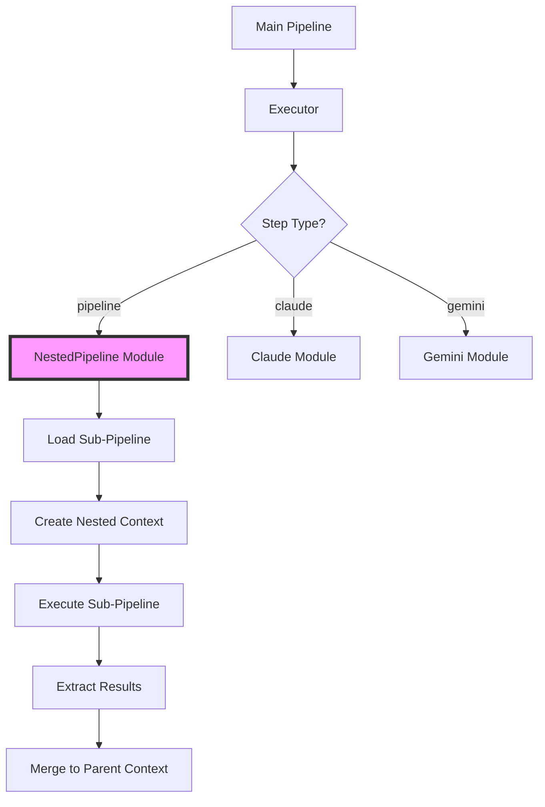

# Recursive Pipelines Guide

## Table of Contents

1. [Overview](#overview)
2. [Core Concepts](#core-concepts)
3. [Basic Usage](#basic-usage)
4. [Context Management](#context-management)
5. [Safety Features](#safety-features)
6. [Developer Experience](#developer-experience)
7. [Advanced Patterns](#advanced-patterns)
8. [Performance Considerations](#performance-considerations)
9. [Best Practices](#best-practices)
10. [Examples and Use Cases](#examples-and-use-cases)
11. [Troubleshooting](#troubleshooting)
12. [API Reference](#api-reference)
13. [Related Guides](#related-guides)

## Overview

Recursive pipelines enable pipeline composition in pipeline_ex, where a pipeline step can execute another complete pipeline. This transforms pipeline_ex from a linear workflow engine into a compositional framework supporting complex, hierarchical AI engineering patterns.

### Key Benefits

- **Modularity**: Build complex workflows from simpler, tested components
- **Reusability**: Share common pipeline patterns across projects
- **Maintainability**: Update shared pipelines in one place
- **Scalability**: Compose arbitrarily complex workflows
- **Testing**: Test pipeline components in isolation

### Architecture



## Core Concepts

### Pipeline Composition

Recursive pipelines allow you to nest complete pipelines within other pipelines:

```yaml
# Instead of monolithic 50+ step pipelines
workflow:
  name: "complete_analysis"
  steps:
    # Compose from reusable components
    - name: "extract_data"
      type: "pipeline"
      pipeline_file: "./pipelines/data_extraction.yaml"
    
    - name: "clean_data"
      type: "pipeline"
      pipeline_file: "./pipelines/data_cleaning.yaml"
    
    - name: "analyze"
      type: "pipeline"
      pipeline_file: "./pipelines/analysis.yaml"
```

### Context Isolation

Each nested pipeline runs in its own isolated context:

- Separate workspace directories
- Independent checkpoint management
- Isolated error handling
- Controlled variable passing

### Nesting Depth Tracking

The system tracks nesting depth to prevent infinite recursion and resource exhaustion.

## Basic Usage

### Step Definition Schema

```yaml
- name: "sub_workflow"
  type: "pipeline"
  
  # Pipeline source (one required)
  pipeline_file: "./path/to/pipeline.yaml"  # External file
  pipeline_ref: "registered_pipeline_name"   # From registry (future)
  pipeline:                                  # Inline definition
    name: "inline_pipeline"
    steps:
      - name: "step1"
        type: "claude"
        prompt: "..."
  
  # Input mapping (optional)
  inputs:
    data: "{{steps.previous.result}}"
    config: "{{workflow.settings}}"
    mode: "production"  # Static values
  
  # Output extraction (optional)
  outputs:
    - "final"  # Simple extraction
    - path: "analysis.metrics.accuracy"
      as: "accuracy_score"  # With aliasing
  
  # Execution configuration (optional)
  config:
    inherit_context: true
    workspace_dir: "./nested/${step.name}"
    timeout_seconds: 300
    max_depth: 5
```

### Simple Example

```yaml
workflow:
  name: "data_processor"
  steps:
    - name: "prepare"
      type: "pipeline"
      pipeline:
        name: "data_prep"
        steps:
          - name: "validate"
            type: "claude"
            prompt: "Validate this data format"
          - name: "clean"
            type: "claude"
            prompt: "Clean and normalize the data"
    
    - name: "analyze"
      type: "pipeline"
      pipeline_file: "./analysis_pipeline.yaml"
```

## Context Management

### Context Inheritance

Control how much context is shared between parent and child pipelines:

```yaml
- name: "nested_step"
  type: "pipeline"
  pipeline_file: "./child.yaml"
  config:
    inherit_context: true      # Pass parent context vars
    inherit_providers: true    # Use parent provider configs
    inherit_functions: false   # Don't inherit function defs
```

When `inherit_context` is true, the child pipeline can access:
- Parent's global variables
- Parent's function definitions
- Parent's provider configurations
- Parent's workflow metadata

### Input Mapping

Pass specific data from parent to child with full template resolution:

```yaml
- name: "process_data"
  type: "pipeline"
  pipeline_file: "./processor.yaml"
  inputs:
    # Variable references from previous steps
    source_data: "{{steps.extract.result}}"
    nested_field: "{{steps.prepare.result.data.items}}"
    
    # Global variables
    api_key: "{{global_vars.api_key}}"
    
    # Workflow configuration
    user_config: "{{workflow.user_settings}}"
    
    # Static values
    processing_mode: "batch"
    max_items: 1000
    
    # Complex expressions (future)
    threshold: "{{multiply(workflow.base_threshold, 1.5)}}"
```

**Type Preservation**: Single template references preserve their original type:
- `"{{steps.data.count}}"` → `42` (integer)
- `"{{steps.data.result}}"` → `{"name": "test", "value": 100}` (object)
- `"Count: {{steps.data.count}}"` → `"Count: 42"` (string)

### Output Extraction

Extract specific results from nested pipelines with flexible patterns:

```yaml
outputs:
  # Simple extraction - gets steps.stepname.result
  - "final_result"
  
  # Path-based extraction with deep access
  - path: "analysis.metrics.accuracy"
    as: "accuracy_score"
  
  # Multiple path-based extractions
  - path: "step1.data"
    as: "processed_data"
  - path: "step2.summary.text"
    as: "summary"
  
  # Extract entire step results
  - "validation"
  - "transformation"
```

Example usage:
```yaml
- name: "analyze"
  type: "pipeline"
  pipeline_file: "./analysis.yaml"
  outputs:
    - path: "metrics.performance.score"
      as: "perf_score"
    - path: "report.summary"
      as: "summary_text"

- name: "use_results"
  type: "claude"
  prompt: |
    Performance score: {{steps.analyze.perf_score}}
    Summary: {{steps.analyze.summary_text}}
```

### Variable Resolution

The custom template resolution engine supports pipeline-specific patterns:

1. **Step Results**: `{{steps.stepname.result}}` or `{{steps.stepname.result.field.nested}}`
2. **Global Variables**: `{{global_vars.variable_name}}`
3. **Workflow Data**: `{{workflow.config.setting}}`
4. **Direct Variables**: `{{variable_name}}`

Resolution order:
1. Check current (child) context first
2. If not found and inheritance enabled, check parent context
3. Continue up the context chain
4. Return the original template if variable not found (graceful fallback)

## Safety Features

The recursive pipeline system includes comprehensive safety mechanisms to prevent common failure modes:

### Recursion Protection

#### Depth Limiting

Control maximum nesting depth to prevent stack overflow:

```yaml
- name: "nested_pipeline"
  type: "pipeline"
  pipeline_file: "./child.yaml"
  config:
    max_depth: 5  # Override default limit
```

Environment-specific defaults:
```elixir
# config/dev.exs - Development
config :pipeline,
  max_nesting_depth: 15,    # More permissive for experimentation
  max_total_steps: 2000

# config/test.exs - Testing
config :pipeline,
  max_nesting_depth: 5,     # Restricted for fast tests
  max_total_steps: 100

# config/prod.exs - Production
config :pipeline,
  max_nesting_depth: 8,     # Conservative for stability
  max_total_steps: 500
```

#### Circular Dependency Detection

The system automatically detects and prevents circular dependencies:

```yaml
# pipeline_a.yaml
- name: "call_b"
  type: "pipeline"
  pipeline_file: "./pipeline_b.yaml"

# pipeline_b.yaml
- name: "call_a"
  type: "pipeline"
  pipeline_file: "./pipeline_a.yaml"  # ERROR: Circular dependency!
```

Error message:
```
Error: Circular dependency detected in pipeline execution chain:
  main_workflow -> pipeline_a -> pipeline_b -> pipeline_a
  
Execution chain:
  1. main_workflow (depth: 0)
  2. pipeline_a (depth: 1)
  3. pipeline_b (depth: 2)
  4. pipeline_a (depth: 3) <- Circular reference
```

### Resource Management

#### Memory Monitoring

Real-time memory usage tracking with configurable limits:

```yaml
config:
  memory_limit_mb: 1024    # 1GB limit
  memory_warning_mb: 768   # Warning at 75% usage
```

Memory pressure warnings:
```
Warning: Memory usage approaching limit
  Current: 850MB / 1024MB (83%)
  Pipeline: data_processor (depth: 2)
  Consider optimizing data handling or increasing limit
```

#### Timeout Protection

Prevent runaway pipelines with execution time limits:

```yaml
config:
  timeout_seconds: 300     # 5 minute timeout
  max_retries: 2          # Retry attempts on timeout
```

#### Step Count Limits

Prevent exponential pipeline expansion:

```yaml
config:
  max_total_steps: 1000   # Total steps across all nested pipelines
```

### Workspace Isolation

Each nested pipeline gets its own isolated workspace:

```yaml
config:
  workspace_dir: "./nested/${step.name}"  # Isolated directory
  cleanup_on_error: true                  # Auto cleanup
  cleanup_on_success: true                # Clean after completion
```

### Resource Cleanup

Automatic cleanup on all execution paths:
- **Workspace directories**: Removed after pipeline completion
- **Memory structures**: Large data cleared from context
- **Context chains**: Parent references cleaned to prevent leaks
- **Temporary files**: All temp files removed

## Developer Experience

The recursive pipeline system includes comprehensive developer tools for debugging, monitoring, and optimization:

### Enhanced Error Messages

Production-grade error reporting with full execution context:

```
Pipeline execution failed in nested pipeline:
  
  Main Pipeline: data_analysis_workflow
  └─ Step: process_data (pipeline)
     └─ Nested Pipeline: data_processor
        └─ Step: validate_schema (claude)
           └─ Error: Invalid JSON in response
  
  Execution Stack:
    1. data_analysis_workflow.process_data (depth: 0)
    2. data_processor.validate_schema (depth: 1)
  
  Context at failure:
    - Total steps executed: 12
    - Nesting depth: 1
    - Elapsed time: 4.2s
    - Memory usage: 234MB
  
  Debug Information:
    - Trace ID: a1b2c3d4-e5f6-7890-abcd-ef1234567890
    - Step config: {"type": "claude", "prompt": "..."}
    - Parent pipeline: data_analysis_workflow
```

### Execution Tracing

Span-based tracing system for performance analysis:

```elixir
# Enable tracing for a pipeline
- name: "complex_workflow"
  type: "pipeline"
  pipeline_file: "./workflow.yaml"
  config:
    enable_tracing: true
    trace_metadata:
      request_id: "{{inputs.request_id}}"
      user_id: "{{inputs.user_id}}"
```

Trace output includes:
- Hierarchical span relationships
- Execution duration per span
- Resource usage metrics
- Success/failure status
- Custom metadata

### Visual Debugging

Interactive execution tree visualization:

```
Execution Tree for trace_id: a1b2c3d4
├─ main_pipeline (289.5ms) ✓
│  ├─ prepare_data (45.2ms) ✓
│  │  └─ validation: {"status": "valid", "records": 1000}
│  ├─ analysis_pipeline (198.3ms) ✓
│  │  ├─ security_scan (89.1ms) ✓
│  │  │  └─ vulnerabilities: []
│  │  ├─ performance_check (72.4ms) ✓
│  │  │  └─ bottlenecks: ["database_query_optimization"]
│  │  └─ code_quality (36.8ms) ✓
│  │     └─ score: 8.5
│  └─ generate_report (46.0ms) ✓
│     └─ report_url: "https://reports.example.com/abc123"

Performance Summary:
- Total Duration: 289.5ms
- Deepest Nesting: 2 levels
- Total Steps: 7
- Success Rate: 100%
- Average Step Duration: 41.4ms
```

### Performance Metrics

Detailed performance analysis per nesting level:

```elixir
# Performance metrics collection
Pipeline.Metrics.NestedPerformance.analyze_performance(execution_id)

# Returns:
%{
  overall_metrics: %{
    total_duration_ms: 289.5,
    total_steps: 7,
    success_rate: 1.0,
    max_depth: 2
  },
  depth_metrics: %{
    0 => %{steps: 3, avg_duration_ms: 96.5, success_rate: 1.0},
    1 => %{steps: 4, avg_duration_ms: 48.6, success_rate: 1.0}
  },
  bottlenecks: [
    %{pipeline: "analysis_pipeline", step: "security_scan", duration_ms: 89.1}
  ],
  performance_grade: :excellent,  # :excellent | :good | :fair | :poor
  recommendations: [
    "Consider caching security scan results for repeated analyses",
    "Database query in performance_check could be optimized"
  ]
}
```

### Debug Commands

Interactive debugging interface:

```elixir
# Start debug session
Pipeline.Debug.NestedExecution.start_debug_session(trace_context)

# Available commands:
# - tree: Show execution tree
# - inspect <step>: Examine step details
# - search <pattern>: Search execution traces
# - analyze: Performance analysis
# - report: Generate debug report
```

### Telemetry Integration

Built-in telemetry events for monitoring:

```elixir
# Attach to telemetry events
:telemetry.attach_many(
  "pipeline-monitoring",
  [
    [:pipeline, :nested, :start],
    [:pipeline, :nested, :stop],
    [:pipeline, :nested, :error],
    [:pipeline, :span, :start],
    [:pipeline, :span, :stop]
  ],
  &handle_pipeline_event/4,
  nil
)

# Event metadata includes:
# - pipeline_id, depth, parent_span
# - duration, memory_usage, step_count
# - error details (for error events)
```

## Advanced Patterns

### Progressive Enhancement

Build complexity gradually through connected prompts:

```yaml
workflow:
  name: "progressive_analysis"
  steps:
    - name: "basic_scan"
      type: "pipeline"
      pipeline_file: "./basic_analysis.yaml"
    
    - name: "detailed_analysis"
      type: "pipeline"
      pipeline_file: "./detailed_analysis.yaml"
      inputs:
        findings: "{{steps.basic_scan.concerns}}"
        source_data: "{{workflow.input_data}}"
    
    - name: "comprehensive_report"
      type: "pipeline"
      pipeline_file: "./report_generator.yaml"
      inputs:
        basic_results: "{{steps.basic_scan.result}}"
        detailed_results: "{{steps.detailed_analysis.result}}"
```

### Conditional Sub-Pipelines

Execute different pipelines based on conditions:

```yaml
workflow:
  name: "adaptive_processing"
  steps:
    - name: "detect_type"
      type: "claude"
      prompt: "Detect the data type: {{input}}"
    
    - name: "process_text"
      type: "pipeline"
      pipeline_file: "./text_processor.yaml"
      condition: "{{steps.detect_type.result.type == 'text'}}"
    
    - name: "process_structured"
      type: "pipeline"
      pipeline_file: "./structured_processor.yaml"
      condition: "{{steps.detect_type.result.type == 'structured'}}"
```

### Parallel Nested Execution

Run multiple sub-pipelines simultaneously:

```yaml
- name: "parallel_analysis"
  type: "parallel_claude"
  parallel_tasks:
    - id: "security_scan"
      type: "pipeline"
      pipeline_file: "./security_analysis.yaml"
      
    - id: "performance_scan"
      type: "pipeline"
      pipeline_file: "./performance_analysis.yaml"
      
    - id: "quality_scan"
      type: "pipeline"
      pipeline_file: "./quality_analysis.yaml"
```

### Self-Referential Pipelines

Pipelines that can call themselves (with proper depth limits):

```yaml
workflow:
  name: "recursive_analyzer"
  steps:
    - name: "analyze_item"
      type: "claude"
      prompt: "Analyze: {{inputs.item}}"
    
    - name: "process_children"
      type: "for_loop"
      over: "{{steps.analyze_item.result.sub_items}}"
      as: "child"
      steps:
        - name: "recurse"
          type: "pipeline"
          pipeline_ref: "recursive_analyzer"  # Self-reference
          inputs:
            item: "{{child}}"
          config:
            max_depth: 3  # Prevent infinite recursion
```

### Error Recovery Pattern

Handle failures gracefully with fallback pipelines:

```yaml
workflow:
  name: "resilient_processor"
  steps:
    - name: "primary_processing"
      type: "pipeline"
      pipeline_file: "./primary.yaml"
      config:
        continue_on_error: true
    
    - name: "fallback_processing"
      type: "pipeline"
      pipeline_file: "./fallback.yaml"
      condition: "{{steps.primary_processing.error != null}}"
      inputs:
        error: "{{steps.primary_processing.error}}"
        original_input: "{{inputs.data}}"
```

## Performance Considerations

### Pipeline Caching

The system caches loaded pipelines for performance:

```elixir
# Automatic caching with TTL
pipeline_cache_ttl: 3600  # 1 hour
```

### Optimization Strategies

1. **Lazy Loading**: Sub-pipelines are loaded only when needed
2. **Context Pooling**: Reuse context structures where safe
3. **Result Streaming**: Stream large results between pipelines
4. **Parallel Execution**: Run independent sub-pipelines concurrently

### Performance Metrics

Track execution metrics:

```yaml
# Prometheus metrics example
pipeline_nested_executions_total{pipeline="analysis", depth="2"} 42
pipeline_nested_duration_seconds{pipeline="analysis", depth="2"} 1.234
pipeline_nested_memory_bytes{pipeline="analysis"} 104857600
```

## Best Practices

### Organization

```
project/
├── pipelines/
│   ├── components/        # Reusable sub-pipelines
│   │   ├── data_prep.yaml
│   │   ├── analysis.yaml
│   │   └── reporting.yaml
│   ├── workflows/         # Main orchestration pipelines
│   │   ├── full_analysis.yaml
│   │   └── quick_scan.yaml
│   └── templates/         # Pipeline templates
└── shared/
    └── common_steps.yaml
```

### Design Principles

1. **Single Responsibility**: Each sub-pipeline should have one clear purpose
2. **Loose Coupling**: Minimize dependencies between pipelines
3. **Clear Interfaces**: Well-defined inputs and outputs
4. **Error Boundaries**: Proper error handling at each level

### Naming Conventions

- **Descriptive names**: `security_vulnerability_scan.yaml` not `scan.yaml`
- **Action-oriented**: `generate_api_tests.yaml` not `api_tests.yaml`
- **Domain prefixes**: `frontend_analysis.yaml`, `backend_review.yaml`
- **Version suffixes**: `data_processor_v2.yaml` for major updates

### Configuration Management

```yaml
# Use consistent configuration patterns
config:
  inherit_context: true
  workspace_dir: "./nested/${step.name}"
  timeout_seconds: 300
  max_depth: 5
```

## Examples and Use Cases

### Use Case 1: Multi-Stage Data Processing

```yaml
workflow:
  name: "data_pipeline"
  steps:
    - name: "ingestion"
      type: "pipeline"
      pipeline_file: "./stages/data_ingestion.yaml"
      inputs:
        source: "{{inputs.data_source}}"
        format: "{{inputs.format}}"
      outputs:
        - path: "raw_data"
          as: "ingested_data"
        - "metadata"
    
    - name: "validation"
      type: "pipeline"
      pipeline_file: "./stages/data_validation.yaml"
      inputs:
        data: "{{steps.ingestion.ingested_data}}"
        schema: "{{steps.ingestion.metadata.schema}}"
      outputs:
        - "validated_data"
        - "validation_report"
    
    - name: "transformation"
      type: "pipeline"
      pipeline_file: "./stages/data_transformation.yaml"
      inputs:
        data: "{{steps.validation.validated_data}}"
        rules: "{{workflow.transformation_rules}}"
      outputs:
        - "processed_data"
```

### Use Case 2: Code Generation Workflow

```yaml
workflow:
  name: "app_generator"
  steps:
    - name: "analyze_requirements"
      type: "pipeline"
      pipeline_file: "./generators/requirements_analysis.yaml"
      inputs:
        specs: "{{inputs.requirements}}"
    
    - name: "generate_backend"
      type: "pipeline"
      pipeline_file: "./generators/backend_generator.yaml"
      inputs:
        architecture: "{{steps.analyze_requirements.backend_spec}}"
        database: "{{steps.analyze_requirements.db_requirements}}"
    
    - name: "generate_frontend"
      type: "pipeline"
      pipeline_file: "./generators/frontend_generator.yaml"
      inputs:
        ui_spec: "{{steps.analyze_requirements.ui_requirements}}"
        api_spec: "{{steps.generate_backend.api_definition}}"
    
    - name: "integration_tests"
      type: "pipeline"
      pipeline_file: "./generators/test_generator.yaml"
      inputs:
        backend_code: "{{steps.generate_backend.result}}"
        frontend_code: "{{steps.generate_frontend.result}}"
```

### Use Case 3: Comprehensive Analysis Framework

```yaml
workflow:
  name: "security_audit"
  steps:
    - name: "static_analysis"
      type: "parallel_claude"
      parallel_tasks:
        - id: "code_security"
          type: "pipeline"
          pipeline_file: "./security/code_analysis.yaml"
        - id: "dependency_check"
          type: "pipeline"
          pipeline_file: "./security/dependency_audit.yaml"
        - id: "config_review"
          type: "pipeline"
          pipeline_file: "./security/config_analysis.yaml"
    
    - name: "dynamic_analysis"
      type: "pipeline"
      pipeline_file: "./security/runtime_analysis.yaml"
      inputs:
        static_findings: "{{steps.static_analysis.result}}"
    
    - name: "compliance_check"
      type: "pipeline"
      pipeline_file: "./security/compliance_review.yaml"
      inputs:
        security_findings: "{{steps.dynamic_analysis.vulnerabilities}}"
        static_results: "{{steps.static_analysis.result}}"
    
    - name: "final_report"
      type: "pipeline"
      pipeline_file: "./reporting/security_report.yaml"
      inputs:
        all_findings: "{{steps.compliance_check.consolidated_results}}"
```

## Troubleshooting

### Common Issues

#### 1. Circular Dependency Error

```
Error: Circular dependency detected: pipeline_a -> pipeline_b -> pipeline_a
```

**Solution**: Review your pipeline call chain and eliminate cycles.

#### 2. Maximum Depth Exceeded

```
Error: Maximum nesting depth (10) exceeded
```

**Solutions**:
- Reduce nesting levels
- Increase `max_depth` configuration
- Refactor deep hierarchies into flatter structures

#### 3. Pipeline Not Found

```
Error: Pipeline file not found: ./missing_pipeline.yaml
```

**Solutions**:
- Verify file path is correct
- Check file permissions
- Ensure file exists in expected location

#### 4. Memory Limit Exceeded

```
Error: Memory limit exceeded: 1500MB > 1024MB
```

**Solutions**:
- Increase memory limit in configuration
- Optimize large data handling
- Stream results instead of loading all in memory

### Debugging Tools

#### Execution Tree Visualization

```bash
# Enable debug mode for detailed execution logging
PIPELINE_DEBUG=true mix pipeline.run complex_workflow.yaml
```

Debug output shows execution hierarchy:
```
Execution Tree:
├─ main_pipeline (depth: 0)
│  ├─ data_prep (depth: 1)
│  │  └─ validation: success
│  ├─ analysis (depth: 1)
│  │  ├─ security_scan (depth: 2)
│  │  └─ performance_check (depth: 2)
│  └─ reporting (depth: 1)
```

#### Enhanced Error Messages

Errors include full execution context:

```
Pipeline execution failed in nested pipeline:
  
  Main Pipeline: data_processor
  └─ Step: analyze_data (pipeline)
     └─ Nested Pipeline: analysis_pipeline
        └─ Step: extract_themes (claude)
           └─ Error: API timeout after 30s
  
  Execution Stack:
    1. data_processor.analyze_data (depth: 0)
    2. analysis_pipeline.extract_themes (depth: 1)
  
  Context at failure:
    - Total steps executed: 15
    - Nesting depth: 1
    - Elapsed time: 32.5s
```

### Performance Debugging

Monitor performance metrics:

```elixir
# Enable telemetry events
:telemetry.attach_many(
  "pipeline-metrics",
  [
    [:pipeline, :nested, :execution],
    [:pipeline, :span, :start],
    [:pipeline, :span, :stop]
  ],
  &handle_telemetry_event/4,
  nil
)
```

## API Reference

### Step Configuration

```yaml
type: pipeline
name: string                    # Step name (required)
pipeline_file: string          # Path to external pipeline file
pipeline_ref: string           # Reference to registered pipeline (future)
pipeline: object               # Inline pipeline definition
inputs: map                    # Input variable mappings
outputs: array                 # Output extraction configuration
config:                        # Execution configuration
  inherit_context: boolean     # Inherit parent context (default: false)
  inherit_providers: boolean   # Inherit provider configs (default: true)
  inherit_functions: boolean   # Inherit function definitions (default: false)
  workspace_dir: string        # Nested workspace directory
  checkpoint_enabled: boolean  # Enable checkpointing (default: false)
  timeout_seconds: integer     # Execution timeout
  max_retries: integer        # Retry attempts
  continue_on_error: boolean  # Continue on sub-pipeline error
  max_depth: integer          # Maximum nesting depth
  memory_limit_mb: integer    # Memory limit in MB
  enable_tracing: boolean     # Enable execution tracing
```

### Elixir API

```elixir
# Execute nested pipeline
Pipeline.Step.NestedPipeline.execute(step_config, context)

# Context management
Pipeline.Context.Nested.create_nested_context(parent_context, step_config)
Pipeline.Context.Nested.extract_outputs(results, output_config)
Pipeline.Context.Nested.resolve_template(template, context)

# Safety checks
Pipeline.Safety.RecursionGuard.check_all_safety(pipeline_id, context, limits)
Pipeline.Safety.ResourceMonitor.check_limits(usage, limits)
Pipeline.Safety.SafetyManager.check_safety(pipeline_id, context, config)

# Error handling
Pipeline.Error.NestedPipeline.format_nested_error(error, context, step)

# Debugging and tracing
Pipeline.Debug.NestedExecution.start_debug_session(trace_context, options)
Pipeline.Tracing.NestedExecution.start_nested_trace(pipeline_id, context, step, parent)
Pipeline.Metrics.NestedPerformance.analyze_performance(execution_id)
```

### Configuration Options

```elixir
# config/config.exs
config :pipeline,
  # Safety limits
  max_nesting_depth: 10,
  max_total_steps: 1000,
  default_memory_limit_mb: 1024,
  default_timeout_seconds: 300,
  
  # Performance
  pipeline_cache_ttl: 3600,
  enable_tracing: false,
  
  # Paths
  nested_workspace_root: "./nested_workspaces",
  allowed_pipeline_dirs: ["./pipelines", "./shared"],
  
  # Features
  enable_pipeline_registry: true,
  enable_performance_metrics: true
```

## Related Guides

### Core Documentation
- **[Context Management Guide](./docs/guides/context_management.md)** - Deep dive into variable passing and context inheritance
- **[Safety Features Guide](./docs/guides/safety_features.md)** - Comprehensive safety configuration and best practices
- **[Developer Experience Guide](./docs/guides/developer_experience.md)** - Debugging tools and performance optimization
- **[Testing Strategy Guide](./docs/guides/testing_recursive_pipelines.md)** - Testing approaches for nested pipelines
- **[Examples Collection](./docs/guides/recursive_pipeline_examples.md)** - Real-world use cases and patterns

### Technical References
- **[Architecture Design](./docs/architecture/20250103_recursive.md)** - Complete technical design document
- **[Implementation Prompts](./docs/architecture/recursive_pipeline_prompts.md)** - Phased implementation guide
- **[Implementation Worklog](./docs/architecture/20250703_recursive_worklog.md)** - Detailed implementation notes

### Related Features
- **[Pipeline Organization](./docs/architecture/pipeline_organization.md)** - Pipeline categorization and structure
- **[Claude.md Blueprint](./CLAUDE.md)** - Overall system vision and roadmap

---

## Implementation Status

### ✅ Phase 1: Core Infrastructure (Completed)
- Basic nested pipeline execution
- Three pipeline source options
- Context isolation and depth tracking
- Error propagation
- 14 tests with full coverage

### ✅ Phase 2: Context Management (Completed)
- Full template resolution engine
- Input mapping with type preservation
- Flexible output extraction
- Context inheritance options
- 21 additional tests

### ✅ Phase 3: Safety Features (Completed)
- Recursion and circular dependency protection
- Memory and timeout monitoring
- Resource cleanup guarantees
- Environment-specific configuration
- 46 safety-focused tests

### ✅ Phase 4: Developer Experience (Completed)
- Enhanced error messages with full context
- Span-based execution tracing
- Visual debugging tools
- Performance metrics and analysis
- 71 debugging and metrics tests

### 📋 Phase 5: Advanced Features (Future)
- Pipeline caching system
- Performance optimizations
- Pipeline registry
- Template system

### Current Capabilities
The recursive pipeline system is **production-ready** with:
- **Complete functionality** for nested pipeline execution
- **Enterprise-grade safety** protections
- **Comprehensive debugging** and monitoring tools
- **152+ tests** ensuring reliability
- **Full backward compatibility** with existing pipelines

---

This guide provides comprehensive documentation for the recursive pipelines feature. The system enables powerful pipeline composition patterns with production-grade safety, performance, and debugging capabilities.