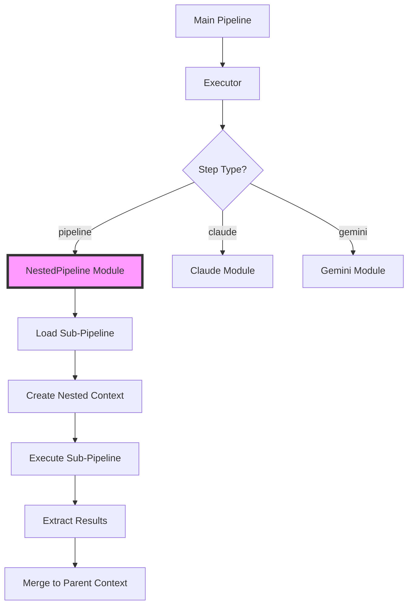

# Recursive Pipeline Architecture Design Document

**Document ID**: 20250103_recursive  
**Status**: Draft  
**Author**: Pipeline Architecture Team  
**Created**: 2025-01-03  
**Last Updated**: 2025-01-03  

## Table of Contents

1. [Executive Summary](#executive-summary)
2. [Problem Statement](#problem-statement)
3. [Goals and Non-Goals](#goals-and-non-goals)
4. [Design Overview](#design-overview)
5. [Detailed Design](#detailed-design)
6. [Implementation Plan](#implementation-plan)
7. [Safety and Resource Management](#safety-and-resource-management)
8. [Performance Considerations](#performance-considerations)
9. [Security Implications](#security-implications)
10. [Testing Strategy](#testing-strategy)
11. [Migration and Compatibility](#migration-and-compatibility)
12. [Monitoring and Observability](#monitoring-and-observability)
13. [API Reference](#api-reference)
14. [Examples and Patterns](#examples-and-patterns)
15. [Future Work](#future-work)
16. [Appendices](#appendices)

## Executive Summary

This document proposes the implementation of recursive pipelines as a first-class feature in pipeline_ex. Recursive pipelines enable pipeline composition, where a pipeline step can execute another complete pipeline, enabling modular, reusable, and maintainable AI workflows. This feature will transform pipeline_ex from a linear workflow engine into a compositional framework supporting complex, hierarchical AI engineering patterns.

Key benefits:
- **Modularity**: Build complex workflows from simpler, tested components
- **Reusability**: Share common pipeline patterns across projects
- **Maintainability**: Update shared pipelines in one place
- **Scalability**: Compose arbitrarily complex workflows
- **Testing**: Test pipeline components in isolation

## Problem Statement

### Current Limitations

1. **No Composition Model**: Pipelines are monolithic, requiring duplication of common patterns
2. **Limited Reusability**: Cannot easily share pipeline logic between workflows
3. **Testing Complexity**: Must test entire pipelines rather than components
4. **Maintenance Burden**: Updates require modifying multiple pipeline files
5. **Scaling Issues**: Complex workflows become unwieldy single files

### Use Cases Requiring Recursive Pipelines

1. **Data Processing Pipelines**
   - Main pipeline orchestrates multiple data transformation sub-pipelines
   - Each sub-pipeline handles specific data types or sources

2. **Code Generation Workflows**
   - Parent pipeline manages project structure
   - Child pipelines generate individual components

3. **Analysis Frameworks**
   - Top-level pipeline coordinates analysis phases
   - Specialized pipelines for each analysis type

4. **Content Generation Systems**
   - Master pipeline manages content strategy
   - Sub-pipelines handle different content formats

### Example Scenario

```yaml
# Current approach - everything in one file
workflow:
  name: "complete_analysis"
  steps:
    # 50+ steps for data extraction, cleaning, analysis, reporting...
    
# Proposed approach - composed pipelines
workflow:
  name: "complete_analysis"
  steps:
    - name: "extract_data"
      type: "pipeline"
      pipeline_file: "./pipelines/data_extraction.yaml"
    
    - name: "clean_data"
      type: "pipeline"
      pipeline_file: "./pipelines/data_cleaning.yaml"
    
    - name: "analyze"
      type: "pipeline"
      pipeline_file: "./pipelines/analysis.yaml"
```

## Goals and Non-Goals

### Goals

1. **First-Class Pipeline Composition**
   - Pipeline steps that execute other pipelines
   - Both file-based and inline pipeline definitions
   - Full integration with existing step types

2. **Context Management**
   - Controlled variable passing between pipelines
   - Result extraction and mapping
   - Optional context inheritance

3. **Resource Isolation**
   - Separate workspaces for nested pipelines
   - Independent checkpoint management
   - Isolated error handling

4. **Developer Experience**
   - Intuitive YAML syntax
   - Clear error messages
   - Comprehensive debugging tools

5. **Performance**
   - Minimal overhead for nested execution
   - Efficient resource sharing
   - Smart caching of pipeline definitions

### Non-Goals

1. **Dynamic Pipeline Generation**
   - Not generating pipeline YAML at runtime
   - Not supporting arbitrary code execution

2. **Cross-Language Support**
   - Not executing non-Elixir pipeline engines
   - Not supporting external workflow systems

3. **Distributed Execution**
   - Not distributing nested pipelines across nodes
   - Not implementing remote pipeline execution

4. **Backward Incompatibility**
   - Not breaking existing pipeline syntax
   - Not requiring migration of current pipelines

## Design Overview

### Architecture Diagram



### Key Components

1. **NestedPipeline Step Module**
   - Loads and validates sub-pipelines
   - Manages context inheritance
   - Handles result extraction

2. **Context Isolation**
   - Creates isolated execution contexts
   - Maps variables between contexts
   - Prevents unintended side effects

3. **Resource Management**
   - Tracks nested execution depth
   - Monitors resource usage
   - Prevents infinite recursion

4. **Error Propagation**
   - Captures sub-pipeline errors
   - Provides full stack traces
   - Enables graceful degradation

## Detailed Design

### Step Definition Schema

```yaml
- name: "sub_workflow"
  type: "pipeline"
  
  # Pipeline source (one of these required)
  pipeline_file: "./path/to/pipeline.yaml"  # External file
  pipeline_ref: "registered_pipeline_name"   # From registry
  pipeline:                                  # Inline definition
    name: "inline_pipeline"
    steps:
      - name: "step1"
        type: "claude"
        prompt: "..."
  
  # Input mapping
  inputs:
    # Map parent context variables to sub-pipeline
    data: "{{steps.previous.result}}"
    config: "{{workflow.settings}}"
    # Can also use static values
    mode: "production"
    # Or complex expressions
    threshold: "{{multiply(workflow.base_threshold, 1.5)}}"
  
  # Output extraction
  outputs:
    # Simple extraction - gets steps.final.result
    - "final"
    # Nested extraction - gets steps.analysis.metrics.accuracy
    - path: "analysis.metrics.accuracy"
      as: "accuracy_score"
    # Multiple extractions from one step
    - path: "report"
      extract:
        - "summary"
        - "recommendations"
  
  # Execution configuration
  config:
    # Context inheritance
    inherit_context: true      # Pass parent context vars
    inherit_providers: true    # Use parent provider configs
    inherit_functions: false   # Don't inherit function defs
    
    # Resource isolation
    workspace_dir: "./nested/${step.name}"
    checkpoint_enabled: false  # Separate from parent
    
    # Execution controls
    timeout_seconds: 300
    max_retries: 2
    continue_on_error: false
    
    # Resource limits
    max_depth: 5              # Prevent deep recursion
    memory_limit_mb: 1024     # Limit memory usage
```

### Context Management

#### Context Inheritance Model

```elixir
defmodule Pipeline.Context.Inheritance do
  @doc """
  Create a nested context from parent context based on configuration
  """
  def create_nested_context(parent_context, step_config) do
    base_context = if step_config["config"]["inherit_context"] do
      inherit_base_context(parent_context)
    else
      create_isolated_context()
    end
    
    base_context
    |> apply_input_mappings(step_config["inputs"], parent_context)
    |> set_nested_metadata(parent_context, step_config)
    |> validate_depth_limit(step_config)
  end
  
  defp inherit_base_context(parent) do
    %{
      # Inherit read-only data
      global_vars: parent.global_vars,
      functions: parent.functions,
      providers: parent.providers,
      
      # Create new mutable data
      results: %{},
      step_index: 0,
      execution_log: [],
      
      # Track nesting
      parent_context: parent,
      nesting_depth: parent.nesting_depth + 1
    }
  end
end
```

#### Variable Resolution

```elixir
defmodule Pipeline.Context.Variables do
  @doc """
  Resolve variables with nested pipeline support
  """
  def resolve(template, context) do
    # Check current context first
    case resolve_in_context(template, context) do
      {:ok, value} -> {:ok, value}
      
      # If not found and has parent, check parent
      {:error, :not_found} when context.parent_context != nil ->
        resolve(template, context.parent_context)
        
      error -> error
    end
  end
end
```

### Execution Flow

1. **Pipeline Loading**
   ```elixir
   def load_pipeline(step_config) do
     cond do
       step_config["pipeline_file"] ->
         load_from_file(step_config["pipeline_file"])
         
       step_config["pipeline_ref"] ->
         load_from_registry(step_config["pipeline_ref"])
         
       step_config["pipeline"] ->
         {:ok, step_config["pipeline"]}
         
       true ->
         {:error, "No pipeline source specified"}
     end
   end
   ```

2. **Execution Lifecycle**
   ```elixir
   def execute(step, context) do
     with {:ok, pipeline} <- load_pipeline(step),
          {:ok, nested_context} <- create_nested_context(context, step),
          {:ok, results} <- execute_pipeline(pipeline, nested_context),
          {:ok, extracted} <- extract_outputs(results, step["outputs"]) do
       
       {:ok, extracted}
     else
       {:error, reason} -> handle_nested_error(reason, step, context)
     end
   end
   ```

### Circular Dependency Detection

```elixir
defmodule Pipeline.Validation.CircularDependency do
  @doc """
  Detect circular dependencies in nested pipelines
  """
  def check_circular_dependency(pipeline_id, context) do
    execution_chain = build_execution_chain(context)
    
    if pipeline_id in execution_chain do
      {:error, format_circular_dependency_error(pipeline_id, execution_chain)}
    else
      :ok
    end
  end
  
  defp build_execution_chain(context) do
    case context.parent_context do
      nil -> [context.pipeline_id]
      parent -> [context.pipeline_id | build_execution_chain(parent)]
    end
  end
end
```

## Implementation Plan

### Phase 1: Core Infrastructure (Week 1-2)

1. **Create NestedPipeline Module**
   - [ ] Implement `Pipeline.Step.NestedPipeline`
   - [ ] Add pipeline loading logic
   - [ ] Create basic execution flow

2. **Update Executor**
   - [ ] Add "pipeline" case to `do_execute_step/2`
   - [ ] Implement context creation
   - [ ] Add result extraction

3. **Basic Tests**
   - [ ] Unit tests for NestedPipeline
   - [ ] Integration tests with simple pipelines
   - [ ] Error handling tests

### Phase 2: Context Management (Week 3-4)

1. **Context Inheritance**
   - [ ] Implement inheritance rules
   - [ ] Variable mapping system
   - [ ] Result extraction logic

2. **Resource Isolation**
   - [ ] Workspace management
   - [ ] Checkpoint isolation
   - [ ] Provider configuration

3. **Advanced Tests**
   - [ ] Context inheritance tests
   - [ ] Variable resolution tests
   - [ ] Isolation tests

### Phase 3: Safety Features (Week 5)

1. **Recursion Protection**
   - [ ] Depth limiting
   - [ ] Circular dependency detection
   - [ ] Resource monitoring

2. **Error Handling**
   - [ ] Error propagation
   - [ ] Stack trace enhancement
   - [ ] Graceful degradation

3. **Performance Optimization**
   - [ ] Pipeline caching
   - [ ] Context pooling
   - [ ] Memory optimization

### Phase 4: Developer Experience (Week 6)

1. **Debugging Tools**
   - [ ] Enhanced logging
   - [ ] Execution visualization
   - [ ] Performance profiling

2. **Documentation**
   - [ ] API documentation
   - [ ] Usage examples
   - [ ] Best practices guide

3. **Migration Tools**
   - [ ] Pipeline refactoring helpers
   - [ ] Compatibility checker
   - [ ] Migration guide

## Safety and Resource Management

### Recursion Limits

```elixir
defmodule Pipeline.Safety.RecursionGuard do
  @max_depth Application.compile_env(:pipeline, :max_nesting_depth, 10)
  @max_total_steps Application.compile_env(:pipeline, :max_total_steps, 1000)
  
  def check_limits(context) do
    cond do
      context.nesting_depth > @max_depth ->
        {:error, "Maximum nesting depth (#{@max_depth}) exceeded"}
        
      count_total_steps(context) > @max_total_steps ->
        {:error, "Maximum total steps (#{@max_total_steps}) exceeded"}
        
      true ->
        :ok
    end
  end
end
```

### Memory Management

```elixir
defmodule Pipeline.Safety.MemoryGuard do
  def check_memory_usage(context, limit_mb) do
    current_mb = :erlang.memory(:total) / 1_048_576
    
    if current_mb > limit_mb do
      {:error, "Memory limit exceeded: #{current_mb}MB > #{limit_mb}MB"}
    else
      :ok
    end
  end
end
```

### Resource Cleanup

```elixir
defmodule Pipeline.Safety.ResourceCleanup do
  def cleanup_nested_resources(context) do
    # Clean workspace
    if context.isolated_workspace do
      File.rm_rf!(context.workspace_dir)
    end
    
    # Clear large data structures
    context
    |> Map.put(:results, %{})
    |> Map.put(:execution_log, [])
    
    # Recursively clean parent contexts
    if context.parent_context do
      cleanup_nested_resources(context.parent_context)
    end
  end
end
```

## Performance Considerations

### Pipeline Caching

```elixir
defmodule Pipeline.Cache.PipelineCache do
  use GenServer
  
  def get_or_load(pipeline_ref) do
    case :ets.lookup(:pipeline_cache, pipeline_ref) do
      [{^pipeline_ref, pipeline, timestamp}] ->
        if fresh?(timestamp) do
          {:ok, pipeline}
        else
          load_and_cache(pipeline_ref)
        end
        
      [] ->
        load_and_cache(pipeline_ref)
    end
  end
  
  defp load_and_cache(pipeline_ref) do
    with {:ok, pipeline} <- load_pipeline(pipeline_ref) do
      :ets.insert(:pipeline_cache, {pipeline_ref, pipeline, DateTime.utc_now()})
      {:ok, pipeline}
    end
  end
end
```

### Execution Metrics

```elixir
defmodule Pipeline.Metrics.NestedExecution do
  def track_execution(step_name, pipeline_ref, depth, fun) do
    start_time = System.monotonic_time()
    
    try do
      result = fun.()
      
      duration = System.monotonic_time() - start_time
      
      :telemetry.execute(
        [:pipeline, :nested, :execution],
        %{duration: duration},
        %{
          step_name: step_name,
          pipeline_ref: pipeline_ref,
          depth: depth,
          status: :success
        }
      )
      
      result
    rescue
      error ->
        duration = System.monotonic_time() - start_time
        
        :telemetry.execute(
          [:pipeline, :nested, :execution],
          %{duration: duration},
          %{
            step_name: step_name,
            pipeline_ref: pipeline_ref,
            depth: depth,
            status: :error,
            error: error
          }
        )
        
        reraise error, __STACKTRACE__
    end
  end
end
```

### Optimization Strategies

1. **Lazy Loading**: Load sub-pipelines only when needed
2. **Context Pooling**: Reuse context structures
3. **Result Streaming**: Stream large results between pipelines
4. **Parallel Execution**: Run independent sub-pipelines concurrently

## Security Implications

### Pipeline Validation

```elixir
defmodule Pipeline.Security.Validation do
  def validate_pipeline_source(source, context) do
    cond do
      # Only allow relative paths within project
      String.contains?(source, "..") ->
        {:error, "Path traversal not allowed"}
        
      # Check whitelist of allowed directories
      not allowed_directory?(source, context) ->
        {:error, "Pipeline source not in allowed directories"}
        
      # Validate file exists and is readable
      not File.exists?(source) ->
        {:error, "Pipeline file not found"}
        
      true ->
        :ok
    end
  end
end
```

### Input Sanitization

```elixir
defmodule Pipeline.Security.InputSanitizer do
  def sanitize_inputs(inputs, schema) do
    inputs
    |> validate_types(schema)
    |> remove_dangerous_patterns()
    |> limit_sizes()
  end
  
  defp remove_dangerous_patterns(inputs) do
    # Remove potential code injection patterns
    Map.new(inputs, fn {k, v} ->
      cleaned = v
        |> String.replace(~r/\$\{.*\}/, "")  # Remove shell expansions
        |> String.replace(~r/`.*`/, "")      # Remove backticks
        |> String.replace(~r/\$\(.*\)/, "")  # Remove command substitutions
      
      {k, cleaned}
    end)
  end
end
```

## Testing Strategy

### Unit Tests

```elixir
defmodule Pipeline.Step.NestedPipelineTest do
  use ExUnit.Case
  
  describe "execute/2" do
    test "executes simple nested pipeline" do
      step = %{
        "name" => "nested",
        "type" => "pipeline",
        "pipeline" => %{
          "name" => "simple",
          "steps" => [
            %{"name" => "echo", "type" => "set_variable", "value" => "hello"}
          ]
        }
      }
      
      assert {:ok, result} = NestedPipeline.execute(step, context)
      assert result == "hello"
    end
    
    test "detects circular dependencies" do
      # Test implementation
    end
    
    test "enforces depth limits" do
      # Test implementation
    end
  end
end
```

### Integration Tests

```elixir
defmodule Pipeline.Integration.NestedPipelineTest do
  use Pipeline.IntegrationCase
  
  @tag :integration
  test "complex nested pipeline workflow" do
    pipeline = load_fixture("nested_workflow.yaml")
    
    assert {:ok, results} = Pipeline.execute(pipeline)
    assert results["main_result"] == expected_value()
    assert results["nested_results"]["sub_pipeline"] == expected_nested()
  end
end
```

### Property-Based Tests

```elixir
defmodule Pipeline.Property.NestedPipelineTest do
  use ExUnit.Case
  use ExUnitProperties
  
  property "nested pipelines maintain context isolation" do
    check all parent_vars <- map_of(string(), term()),
              nested_vars <- map_of(string(), term()),
              inherit <- boolean() do
      
      # Property test implementation
    end
  end
end
```

## Migration and Compatibility

### Backward Compatibility

- All existing pipelines continue to work unchanged
- New "pipeline" step type is additive
- No changes to existing step types

### Migration Patterns

1. **Extract Repeated Patterns**
   ```yaml
   # Before: Repeated analysis steps in multiple pipelines
   
   # After: Shared analysis pipeline
   workflow:
     name: "shared_analysis"
     steps:
       - name: "analyze"
         type: "pipeline"
         pipeline_file: "./common/analysis.yaml"
   ```

2. **Decompose Large Pipelines**
   ```yaml
   # Before: 100+ step monolithic pipeline
   
   # After: Composed of logical sub-pipelines
   workflow:
     name: "main_workflow"
     steps:
       - name: "phase1"
         type: "pipeline"
         pipeline_file: "./phases/ingestion.yaml"
       - name: "phase2"
         type: "pipeline"
         pipeline_file: "./phases/processing.yaml"
   ```

### Migration Tooling

```elixir
defmodule Mix.Tasks.Pipeline.Refactor do
  @shortdoc "Refactor monolithic pipelines into composed pipelines"
  
  def run(args) do
    # Analyze pipeline for extraction opportunities
    # Suggest refactoring patterns
    # Generate sub-pipeline files
  end
end
```

## Monitoring and Observability

### Execution Tracing

```elixir
defmodule Pipeline.Tracing.NestedExecution do
  def trace_nested_execution(step, context) do
    span_id = generate_span_id()
    parent_span = context[:current_span]
    
    span = %{
      id: span_id,
      parent: parent_span,
      pipeline: step["pipeline_file"] || "inline",
      depth: context.nesting_depth,
      start_time: DateTime.utc_now()
    }
    
    # Emit span start event
    :telemetry.execute([:pipeline, :span, :start], %{}, span)
    
    # Execute with span context
    result = execute_with_span(step, put_in(context[:current_span], span_id))
    
    # Emit span end event
    :telemetry.execute(
      [:pipeline, :span, :stop],
      %{duration: DateTime.diff(DateTime.utc_now(), span.start_time)},
      span
    )
    
    result
  end
end
```

### Metrics Collection

```yaml
# Prometheus metrics
pipeline_nested_executions_total{pipeline="analysis", depth="2"} 42
pipeline_nested_duration_seconds{pipeline="analysis", depth="2"} 1.234
pipeline_nested_errors_total{pipeline="analysis", error="depth_exceeded"} 3
pipeline_nested_memory_bytes{pipeline="analysis"} 104857600
```

### Debugging Interface

```elixir
defmodule Pipeline.Debug.NestedExecution do
  def debug_execution_tree(context) do
    IO.puts("Execution Tree:")
    print_tree(context, 0)
  end
  
  defp print_tree(context, indent) do
    padding = String.duplicate("  ", indent)
    IO.puts("#{padding}├─ #{context.pipeline_name} (depth: #{context.nesting_depth})")
    
    for {step_name, result} <- context.results do
      if match?(%{pipeline_context: _}, result) do
        print_tree(result.pipeline_context, indent + 1)
      else
        IO.puts("#{padding}│  └─ #{step_name}: #{inspect(result)}")
      end
    end
  end
end
```

## API Reference

### Step Configuration

```yaml
type: pipeline
name: string                   # Step name
pipeline_file: string         # Path to external pipeline
pipeline_ref: string          # Reference to registered pipeline
pipeline: object              # Inline pipeline definition
inputs: map                   # Input variable mappings
outputs: array               # Output extraction configuration
config:                      # Execution configuration
  inherit_context: boolean   # Inherit parent context
  inherit_providers: boolean # Inherit provider configs
  inherit_functions: boolean # Inherit function definitions
  workspace_dir: string      # Nested workspace directory
  checkpoint_enabled: boolean # Enable checkpointing
  timeout_seconds: integer   # Execution timeout
  max_retries: integer      # Retry attempts
  continue_on_error: boolean # Continue on sub-pipeline error
  max_depth: integer        # Maximum nesting depth
  memory_limit_mb: integer  # Memory limit
```

### Elixir API

```elixir
# Execute nested pipeline programmatically
Pipeline.Step.NestedPipeline.execute(step_config, context)

# Load and validate pipeline
Pipeline.Loader.load_pipeline(source)

# Check for circular dependencies
Pipeline.Validation.check_circular(pipeline_id, context)

# Create nested context
Pipeline.Context.create_nested(parent_context, config)
```

## Examples and Patterns

### Basic Composition

```yaml
# main.yaml
workflow:
  name: "data_analysis"
  steps:
    - name: "prepare_data"
      type: "pipeline"
      pipeline_file: "./components/data_prep.yaml"
      inputs:
        source: "{{inputs.data_source}}"
        format: "{{inputs.data_format}}"
      outputs:
        - "cleaned_data"
        - "metadata"
    
    - name: "analyze"
      type: "pipeline"
      pipeline_file: "./components/analysis.yaml"
      inputs:
        data: "{{steps.prepare_data.cleaned_data}}"
        config: "{{steps.prepare_data.metadata}}"
```

### Conditional Sub-Pipelines

```yaml
workflow:
  name: "adaptive_processing"
  steps:
    - name: "detect_type"
      type: "claude"
      prompt: "Detect the data type of: {{input}}"
    
    - name: "process_text"
      type: "pipeline"
      pipeline_file: "./processors/text.yaml"
      condition: "{{steps.detect_type.result.type == 'text'}}"
      inputs:
        data: "{{input}}"
    
    - name: "process_structured"
      type: "pipeline"
      pipeline_file: "./processors/structured.yaml"
      condition: "{{steps.detect_type.result.type == 'structured'}}"
      inputs:
        data: "{{input}}"
```

### Recursive Processing

```yaml
workflow:
  name: "recursive_analyzer"
  steps:
    - name: "analyze_item"
      type: "claude"
      prompt: "Analyze: {{inputs.item}}"
    
    - name: "process_children"
      type: "for_loop"
      over: "{{steps.analyze_item.result.sub_items}}"
      as: "child"
      steps:
        - name: "recurse"
          type: "pipeline"
          pipeline_ref: "recursive_analyzer"  # Self-reference
          inputs:
            item: "{{child}}"
          config:
            max_depth: 3  # Prevent infinite recursion
```

### Error Recovery Pattern

```yaml
workflow:
  name: "resilient_processor"
  steps:
    - name: "primary_processing"
      type: "pipeline"
      pipeline_file: "./primary.yaml"
      config:
        continue_on_error: true
    
    - name: "fallback_processing"
      type: "pipeline"
      pipeline_file: "./fallback.yaml"
      condition: "{{steps.primary_processing.error != null}}"
      inputs:
        error: "{{steps.primary_processing.error}}"
        original_input: "{{inputs.data}}"
```

## Future Work

### Phase 2 Features

1. **Pipeline Registry**
   - Central registry for reusable pipelines
   - Version management
   - Dependency tracking

2. **Dynamic Pipeline Loading**
   - Load pipelines from URLs
   - Git integration
   - Package management

3. **Advanced Composition**
   - Pipeline inheritance
   - Mixin support
   - Template pipelines

### Phase 3 Features

1. **Distributed Execution**
   - Execute sub-pipelines on different nodes
   - Load balancing
   - Fault tolerance

2. **Pipeline Marketplace**
   - Share pipelines publicly
   - Pipeline discovery
   - Rating and reviews

3. **Visual Pipeline Builder**
   - Drag-and-drop interface
   - Real-time validation
   - Export to YAML

## Appendices

### A. Performance Benchmarks

```elixir
# Benchmark nested vs flat pipeline execution
defmodule Pipeline.Benchmark.Nested do
  def run do
    Benchee.run(%{
      "flat_pipeline" => fn -> execute_flat_pipeline() end,
      "nested_pipeline" => fn -> execute_nested_pipeline() end,
      "deeply_nested" => fn -> execute_deeply_nested_pipeline() end
    })
  end
end
```

### B. Error Codes

| Code | Description | Resolution |
|------|-------------|------------|
| E001 | Circular dependency detected | Check pipeline references |
| E002 | Maximum depth exceeded | Reduce nesting or increase limit |
| E003 | Pipeline not found | Verify file path or reference |
| E004 | Invalid pipeline format | Check YAML syntax |
| E005 | Memory limit exceeded | Optimize pipeline or increase limit |

### C. Configuration Reference

```elixir
# config/config.exs
config :pipeline,
  max_nesting_depth: 10,
  max_total_steps: 1000,
  pipeline_cache_ttl: 3600,
  nested_workspace_root: "./nested_workspaces",
  allowed_pipeline_dirs: ["./pipelines", "./shared"],
  enable_pipeline_registry: true
```

---

**Document Status**: This is a living document that will be updated as the implementation progresses and new requirements emerge.