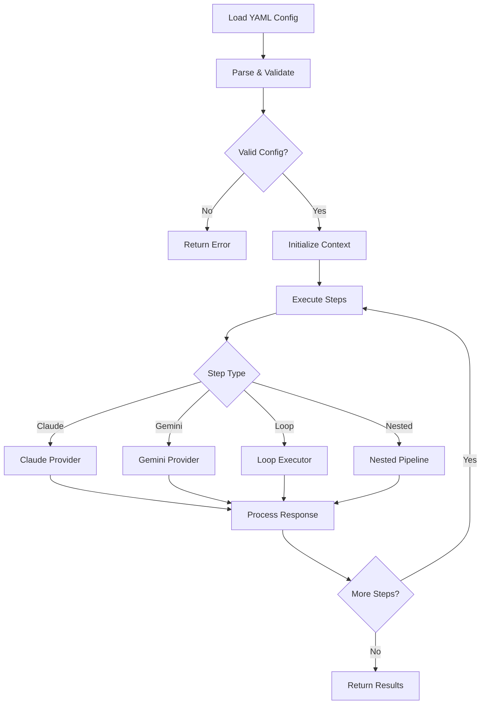
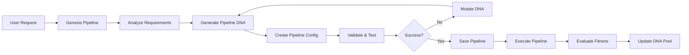
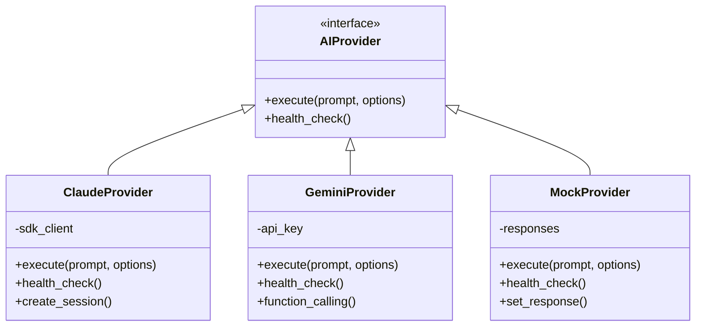
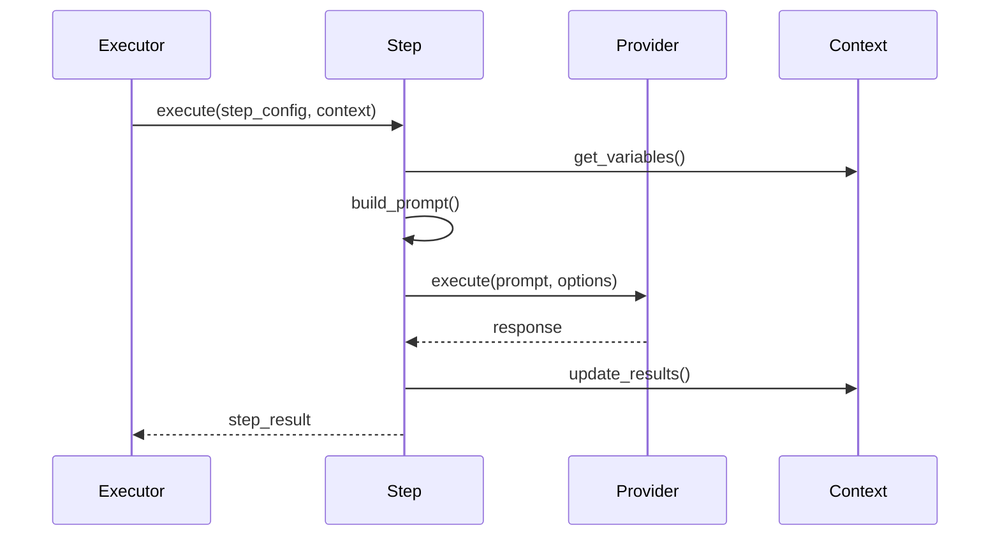
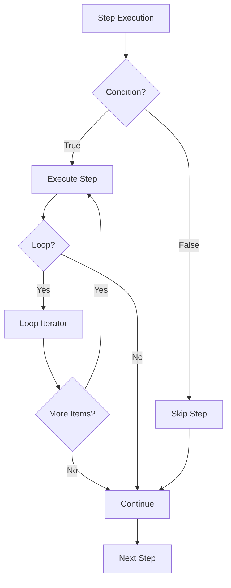
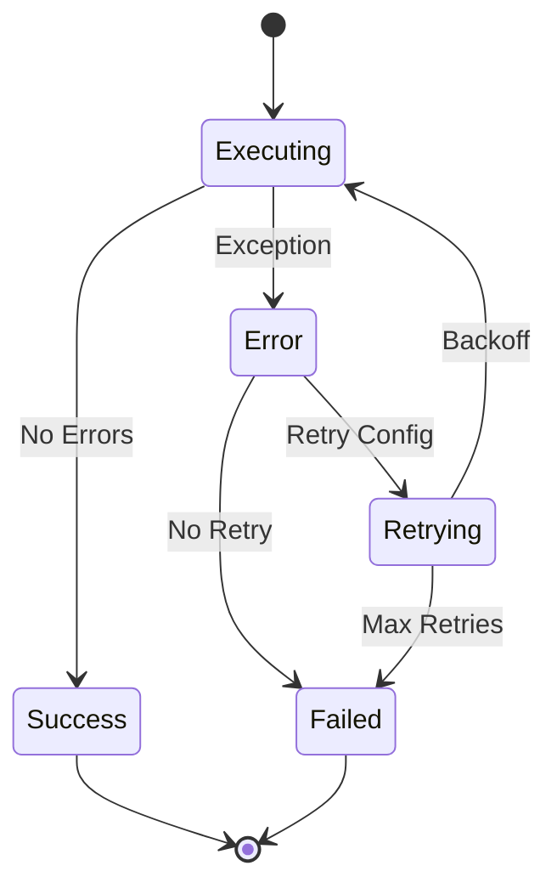
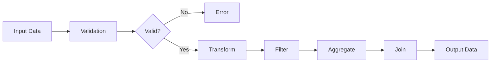

# Pipeline Flow Diagrams

This document provides visual representations of the Pipeline.ex architecture and execution flow using Mermaid diagrams.

## Pipeline Execution Flow

The following diagram shows the overall execution flow of a pipeline:

## Genesis Pipeline Architecture

The Genesis/Meta pipeline system enables self-improving pipelines:

## Provider Architecture

## Step Processing Flow

## Control Flow Features

## Error Handling Flow

## Data Transformation Pipeline

These diagrams provide a visual understanding of the Pipeline.ex system architecture and execution flows.