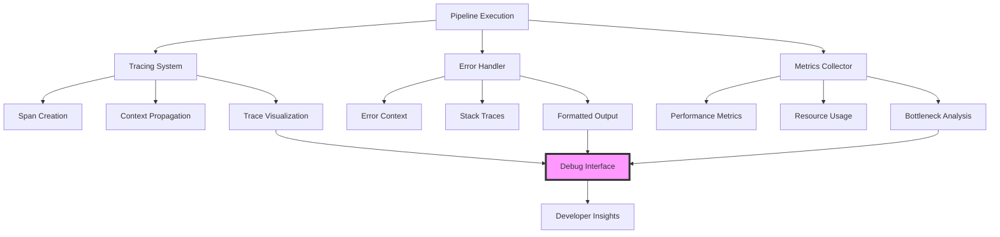

# Developer Experience Guide for Recursive Pipelines

## Table of Contents

1. [Overview](#overview)
2. [Enhanced Error Messages](#enhanced-error-messages)
3. [Execution Tracing](#execution-tracing)
4. [Visual Debugging](#visual-debugging)
5. [Performance Analysis](#performance-analysis)
6. [Interactive Debugging](#interactive-debugging)
7. [Telemetry and Monitoring](#telemetry-and-monitoring)
8. [Development Tools](#development-tools)
9. [Testing and Validation](#testing-and-validation)
10. [Best Practices](#best-practices)
11. [Troubleshooting Guide](#troubleshooting-guide)
12. [API Reference](#api-reference)

## Overview

The recursive pipeline system includes comprehensive developer tools designed to make debugging, monitoring, and optimizing nested pipeline executions intuitive and efficient. These tools provide visibility into complex execution flows and help identify issues quickly.

### Developer Experience Architecture



## Enhanced Error Messages

### Contextual Error Reporting

Errors include complete execution context and actionable information:

```elixir
# Example error with full context
Pipeline execution failed in nested pipeline:

Main Pipeline: data_analysis_workflow
└─ Step: process_data (pipeline)
   └─ Nested Pipeline: data_processor  
      └─ Step: validate_schema (claude)
         └─ Error: Invalid JSON in response

Execution Stack:
  1. data_analysis_workflow.process_data (depth: 0)
     Started: 12:34:56.123
     Duration: 2.5s
     
  2. data_processor.validate_schema (depth: 1)
     Started: 12:34:57.234
     Duration: 1.2s
     Error: JSON parsing failed at position 234

Context at failure:
  - Total steps executed: 12
  - Nesting depth: 1
  - Elapsed time: 4.2s
  - Memory usage: 234MB
  - Last successful step: data_processor.load_data

Available variables:
  - steps.load_data.result: <Map with 3 keys>
  - global_vars.api_key: "***ed45" (redacted)
  - workflow.config.mode: "production"

Debug Information:
  - Trace ID: a1b2c3d4-e5f6-7890-abcd-ef1234567890
  - Parent span: 9f8e7d6c-5b4a-3210-fedc-ba0987654321
  - Log correlation ID: req-123456
  
Recovery suggestions:
  1. Check the JSON structure in validate_schema step
  2. Review the prompt for proper JSON formatting instructions
  3. Add error handling for malformed responses
  4. Use --resume flag to continue from last checkpoint
```

### Error Formatting Options

Configure error output format:

```elixir
# config/dev.exs - Detailed errors for development
config :pipeline, :error_formatting,
  style: :detailed,
  include_variables: true,
  include_suggestions: true,
  color_output: true,
  max_context_depth: 10

# config/prod.exs - Concise errors for production  
config :pipeline, :error_formatting,
  style: :concise,
  include_variables: false,
  include_suggestions: false,
  color_output: false,
  max_context_depth: 3
```

### Custom Error Handlers

Implement custom error formatting:

```elixir
defmodule MyApp.ErrorHandler do
  @behaviour Pipeline.Error.Handler
  
  def format_error(error, context, options) do
    case error do
      %Pipeline.Error.NestedPipeline{} = nested_error ->
        format_nested_error(nested_error, context, options)
        
      %Pipeline.Error.Timeout{} = timeout_error ->
        format_timeout_error(timeout_error, context, options)
        
      _ ->
        Pipeline.Error.NestedPipeline.format_error(error, context, options)
    end
  end
  
  defp format_nested_error(error, context, _options) do
    """
    🚨 Pipeline Error in #{error.pipeline_name}
    
    Location: #{error.step_name} (depth: #{context.depth})
    Message: #{error.message}
    
    Quick Actions:
    - Run `pipeline debug #{context.trace_id}` for details
    - Check logs with correlation ID: #{context.correlation_id}
    """
  end
end
```

## Execution Tracing

### Span-Based Tracing

Every pipeline execution creates a hierarchical span structure:

```elixir
# Span structure
%Span{
  id: "a1b2c3d4",
  parent_id: "9f8e7d6c",
  pipeline_id: "data_processor",
  step_name: "validate",
  start_time: ~U[2025-01-03 12:34:56.123Z],
  end_time: ~U[2025-01-03 12:34:57.456Z],
  duration_ms: 1333,
  status: :success,
  metadata: %{
    depth: 2,
    memory_before_mb: 123.4,
    memory_after_mb: 145.6,
    step_type: "claude",
    tokens_used: 1234
  },
  events: [
    {~U[2025-01-03 12:34:56.500Z], "Starting validation"},
    {~U[2025-01-03 12:34:57.000Z], "API call completed"},
    {~U[2025-01-03 12:34:57.400Z], "Result processed"}
  ]
}
```

### Enabling Tracing

```yaml
# Enable tracing for specific pipelines
- name: "complex_workflow"
  type: "pipeline"
  pipeline_file: "./workflow.yaml"
  config:
    enable_tracing: true
    trace_config:
      capture_inputs: true      # Include input data in spans
      capture_outputs: true     # Include output data
      capture_llm_calls: true   # Trace LLM interactions
      sampling_rate: 1.0        # Trace all executions
```

### Trace Visualization

```elixir
# Generate trace visualization
Pipeline.Tracing.NestedExecution.visualize_trace(trace_id)

# Output:
Execution Trace: a1b2c3d4-e5f6-7890-abcd-ef1234567890
Total Duration: 4,523ms

├─ main_pipeline (4,523ms) ✓
│  ├─ load_data (234ms) ✓
│  │  └─ [file_read] data.json (45ms)
│  ├─ data_processor (3,456ms) ✓
│  │  ├─ validate_schema (1,234ms) ✓
│  │  │  ├─ [claude_api] Validate structure (1,100ms)
│  │  │  └─ [json_parse] Process response (34ms)
│  │  ├─ transform_data (1,567ms) ✓
│  │  │  ├─ [compute] Apply transformations (1,234ms)
│  │  │  └─ [validate] Check results (333ms)
│  │  └─ save_results (655ms) ✓
│  │     └─ [file_write] output.json (623ms)
│  └─ generate_report (833ms) ✓
│     └─ [claude_api] Create summary (812ms)

Performance Indicators:
🟢 Excellent (<100ms)  🟡 Good (<500ms)  🟠 Fair (<2s)  🔴 Poor (>2s)
```

### Distributed Tracing Integration

```elixir
# Integration with OpenTelemetry
config :pipeline, :tracing,
  backend: :opentelemetry,
  service_name: "pipeline_ex",
  exporter: :otlp,
  endpoint: "http://localhost:4317"

# Custom trace attributes
Pipeline.Tracing.add_attributes(%{
  "user.id" => user_id,
  "pipeline.version" => "2.0",
  "deployment.environment" => "production"
})
```

## Visual Debugging

### Interactive Execution Tree

```elixir
# Start interactive debug session
Pipeline.Debug.NestedExecution.start_debug_session(trace_id)

# Interactive commands available:
Pipeline Debug Console v1.0
Trace ID: a1b2c3d4-e5f6-7890-abcd-ef1234567890

Commands:
  tree          - Show execution tree
  inspect <id>  - Inspect specific span
  search <term> - Search spans
  timeline      - Show execution timeline
  perf          - Performance analysis
  vars <id>     - Show variables at span
  errors        - List all errors
  export        - Export trace data
  help          - Show this help
  exit          - Exit debug console

debug> tree

📊 Execution Tree
├─ main_workflow (289.5ms) ✓ [a1b2c3d4]
│  ├─ prepare_data (45.2ms) ✓ [b2c3d4e5]
│  │  ├─ 📝 Input: {source: "api", format: "json"}
│  │  └─ ✅ Output: {records: 1000, valid: true}
│  ├─ analysis_pipeline (198.3ms) ✓ [c3d4e5f6]
│  │  ├─ security_scan (89.1ms) ✓ [d4e5f6g7]
│  │  │  ├─ 🔍 Scanning 1000 records
│  │  │  └─ ✅ No vulnerabilities found
│  │  └─ performance_check (72.4ms) ⚠️ [e5f6g7h8]
│  │     ├─ ⚡ Analyzing query patterns
│  │     └─ ⚠️ Slow query detected: line 45
│  └─ generate_report (46.0ms) ✓ [f6g7h8i9]
│     └─ 📄 Report: report_20250103_123456.pdf

Legend: ✓ Success  ❌ Failed  ⚠️ Warning  🔄 Running
```

### Timeline Visualization

```elixir
debug> timeline

📅 Execution Timeline
──────────────────────────────────────────────────────────
Time     │ Duration │ Pipeline/Step              │ Status
──────────────────────────────────────────────────────────
0ms      │ 45.2ms   │ ▓▓▓▓▓ prepare_data        │ ✓
45.2ms   │ 89.1ms   │ ▓▓▓▓▓▓▓▓▓▓ security_scan  │ ✓
134.3ms  │ 72.4ms   │ ▓▓▓▓▓▓▓▓ performance_check│ ⚠️
206.7ms  │ 36.8ms   │ ▓▓▓▓ code_quality         │ ✓
243.5ms  │ 46.0ms   │ ▓▓▓▓▓ generate_report     │ ✓
──────────────────────────────────────────────────────────
Total: 289.5ms

Parallelism opportunities:
- security_scan and performance_check could run in parallel
- Potential time savings: ~72ms (25%)
```

### Variable Inspector

```elixir
debug> vars c3d4e5f6

📦 Variables at span c3d4e5f6 (analysis_pipeline)

Context Variables:
├─ steps
│  ├─ prepare_data
│  │  └─ result: {records: 1000, valid: true, source: "api"}
│  └─ security_scan
│     └─ result: {vulnerabilities: [], risk_level: "low"}
├─ global_vars
│  ├─ api_endpoint: "https://api.example.com"
│  ├─ auth_token: "***4567" (redacted)
│  └─ scan_config: {depth: "full", exclude: ["tests"]}
└─ workflow
   ├─ name: "security_audit"
   └─ config: {environment: "staging", parallel: true}

Local Variables:
├─ current_step: "performance_check"
├─ accumulated_issues: []
└─ scan_metadata: {start_time: "12:34:56", records_processed: 567}
```

## Performance Analysis

### Automated Performance Analysis

```elixir
# Analyze performance for execution
Pipeline.Metrics.NestedPerformance.analyze_performance(execution_id)

# Returns detailed analysis:
%{
  overall_metrics: %{
    total_duration_ms: 4523.7,
    total_steps: 24,
    success_rate: 0.958,  # 23/24 succeeded
    max_depth: 3,
    parallelism_score: 0.45  # 45% of time was parallel
  },
  
  depth_metrics: %{
    0 => %{
      steps: 5,
      avg_duration_ms: 567.3,
      max_duration_ms: 1234.5,
      success_rate: 1.0
    },
    1 => %{
      steps: 12,
      avg_duration_ms: 234.6,
      max_duration_ms: 567.8,
      success_rate: 0.917
    },
    2 => %{
      steps: 7,
      avg_duration_ms: 123.4,
      max_duration_ms: 234.5,
      success_rate: 1.0
    }
  },
  
  bottlenecks: [
    %{
      pipeline: "data_processor",
      step: "large_file_transform",
      duration_ms: 1234.5,
      percentage_of_total: 27.3,
      suggestions: [
        "Consider streaming for large files",
        "Implement parallel processing",
        "Add caching for repeated transformations"
      ]
    },
    %{
      pipeline: "api_caller",
      step: "batch_request",
      duration_ms: 890.1,
      percentage_of_total: 19.7,
      suggestions: [
        "Batch API calls more efficiently",
        "Implement request pooling",
        "Consider async processing"
      ]
    }
  ],
  
  performance_grade: :fair,  # :excellent | :good | :fair | :poor
  
  recommendations: [
    "Enable parallel execution for independent steps",
    "Implement caching for expensive operations",
    "Consider breaking large_file_transform into smaller chunks",
    "Review API rate limits and optimize batch sizes"
  ],
  
  resource_usage: %{
    peak_memory_mb: 456.7,
    avg_memory_mb: 234.5,
    cpu_usage_percent: 67.8,
    io_wait_percent: 23.4
  }
}
```

### Performance Grading System

```elixir
# Performance grades based on execution characteristics
defmodule Pipeline.Metrics.PerformanceGrader do
  def calculate_grade(metrics) do
    scores = %{
      duration: score_duration(metrics.avg_duration_ms),
      memory: score_memory(metrics.peak_memory_mb),
      success: score_success_rate(metrics.success_rate),
      efficiency: score_efficiency(metrics.parallelism_score)
    }
    
    weighted_average = 
      scores.duration * 0.4 +
      scores.memory * 0.2 +
      scores.success * 0.3 +
      scores.efficiency * 0.1
      
    cond do
      weighted_average >= 0.9 -> :excellent
      weighted_average >= 0.7 -> :good
      weighted_average >= 0.5 -> :fair
      true -> :poor
    end
  end
end
```

### Performance Monitoring Dashboard

```yaml
# Enable performance dashboard
config:
  performance_monitoring:
    enabled: true
    dashboard_port: 4000
    metrics_retention_days: 30
    
# Access dashboard at http://localhost:4000/pipeline/metrics
```

Dashboard features:
- Real-time execution monitoring
- Historical performance trends
- Resource usage graphs
- Bottleneck identification
- SLA tracking

## Interactive Debugging

### Debug REPL

```elixir
# Start interactive debug REPL
iex> Pipeline.Debug.start_repl(execution_id)

Pipeline Debug REPL
Connected to execution: a1b2c3d4-e5f6-7890
Type 'help' for commands

debug> current_state
%{
  pipeline: "data_processor",
  step: "transform_data",
  status: :running,
  elapsed: 234.5,
  memory_mb: 123.4
}

debug> breakpoint "validate_results"
Breakpoint set at validate_results
Execution will pause when reached

debug> continue
Continuing execution...
⏸️ Paused at breakpoint: validate_results

debug> inspect_vars
%{
  "transformed_data" => %{size: 1000, format: "json"},
  "validation_rules" => ["required_fields", "data_types"],
  "previous_errors" => []
}

debug> step_over
Executing validate_results...
✓ Step completed successfully

debug> watch "memory_mb > 500"
Watch expression added
Will notify when memory exceeds 500MB
```

### Debugging Configuration

```yaml
# Enable debugging features
- name: "debuggable_pipeline"
  type: "pipeline"
  pipeline_file: "./complex_workflow.yaml"
  config:
    debug:
      enabled: true
      breakpoints: ["critical_step", "after_transform"]
      watch_expressions: 
        - "steps.transform.result.error != null"
        - "context.memory_mb > 800"
      pause_on_error: true
      interactive_mode: true
```

### Remote Debugging

```elixir
# Enable remote debugging
config :pipeline, :debug,
  remote_enabled: true,
  debug_port: 9999,
  allowed_ips: ["127.0.0.1", "10.0.0.0/8"],
  auth_token: System.get_env("DEBUG_TOKEN")

# Connect from remote machine
$ pipeline debug connect --host prod-server --port 9999 --token $DEBUG_TOKEN
Connected to remote pipeline debugger
Active executions: 3

Select execution to debug:
1. data_processor_20250103_123456 (running)
2. report_generator_20250103_123500 (paused)
3. api_sync_20250103_123600 (completed)
```

## Telemetry and Monitoring

### Built-in Telemetry Events

```elixir
# Comprehensive telemetry events for monitoring
:telemetry.execute(
  [:pipeline, :nested, :start],
  %{system_time: System.system_time()},
  %{
    pipeline_id: pipeline_id,
    parent_id: parent_id,
    depth: depth,
    step_count: length(pipeline.steps)
  }
)

# Available events:
[:pipeline, :nested, :start]         # Pipeline execution started
[:pipeline, :nested, :stop]          # Pipeline execution completed
[:pipeline, :nested, :error]         # Pipeline execution failed
[:pipeline, :span, :start]           # Span started
[:pipeline, :span, :stop]            # Span completed
[:pipeline, :span, :event]           # Span event logged
[:pipeline, :debug, :breakpoint]     # Breakpoint hit
[:pipeline, :debug, :watch]          # Watch expression triggered
[:pipeline, :performance, :warning]   # Performance threshold exceeded
[:pipeline, :resource, :pressure]     # Resource pressure detected
```

### Custom Telemetry Handlers

```elixir
defmodule MyApp.PipelineTelemetry do
  def attach_handlers do
    :telemetry.attach_many(
      "my-app-pipeline-handler",
      [
        [:pipeline, :nested, :start],
        [:pipeline, :nested, :stop],
        [:pipeline, :performance, :warning]
      ],
      &handle_event/4,
      nil
    )
  end
  
  def handle_event([:pipeline, :nested, :stop], measurements, metadata, _config) do
    duration_ms = measurements.duration / 1_000_000
    
    # Log to metrics system
    StatsD.timing("pipeline.execution.duration", duration_ms, 
      tags: [
        "pipeline:#{metadata.pipeline_id}",
        "depth:#{metadata.depth}"
      ]
    )
    
    # Alert on slow executions
    if duration_ms > 5000 do
      AlertManager.send_alert(%{
        type: :slow_pipeline,
        pipeline: metadata.pipeline_id,
        duration_ms: duration_ms
      })
    end
  end
end
```

### Metrics Export

```elixir
# Configure metrics export
config :pipeline, :metrics,
  exporters: [
    {Pipeline.Metrics.Prometheus, port: 9090},
    {Pipeline.Metrics.StatsD, host: "localhost", port: 8125},
    {Pipeline.Metrics.CloudWatch, region: "us-east-1"}
  ],
  
  # Metrics to collect
  collect: [
    :execution_duration,
    :step_duration,
    :memory_usage,
    :error_rate,
    :depth_distribution,
    :resource_usage
  ]
```

## Development Tools

### Pipeline Development CLI

```bash
# Development commands
$ pipeline dev validate ./my_pipeline.yaml
✓ Syntax valid
✓ All referenced files exist
✓ No circular dependencies detected
⚠️ Warning: Deep nesting at step 'analyze' (depth: 6)

$ pipeline dev analyze ./my_pipeline.yaml
Pipeline Analysis: my_pipeline
- Total steps: 45
- Max depth: 6
- Estimated duration: 2-5 minutes
- Memory requirement: ~500MB
- External calls: 12 (8 Claude, 4 API)

$ pipeline dev visualize ./my_pipeline.yaml --output graph.png
Generated pipeline visualization: graph.png

$ pipeline dev profile ./my_pipeline.yaml --iterations 5
Running 5 iterations for profiling...
Average duration: 3,456ms
Std deviation: 234ms
Bottlenecks identified:
1. data_transform step (45% of total time)
2. api_batch_call step (23% of total time)
```

### VS Code Extension

Install the Pipeline Developer extension for:
- Syntax highlighting for pipeline YAML
- Inline error detection
- Go to definition for pipeline references
- Hover documentation
- Debugging integration
- Performance hints

### Development Mode Features

```yaml
# Enable development mode
config:
  development_mode: true
  dev_features:
    hot_reload: true           # Reload pipelines on change
    verbose_logging: true      # Detailed execution logs
    mock_llm_calls: true      # Use mock responses
    synthetic_delays: false    # Add artificial delays
    record_replay: true       # Record/replay executions
```

## Testing and Validation

### Pipeline Testing Framework

```elixir
defmodule MyPipelineTest do
  use Pipeline.TestCase
  
  describe "nested pipeline execution" do
    test "processes data correctly through multiple levels" do
      # Setup test data
      input = %{data: [1, 2, 3, 4, 5]}
      
      # Execute pipeline with test helpers
      result = execute_pipeline("./pipelines/processor.yaml", 
        inputs: input,
        mock_llm: true,
        max_depth: 3
      )
      
      # Assert execution succeeded
      assert result.status == :success
      assert result.depth_reached == 2
      assert length(result.steps_executed) == 15
      
      # Verify specific outputs
      assert result.outputs.processed_count == 5
      assert result.outputs.validation_passed == true
      
      # Check performance
      assert result.duration_ms < 1000
      assert result.memory_peak_mb < 100
    end
    
    test "handles errors gracefully at depth 3" do
      # Test error propagation
      result = execute_pipeline("./pipelines/error_test.yaml",
        inputs: %{trigger_error_at_depth: 3}
      )
      
      assert result.status == :error
      assert result.error.depth == 3
      assert result.error.message =~ "Simulated error"
      
      # Verify partial results were preserved
      assert result.completed_steps == ["step1", "step2"]
    end
  end
end
```

### Mock Execution Mode

```yaml
# Use mocks for testing
- name: "test_pipeline"
  type: "pipeline"
  pipeline_file: "./processor.yaml"
  config:
    mock_mode: true
    mock_responses:
      "validate_step": {status: "valid", score: 95}
      "transform_step": {result: "transformed_data"}
    mock_delays:
      "api_call": 100  # Simulate 100ms delay
```

### Validation Tools

```elixir
# Validate pipeline before execution
case Pipeline.Validator.validate_pipeline(pipeline_config) do
  {:ok, validated_config} ->
    Pipeline.execute(validated_config)
    
  {:error, validation_errors} ->
    Enum.each(validation_errors, fn error ->
      IO.puts("Validation error: #{error.message}")
      IO.puts("  Location: #{error.path}")
      IO.puts("  Suggestion: #{error.suggestion}")
    end)
end
```

## Best Practices

### 1. Structured Logging

```elixir
# Use structured logging for better debugging
Logger.info("Pipeline execution started",
  pipeline_id: pipeline_id,
  parent_id: parent_id,
  depth: depth,
  input_size: byte_size(input_data),
  trace_id: trace_id
)

# Configure log aggregation
config :logger,
  backends: [
    {LoggerJSON.Formatters.Datadog, :datadog},
    {Logger.Backends.Console, :console}
  ]
```

### 2. Error Context Preservation

```yaml
# Preserve context for debugging
- name: "process_with_context"
  type: "pipeline"
  pipeline_file: "./processor.yaml"
  config:
    preserve_error_context: true
    error_context_fields:
      - "input_data"
      - "previous_results"
      - "execution_metadata"
```

### 3. Performance Budgets

```yaml
# Set performance budgets
config:
  performance_budgets:
    total_duration_ms: 5000
    step_duration_ms: 1000
    memory_usage_mb: 512
    
  on_budget_exceeded:
    action: "warn"  # warn | error | abort
    notify: ["ops-team@example.com"]
```

### 4. Debug-Friendly Pipeline Design

```yaml
# Design pipelines for debuggability
workflow:
  name: "debuggable_workflow"
  metadata:
    version: "1.2.3"
    owner: "data-team"
    sla_ms: 5000
    
  # Add checkpoints for debugging
  steps:
    - name: "checkpoint_1"
      type: "claude"
      prompt: "Log state: {{json(context)}}"
      metadata:
        checkpoint: true
        
    - name: "main_processing"
      type: "pipeline"
      pipeline_file: "./processor.yaml"
      
    - name: "checkpoint_2"
      type: "claude"
      prompt: "Verify results: {{json(steps)}}"
      metadata:
        checkpoint: true
```

### 5. Monitoring Integration

```elixir
# Integrate with monitoring systems
defmodule Pipeline.Monitoring do
  def setup do
    # Datadog APM
    DatadogAPM.trace("pipeline.execution") do
      Pipeline.execute(config)
    end
    
    # Custom metrics
    StatsD.increment("pipeline.executions.total",
      tags: ["pipeline:#{name}", "env:#{env}"]
    )
    
    # Health checks
    HealthCheck.register(:pipeline_executor,
      fn -> check_pipeline_health() end
    )
  end
end
```

## Troubleshooting Guide

### Common Issues and Solutions

#### 1. Missing Trace Information

**Problem**: Traces not showing complete information

**Solution**:
```yaml
config:
  tracing:
    capture_all: true
    include_sensitive: false  # Be careful in production
    max_span_attributes: 100
    sampling_rate: 1.0       # Capture all in dev
```

#### 2. Debug Session Not Connecting

**Problem**: Can't connect to debug session

**Diagnostic**:
```bash
# Check if debug server is running
$ pipeline debug status
Debug server: inactive

# Start debug server
$ pipeline debug server --port 9999

# Verify connection
$ netstat -an | grep 9999
tcp 0.0.0.0:9999 LISTEN
```

#### 3. Performance Metrics Missing

**Problem**: Performance analysis returns incomplete data

**Solution**:
```elixir
# Enable comprehensive metrics collection
config :pipeline, :metrics,
  collect_all: true,
  resolution_ms: 10,
  persist_to_disk: true,
  retention_hours: 24
```

#### 4. Large Trace Data

**Problem**: Traces too large for analysis

**Solution**:
```yaml
config:
  tracing:
    max_trace_size_mb: 10
    compression: :gzip
    filter_large_fields: true
    summarize_arrays: true  # Replace large arrays with summaries
```

### Debug Checklist

When debugging pipeline issues:

1. **Enable comprehensive logging**
   ```elixir
   Logger.configure(level: :debug)
   ```

2. **Check execution traces**
   ```bash
   pipeline trace show <trace_id>
   ```

3. **Review resource usage**
   ```bash
   pipeline metrics <execution_id>
   ```

4. **Inspect error context**
   ```bash
   pipeline errors <execution_id> --full-context
   ```

5. **Analyze performance**
   ```bash
   pipeline perf analyze <execution_id>
   ```

6. **Export debug data**
   ```bash
   pipeline debug export <execution_id> --output debug_bundle.zip
   ```

## API Reference

### Debug API

```elixir
# Start debug session
Pipeline.Debug.NestedExecution.start_debug_session(trace_context, options \\ [])

# Inspect execution state
Pipeline.Debug.NestedExecution.inspect_span(span_id)
Pipeline.Debug.NestedExecution.get_variables_at_span(span_id)
Pipeline.Debug.NestedExecution.get_execution_tree(trace_id)

# Interactive debugging
Pipeline.Debug.NestedExecution.set_breakpoint(pipeline_id, step_name)
Pipeline.Debug.NestedExecution.remove_breakpoint(breakpoint_id)
Pipeline.Debug.NestedExecution.continue_execution(session_id)
Pipeline.Debug.NestedExecution.step_over(session_id)

# Performance analysis
Pipeline.Metrics.NestedPerformance.analyze_performance(execution_id)
Pipeline.Metrics.NestedPerformance.get_bottlenecks(execution_id, top_n \\ 5)
Pipeline.Metrics.NestedPerformance.calculate_grade(metrics)
```

### Tracing API

```elixir
# Span management
Pipeline.Tracing.NestedExecution.start_span(name, attributes \\ %{})
Pipeline.Tracing.NestedExecution.end_span(span_id, status \\ :ok)
Pipeline.Tracing.NestedExecution.add_span_event(span_id, event_name, attributes)
Pipeline.Tracing.NestedExecution.set_span_attributes(span_id, attributes)

# Trace context
Pipeline.Tracing.NestedExecution.get_current_trace_context()
Pipeline.Tracing.NestedExecution.with_trace_context(context, fun)

# Visualization
Pipeline.Tracing.NestedExecution.visualize_trace(trace_id, format \\ :tree)
Pipeline.Tracing.NestedExecution.export_trace(trace_id, format \\ :otlp)
```

### Error Formatting API

```elixir
# Error formatting
Pipeline.Error.NestedPipeline.format_error(error, context, options \\ [])
Pipeline.Error.NestedPipeline.format_stack_trace(execution_chain)
Pipeline.Error.NestedPipeline.add_suggestions(error, context)

# Error context
Pipeline.Error.NestedPipeline.capture_error_context(error, context)
Pipeline.Error.NestedPipeline.get_error_metadata(error)
```

### Telemetry Configuration

```elixir
# Telemetry event structure
%{
  event: [:pipeline, :nested, :stop],
  measurements: %{
    duration: 1_234_567_890,  # nanoseconds
    memory_delta: 12_345_678   # bytes
  },
  metadata: %{
    pipeline_id: "processor",
    trace_id: "abc123",
    span_id: "def456",
    parent_span_id: "ghi789",
    depth: 2,
    status: :success,
    step_count: 15
  }
}
```

---

This guide provides comprehensive documentation for the developer experience features in recursive pipelines. These tools enable efficient debugging, monitoring, and optimization of complex nested pipeline executions.