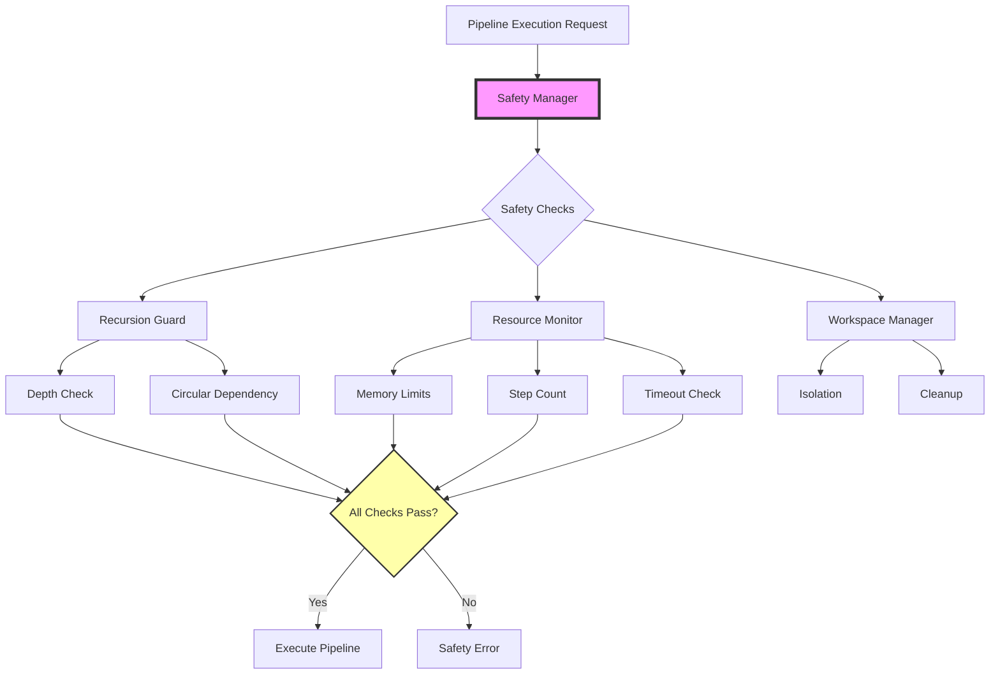

# Safety Features Guide for Recursive Pipelines

## Table of Contents

1. [Overview](#overview)
2. [Recursion Protection](#recursion-protection)
3. [Circular Dependency Detection](#circular-dependency-detection)
4. [Resource Management](#resource-management)
5. [Memory Monitoring](#memory-monitoring)
6. [Timeout Protection](#timeout-protection)
7. [Step Count Limits](#step-count-limits)
8. [Workspace Isolation](#workspace-isolation)
9. [Configuration Management](#configuration-management)
10. [Monitoring and Alerts](#monitoring-and-alerts)
11. [Best Practices](#best-practices)
12. [Troubleshooting](#troubleshooting)
13. [API Reference](#api-reference)

## Overview

The recursive pipeline system includes comprehensive safety mechanisms designed to prevent common failure modes in nested execution scenarios. These safety features ensure system stability, prevent resource exhaustion, and provide clear feedback when limits are reached.

### Safety Architecture



## Recursion Protection

### Depth Limiting

Control maximum nesting depth to prevent stack overflow and resource exhaustion:

#### Configuration

```elixir
# config/dev.exs - Development environment
config :pipeline,
  max_nesting_depth: 15,      # More permissive for experimentation
  depth_warning_threshold: 10  # Warn at 10 levels

# config/test.exs - Test environment  
config :pipeline,
  max_nesting_depth: 5,       # Restricted for fast tests
  depth_warning_threshold: 3   # Early warnings

# config/prod.exs - Production environment
config :pipeline,
  max_nesting_depth: 8,       # Conservative for stability
  depth_warning_threshold: 5   # Warn at 5 levels
```

#### Per-Pipeline Override

```yaml
# Override global depth limit for specific pipeline
- name: "deep_analysis"
  type: "pipeline"
  pipeline_file: "./analyzer.yaml"
  config:
    max_depth: 10  # Override default limit
    warn_at_depth: 7
```

#### Depth Tracking

The system maintains execution depth across the entire call chain:

```elixir
# Execution context tracks depth
%Context{
  depth: 3,
  execution_chain: [
    "main_workflow",
    "data_processor", 
    "validation_pipeline",
    "schema_checker"  # Current
  ]
}
```

#### Error Messages

Clear error reporting when depth limits are exceeded:

```
Error: Maximum nesting depth (8) exceeded

Execution chain (9 levels):
  1. main_workflow (depth: 0)
  2. ├─ data_preparation (depth: 1)
  3. │  └─ validation_suite (depth: 2)
  4. │     └─ schema_validation (depth: 3)
  5. │        └─ deep_validator (depth: 4)
  6. │           └─ field_checker (depth: 5)
  7. │              └─ type_validator (depth: 6)
  8. │                 └─ complex_rules (depth: 7)
  9. │                    └─ nested_check (depth: 8) ← Limit exceeded

Configuration:
  - Maximum depth: 8
  - Current depth: 9
  - Environment: production

Suggestions:
  - Refactor deep nesting into flatter structure
  - Increase max_depth in configuration if needed
  - Consider breaking into multiple sequential pipelines
```

## Circular Dependency Detection

### How It Works

The system tracks the execution chain to detect when a pipeline attempts to call itself:

```elixir
# RecursionGuard tracks pipeline paths
defmodule Pipeline.Safety.RecursionGuard do
  def check_circular_dependency(pipeline_id, context) do
    execution_chain = get_execution_chain(context)
    
    if pipeline_id in execution_chain do
      {:error, format_circular_error(pipeline_id, execution_chain)}
    else
      :ok
    end
  end
end
```

### Detection Examples

#### Direct Circular Reference

```yaml
# pipeline_a.yaml
steps:
  - name: "process"
    type: "claude"
    prompt: "Process data"
  
  - name: "recurse"
    type: "pipeline"
    pipeline_file: "./pipeline_a.yaml"  # ERROR: Self-reference
```

Error:
```
Error: Circular dependency detected
  Pipeline 'pipeline_a' is already in the execution chain
  
  Circular path:
    pipeline_a → pipeline_a
```

#### Indirect Circular Reference

```yaml
# pipeline_a.yaml
- name: "call_b"
  type: "pipeline"
  pipeline_file: "./pipeline_b.yaml"

# pipeline_b.yaml
- name: "call_c"
  type: "pipeline"
  pipeline_file: "./pipeline_c.yaml"

# pipeline_c.yaml
- name: "call_a"
  type: "pipeline"
  pipeline_file: "./pipeline_a.yaml"  # ERROR: Circular through chain
```

Error:
```
Error: Circular dependency detected in pipeline execution

Execution creates a cycle:
  main → pipeline_a → pipeline_b → pipeline_c → pipeline_a
           ↑                                        ↓
           └────────────────────────────────────────┘

Execution chain:
  1. main (depth: 0)
  2. pipeline_a (depth: 1) ← First occurrence
  3. pipeline_b (depth: 2)
  4. pipeline_c (depth: 3)
  5. pipeline_a (depth: 4) ← Circular reference detected

Resolution:
  - Review pipeline dependencies
  - Break circular reference
  - Consider extracting shared logic
```

### Allowed Patterns

Self-reference is allowed with proper termination conditions:

```yaml
# Recursive directory processor (allowed)
workflow:
  name: "directory_scanner"
  steps:
    - name: "scan_current"
      type: "claude"
      prompt: "List items in: {{inputs.path}}"
    
    - name: "process_subdirs"
      type: "for_loop"
      over: "{{steps.scan_current.subdirectories}}"
      as: "subdir"
      steps:
        - name: "recurse"
          type: "pipeline"
          pipeline_ref: "directory_scanner"  # Self-reference
          condition: "{{context.depth < 5}}"  # Termination condition
          inputs:
            path: "{{subdir.path}}"
```

## Resource Management

### Memory Monitoring

Real-time memory usage tracking with configurable limits:

#### Configuration

```elixir
# Global configuration
config :pipeline,
  default_memory_limit_mb: 1024,      # 1GB default
  memory_check_interval_ms: 1000,     # Check every second
  memory_warning_percentage: 75       # Warn at 75% usage
```

#### Per-Pipeline Limits

```yaml
- name: "memory_intensive"
  type: "pipeline"
  pipeline_file: "./processor.yaml"
  config:
    memory_limit_mb: 2048        # 2GB limit
    memory_warning_mb: 1536      # Warn at 1.5GB
    memory_check_enabled: true
```

#### Memory Pressure Handling

The system monitors memory usage and provides warnings:

```
Warning: High memory usage detected
  Pipeline: data_processor (depth: 2)
  Current usage: 850MB / 1024MB (83%)
  Parent pipeline: main_workflow
  
  Memory breakdown:
    - Context data: 450MB
    - Step results: 300MB  
    - Workspace files: 100MB
    
  Recommendations:
    - Consider streaming large datasets
    - Clear intermediate results after use
    - Increase memory limit if needed
```

#### Automatic Cleanup

Configure automatic cleanup of large data:

```yaml
config:
  auto_cleanup:
    enabled: true
    threshold_mb: 100           # Clean results > 100MB
    keep_final_result: true     # Preserve final output
    cleanup_on_success: true    # Clean intermediate data
```

### Resource Pooling

Efficient resource management through pooling:

```elixir
# Resource pool configuration
config :pipeline,
  resource_pools:
    context_pool:
      size: 50
      overflow: 10
      strategy: :lifo
    workspace_pool:
      size: 20
      overflow: 5
      cleanup_on_return: true
```

## Memory Monitoring

### Memory Usage Tracking

The ResourceMonitor module tracks memory usage across all nested pipelines:

```elixir
# Memory tracking structure
%MemoryUsage{
  current_mb: 456.7,
  peak_mb: 512.3,
  limit_mb: 1024,
  breakdown: %{
    contexts: 234.5,
    results: 189.2,
    workspaces: 33.0
  },
  history: [
    {~U[2025-01-03 12:00:00Z], 123.4},
    {~U[2025-01-03 12:00:01Z], 234.5},
    # ...
  ]
}
```

### Memory Limits and Actions

Define actions when memory limits are approached:

```yaml
config:
  memory_limits:
    soft_limit_mb: 768         # Warning threshold
    hard_limit_mb: 1024        # Execution stops
    
  memory_actions:
    at_50_percent:
      - log_warning
    at_75_percent:
      - log_warning
      - trigger_gc
      - clear_caches
    at_90_percent:
      - log_error
      - pause_execution
      - await_cleanup
    at_100_percent:
      - terminate_execution
      - cleanup_all
      - return_error
```

### Memory Optimization Strategies

```yaml
# 1. Streaming Results
- name: "process_large_data"
  type: "pipeline"
  pipeline_file: "./stream_processor.yaml"
  config:
    stream_results: true
    chunk_size_mb: 10
    
# 2. Result Pruning
- name: "analyze"
  type: "pipeline"
  pipeline_file: "./analyzer.yaml"
  config:
    prune_results:
      keep_fields: ["summary", "score"]
      remove_fields: ["raw_data", "intermediate"]
      
# 3. Garbage Collection
- name: "memory_intensive"
  type: "pipeline"
  pipeline_file: "./processor.yaml"
  config:
    gc_after_steps: ["large_transform", "aggregation"]
    gc_threshold_mb: 500
```

## Timeout Protection

### Execution Time Limits

Prevent runaway pipelines with configurable timeouts:

#### Global Configuration

```elixir
config :pipeline,
  default_timeout_seconds: 300,        # 5 minutes default
  timeout_check_interval_ms: 1000,     # Check every second
  timeout_grace_period_seconds: 10     # Grace period for cleanup
```

#### Pipeline-Specific Timeouts

```yaml
- name: "long_running_analysis"
  type: "pipeline"
  pipeline_file: "./analysis.yaml"
  config:
    timeout_seconds: 600        # 10 minutes
    timeout_warning_seconds: 480 # Warn at 8 minutes
    on_timeout: "graceful"      # graceful | immediate | retry
```

### Timeout Handling Strategies

#### Graceful Timeout

```yaml
config:
  timeout_seconds: 300
  on_timeout: "graceful"
  graceful_timeout:
    save_checkpoint: true
    cleanup_resources: true
    return_partial_results: true
```

#### Immediate Timeout

```yaml
config:
  timeout_seconds: 300
  on_timeout: "immediate"
  immediate_timeout:
    force_stop: true
    skip_cleanup: false  # Still attempt cleanup
```

#### Retry on Timeout

```yaml
config:
  timeout_seconds: 300
  on_timeout: "retry"
  retry_config:
    max_attempts: 3
    backoff_factor: 2
    increase_timeout: true  # Double timeout on retry
```

### Timeout Error Messages

```
Error: Pipeline execution timeout

Details:
  Pipeline: complex_analysis (depth: 2)
  Elapsed time: 301.5 seconds
  Timeout limit: 300 seconds
  
Execution progress:
  - Completed steps: 45/60 (75%)
  - Current step: deep_learning_analysis
  - Step duration: 125.3 seconds
  
Partial results saved: true
Checkpoint available: true
  
Recovery options:
  1. Resume from checkpoint with --resume flag
  2. Increase timeout in configuration
  3. Optimize slow steps identified above
```

## Step Count Limits

### Preventing Exponential Growth

Limit total steps across all nested pipelines:

```elixir
config :pipeline,
  max_total_steps: 1000,              # Total across all pipelines
  step_warning_threshold: 750,         # Warn at 75%
  count_nested_steps: true            # Include nested pipeline steps
```

### Step Counting Logic

```elixir
# Steps are counted across all nesting levels
def count_total_steps(pipeline, context) do
  direct_steps = length(pipeline.steps)
  
  nested_steps = Enum.sum(
    for step <- pipeline.steps,
        step.type == "pipeline" do
      count_nested_pipeline_steps(step, context)
    end
  )
  
  direct_steps + nested_steps
end
```

### Step Count Monitoring

```yaml
# Monitor step explosion in complex pipelines
- name: "analyze_all_files"
  type: "for_loop"
  over: "{{file_list}}"  # 100 files
  steps:
    - name: "process_file"
      type: "pipeline"
      pipeline_file: "./file_processor.yaml"  # 20 steps each
      config:
        max_total_steps: 2500  # Override for this use case
```

Warning output:
```
Warning: Approaching step count limit
  Current steps: 1,750 / 2,000 (87.5%)
  
  Step breakdown by pipeline:
    - main_workflow: 5 steps
    - file_processor (x87): 1,740 steps
    - cleanup_pipeline: 5 steps
    
  Largest contributors:
    1. file_processor.deep_analysis: 522 steps (30%)
    2. file_processor.validation: 348 steps (20%)
    3. file_processor.transformation: 261 steps (15%)
```

## Workspace Isolation

### Isolated Execution Environments

Each nested pipeline gets its own workspace:

```yaml
config:
  workspace_isolation:
    enabled: true
    base_dir: "./workspaces"
    naming_pattern: "${pipeline_id}_${timestamp}"
    permissions: "0750"
```

### Workspace Structure

```
workspaces/
├── main_workflow_1704288000/
│   ├── .metadata.json
│   ├── inputs/
│   ├── outputs/
│   └── temp/
├── nested_processor_1704288030/
│   ├── .metadata.json
│   ├── inputs/
│   ├── outputs/
│   └── temp/
```

### Workspace Lifecycle

```yaml
# Workspace configuration
- name: "isolated_execution"
  type: "pipeline"
  pipeline_file: "./processor.yaml"
  config:
    workspace:
      create_on_start: true
      cleanup_on_success: true
      cleanup_on_error: false  # Keep for debugging
      preserve_outputs: true   # Copy outputs before cleanup
      max_size_mb: 500        # Limit workspace size
```

### Workspace Security

```elixir
# Security measures for workspace isolation
config :pipeline,
  workspace_security:
    enforce_isolation: true,
    prevent_traversal: true,
    sandbox_commands: true,
    allowed_paths: [
      "./workspaces/",
      "./shared/resources/"
    ],
    blocked_paths: [
      "/etc/",
      "/usr/",
      "~/"
    ]
```

## Configuration Management

### Environment-Specific Configuration

```elixir
# config/dev.exs
config :pipeline, :safety,
  recursion:
    max_depth: 15,
    warning_depth: 10
  memory:
    limit_mb: 2048,
    warning_percent: 70
  timeout:
    default_seconds: 600,
    warning_seconds: 480
  development_mode: true,
  relaxed_limits: true

# config/prod.exs  
config :pipeline, :safety,
  recursion:
    max_depth: 8,
    warning_depth: 5
  memory:
    limit_mb: 1024,
    warning_percent: 75
  timeout:
    default_seconds: 300,
    warning_seconds: 240
  production_mode: true,
  strict_enforcement: true
```

### Runtime Configuration

Override safety settings at runtime:

```elixir
# Via environment variables
PIPELINE_MAX_DEPTH=10 mix pipeline.run workflow.yaml

# Via CLI flags
mix pipeline.run workflow.yaml \
  --max-depth 10 \
  --memory-limit 2048 \
  --timeout 600
```

### Configuration Validation

The system validates safety configurations:

```elixir
# Invalid configuration detected
Error: Invalid safety configuration
  
  Issues found:
    - max_depth (3) is less than minimum (5)
    - memory_limit (100MB) is below minimum (256MB)
    - timeout (30s) is below minimum (60s)
    
  Please adjust configuration to meet minimum safety requirements
```

## Monitoring and Alerts

### Telemetry Integration

```elixir
# Attach to safety-related telemetry events
:telemetry.attach_many(
  "pipeline-safety-monitoring",
  [
    [:pipeline, :safety, :limit_warning],
    [:pipeline, :safety, :limit_exceeded],
    [:pipeline, :safety, :resource_pressure],
    [:pipeline, :safety, :check_performed]
  ],
  &handle_safety_event/4,
  nil
)
```

### Safety Metrics

Export safety metrics for monitoring:

```elixir
# Prometheus metrics
pipeline_safety_checks_total{type="recursion", result="pass"} 1523
pipeline_safety_checks_total{type="recursion", result="fail"} 12
pipeline_safety_limit_warnings{type="memory", level="75_percent"} 45
pipeline_safety_limit_exceeded{type="timeout"} 3
pipeline_max_depth_reached{pipeline="analyzer"} 7
pipeline_memory_usage_bytes{pipeline="processor", percentile="95"} 892739584
```

### Alert Configuration

```yaml
# Alert when safety limits are approached
alerts:
  - name: "high_memory_usage"
    condition: "memory_usage_percent > 80"
    severity: "warning"
    actions:
      - log_warning
      - send_notification
      
  - name: "depth_limit_approached"
    condition: "current_depth > max_depth * 0.8"
    severity: "warning"
    actions:
      - log_warning
      - add_metric
      
  - name: "timeout_imminent"
    condition: "elapsed_time > timeout * 0.9"
    severity: "critical"
    actions:
      - log_error
      - trigger_graceful_shutdown
      - notify_operators
```

## Best Practices

### 1. Configure Appropriate Limits

Set limits based on your use case:

```yaml
# Data processing pipeline - higher memory, longer timeout
config:
  memory_limit_mb: 4096
  timeout_seconds: 1800  # 30 minutes
  max_depth: 5          # Keep shallow

# Quick validation pipeline - lower limits
config:
  memory_limit_mb: 512
  timeout_seconds: 60   # 1 minute
  max_depth: 3         # Very shallow
```

### 2. Design for Safety

Structure pipelines with safety in mind:

```yaml
# Good: Flat structure with sequential processing
workflow:
  steps:
    - name: "validate"
      type: "pipeline"
      pipeline_file: "./validate.yaml"
    - name: "process"
      type: "pipeline"
      pipeline_file: "./process.yaml"
    - name: "report"
      type: "pipeline"
      pipeline_file: "./report.yaml"

# Avoid: Deep nesting without clear need
workflow:
  steps:
    - name: "level1"
      type: "pipeline"
      pipeline:
        steps:
          - name: "level2"
            type: "pipeline"
            pipeline:
              steps:
                - name: "level3"
                  type: "pipeline"
                  # ... continues deeper
```

### 3. Monitor Resource Usage

Add monitoring steps:

```yaml
- name: "check_resources"
  type: "claude"
  prompt: |
    Check current resource usage:
    - Memory: {{system.memory_usage_mb}}MB / {{config.memory_limit_mb}}MB
    - Steps: {{system.total_steps}} / {{config.max_total_steps}}
    - Depth: {{context.depth}} / {{config.max_depth}}
    - Time: {{system.elapsed_seconds}}s / {{config.timeout_seconds}}s
```

### 4. Implement Graceful Degradation

```yaml
# Primary processing with fallback
- name: "primary_analysis"
  type: "pipeline"
  pipeline_file: "./full_analysis.yaml"
  config:
    memory_limit_mb: 1024
    continue_on_error: true
    
- name: "fallback_analysis"
  type: "pipeline"
  pipeline_file: "./lightweight_analysis.yaml"
  condition: "{{steps.primary_analysis.error == 'memory_limit_exceeded'}}"
  config:
    memory_limit_mb: 256  # Much lower requirement
```

### 5. Test Safety Limits

Include safety limit tests:

```yaml
# test_safety_limits.yaml
tests:
  - name: "test_max_depth"
    pipeline: "./deep_pipeline.yaml"
    expect_error: "max_depth_exceeded"
    
  - name: "test_memory_limit"
    pipeline: "./memory_intensive.yaml"
    config:
      memory_limit_mb: 100  # Artificially low
    expect_error: "memory_limit_exceeded"
    
  - name: "test_timeout"
    pipeline: "./slow_pipeline.yaml"
    config:
      timeout_seconds: 1
    expect_error: "timeout_exceeded"
```

## Troubleshooting

### Common Safety Issues

#### 1. Unexpected Depth Limit Errors

**Problem**: Pipeline fails with depth limit when not expected

**Diagnosis**:
```yaml
- name: "debug_depth"
  type: "claude"  
  prompt: |
    Current execution chain:
    {{json(context.execution_chain)}}
    Current depth: {{context.depth}}
    Max depth: {{config.max_depth}}
```

**Solutions**:
- Review execution chain for unexpected nesting
- Check for accidental recursive calls
- Increase depth limit if legitimate

#### 2. Memory Pressure Issues

**Problem**: Frequent memory warnings or failures

**Diagnosis**:
```elixir
# Enable detailed memory profiling
config :pipeline,
  memory_profiling:
    enabled: true
    sample_interval_ms: 100
    track_allocations: true
```

**Solutions**:
- Identify large data structures
- Implement streaming for large datasets
- Clear intermediate results
- Increase memory limits

#### 3. Timeout Issues

**Problem**: Pipelines timing out unexpectedly

**Diagnosis**:
```yaml
# Add timing instrumentation
- name: "measure_step_time"
  type: "claude"
  prompt: "Starting expensive operation"
  metadata:
    timer_start: "expensive_op"
    
- name: "expensive_operation"
  type: "pipeline"
  pipeline_file: "./processor.yaml"
  
- name: "report_time"
  type: "claude"
  prompt: |
    Operation took: {{timer.expensive_op.elapsed_ms}}ms
```

**Solutions**:
- Profile slow steps
- Implement caching
- Parallelize where possible
- Increase timeout appropriately

### Debug Mode

Enable comprehensive safety debugging:

```bash
# Run with safety debug mode
PIPELINE_SAFETY_DEBUG=true mix pipeline.run workflow.yaml

# Debug output includes:
# - All safety checks performed
# - Resource usage at each step
# - Limit approaching warnings
# - Configuration validation
# - Execution chain visualization
```

## API Reference

### Safety Manager API

```elixir
# Main safety check interface
Pipeline.Safety.SafetyManager.check_safety(pipeline_id, context, config)
# Returns: :ok | {:error, reason}

# Individual safety checks
Pipeline.Safety.RecursionGuard.check_depth(context, max_depth)
Pipeline.Safety.RecursionGuard.check_circular_dependency(pipeline_id, context)
Pipeline.Safety.ResourceMonitor.check_memory(current_usage, limit)
Pipeline.Safety.ResourceMonitor.check_timeout(start_time, timeout)
Pipeline.Safety.ResourceMonitor.check_step_count(count, limit)

# Resource tracking
Pipeline.Safety.ResourceMonitor.start_monitoring(context)
Pipeline.Safety.ResourceMonitor.stop_monitoring(context)
Pipeline.Safety.ResourceMonitor.get_current_usage(context)

# Configuration
Pipeline.Safety.Config.get_limits(context)
Pipeline.Safety.Config.validate_config(config)
```

### Configuration Schema

```elixir
# Safety configuration structure
%{
  recursion: %{
    max_depth: integer(),
    warning_depth: integer(),
    track_chain: boolean()
  },
  memory: %{
    limit_mb: integer(),
    warning_percent: integer(),
    check_interval_ms: integer(),
    auto_cleanup: boolean()
  },
  timeout: %{
    default_seconds: integer(),
    warning_seconds: integer(),
    grace_period_seconds: integer(),
    on_timeout: :graceful | :immediate | :retry
  },
  steps: %{
    max_total: integer(),
    warning_threshold: integer(),
    count_nested: boolean()
  },
  workspace: %{
    isolation_enabled: boolean(),
    cleanup_on_success: boolean(),
    cleanup_on_error: boolean(),
    max_size_mb: integer()
  }
}
```

### Telemetry Events

```elixir
# Safety-related telemetry events
[:pipeline, :safety, :check_started]
# Metadata: %{check_type: atom(), pipeline_id: string(), context: map()}

[:pipeline, :safety, :check_completed]  
# Metadata: %{check_type: atom(), result: :ok | :error, duration_μs: integer()}

[:pipeline, :safety, :limit_warning]
# Metadata: %{limit_type: atom(), current: number(), limit: number(), percent: float()}

[:pipeline, :safety, :limit_exceeded]
# Metadata: %{limit_type: atom(), current: number(), limit: number(), pipeline_id: string()}

[:pipeline, :safety, :resource_cleaned]
# Metadata: %{resource_type: atom(), size_bytes: integer(), pipeline_id: string()}
```

---

This guide provides comprehensive documentation for the safety features in recursive pipelines. These mechanisms ensure stable, predictable execution while providing clear feedback when limits are approached or exceeded.