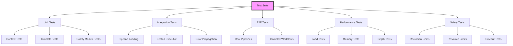

# Testing Strategy Guide for Recursive Pipelines

## Table of Contents

1. [Overview](#overview)
2. [Testing Philosophy](#testing-philosophy)
3. [Test Categories](#test-categories)
4. [Unit Testing](#unit-testing)
5. [Integration Testing](#integration-testing)
6. [End-to-End Testing](#end-to-end-testing)
7. [Performance Testing](#performance-testing)
8. [Safety Testing](#safety-testing)
9. [Mock Strategies](#mock-strategies)
10. [Test Fixtures and Helpers](#test-fixtures-and-helpers)
11. [Continuous Integration](#continuous-integration)
12. [Debugging Failed Tests](#debugging-failed-tests)
13. [Best Practices](#best-practices)
14. [Example Test Suite](#example-test-suite)

## Overview

Testing recursive pipelines requires special consideration due to their nested nature, complex context management, and potential for exponential complexity. This guide provides comprehensive strategies for testing recursive pipeline implementations effectively.

### Testing Architecture



## Testing Philosophy

### Core Principles

1. **Isolation**: Test components independently before testing integration
2. **Determinism**: Tests should produce consistent results
3. **Clarity**: Test failures should clearly indicate what went wrong
4. **Speed**: Unit tests should run quickly, integration tests can be slower
5. **Coverage**: Aim for high coverage of critical paths and edge cases

### Testing Pyramid for Recursive Pipelines

```
        /\
       /E2E\      <- Few comprehensive tests
      /------\
     /  Integ  \   <- Moderate integration tests
    /------------\
   /   Unit Tests  \ <- Many focused unit tests
  /------------------\
 /   Property Tests   \ <- Property-based testing for invariants
/----------------------\
```

## Test Categories

### 1. Unit Tests
- Context management functions
- Template resolution
- Safety checks
- Error formatting
- Individual module behavior

### 2. Integration Tests
- Pipeline loading and parsing
- Nested pipeline execution
- Context inheritance
- Output extraction
- Error propagation

### 3. End-to-End Tests
- Complete workflow execution
- Real-world scenarios
- Performance characteristics
- Resource usage patterns

### 4. Property-Based Tests
- Invariant checking
- Edge case discovery
- Randomized testing

### 5. Performance Tests
- Execution time benchmarks
- Memory usage patterns
- Scalability testing
- Bottleneck identification

## Unit Testing

### Testing Context Management

```elixir
defmodule Pipeline.Context.NestedTest do
  use ExUnit.Case
  alias Pipeline.Context.Nested
  
  describe "create_nested_context/2" do
    test "creates isolated context with correct depth" do
      parent = %Context{depth: 1, variables: %{"parent_var" => "value"}}
      config = %{inherit_context: false}
      
      child = Nested.create_nested_context(parent, config)
      
      assert child.depth == 2
      assert child.parent == parent
      assert child.variables == %{}  # Isolated, no inheritance
    end
    
    test "inherits context when configured" do
      parent = %Context{
        depth: 0,
        variables: %{"global_vars" => %{"api_key" => "secret"}}
      }
      config = %{inherit_context: true}
      
      child = Nested.create_nested_context(parent, config)
      
      assert child.variables["global_vars"]["api_key"] == "secret"
    end
  end
  
  describe "resolve_template/2" do
    test "resolves simple variable reference" do
      context = %Context{
        variables: %{
          "steps" => %{"extract" => %{"result" => "data"}}
        }
      }
      
      result = Nested.resolve_template("{{steps.extract.result}}", context)
      assert result == "data"
    end
    
    test "preserves type for single variable template" do
      context = %Context{
        variables: %{
          "steps" => %{"count" => %{"result" => 42}}
        }
      }
      
      result = Nested.resolve_template("{{steps.count.result}}", context)
      assert result == 42  # Integer preserved
    end
    
    test "returns original template when variable not found" do
      context = %Context{variables: %{}}
      
      result = Nested.resolve_template("{{missing.var}}", context)
      assert result == "{{missing.var}}"
    end
  end
end
```

### Testing Safety Features

```elixir
defmodule Pipeline.Safety.RecursionGuardTest do
  use ExUnit.Case
  alias Pipeline.Safety.RecursionGuard
  
  describe "check_depth/2" do
    test "allows execution within depth limit" do
      context = %Context{depth: 3}
      assert :ok == RecursionGuard.check_depth(context, 5)
    end
    
    test "prevents execution beyond depth limit" do
      context = %Context{depth: 5}
      assert {:error, _} = RecursionGuard.check_depth(context, 5)
    end
  end
  
  describe "check_circular_dependency/2" do
    test "detects direct circular reference" do
      context = %Context{
        execution_chain: ["pipeline_a", "pipeline_b"]
      }
      
      assert {:error, error} = 
        RecursionGuard.check_circular_dependency("pipeline_a", context)
      assert error.type == :circular_dependency
    end
    
    test "allows non-circular references" do
      context = %Context{
        execution_chain: ["pipeline_a", "pipeline_b"]
      }
      
      assert :ok = 
        RecursionGuard.check_circular_dependency("pipeline_c", context)
    end
  end
end
```

### Testing Error Formatting

```elixir
defmodule Pipeline.Error.NestedPipelineTest do
  use ExUnit.Case
  alias Pipeline.Error.NestedPipeline
  
  test "formats nested error with full context" do
    error = %RuntimeError{message: "Test error"}
    context = %Context{
      depth: 2,
      pipeline_id: "test_pipeline",
      execution_chain: ["main", "sub1", "sub2"]
    }
    step = %{name: "failing_step", type: "claude"}
    
    formatted = NestedPipeline.format_error(error, context, step)
    
    assert formatted =~ "Pipeline execution failed"
    assert formatted =~ "test_pipeline"
    assert formatted =~ "failing_step"
    assert formatted =~ "Execution Stack:"
    assert formatted =~ "depth: 2"
  end
end
```

## Integration Testing

### Testing Pipeline Loading and Execution

```elixir
defmodule Pipeline.Step.NestedPipelineIntegrationTest do
  use Pipeline.IntegrationCase
  
  @tag :integration
  test "loads and executes external pipeline file" do
    # Create temporary pipeline file
    pipeline_content = """
    workflow:
      name: test_sub_pipeline
      steps:
        - name: echo_input
          type: test_echo
          message: "{{inputs.message}}"
    """
    
    with_temp_file "sub_pipeline.yaml", pipeline_content do |path|
      step = %{
        name: "nested",
        type: "pipeline",
        pipeline_file: path,
        inputs: %{message: "Hello from parent"}
      }
      
      context = %Context{}
      result = Pipeline.Step.NestedPipeline.execute(step, context)
      
      assert {:ok, updated_context} = result
      assert updated_context.variables["steps"]["nested"]["echo_input"] == 
        "Hello from parent"
    end
  end
  
  @tag :integration  
  test "properly isolates nested pipeline errors" do
    error_pipeline = """
    workflow:
      name: error_pipeline
      steps:
        - name: fail_step
          type: test_echo
          error: "Simulated failure"
    """
    
    with_temp_file "error_pipeline.yaml", error_pipeline do |path|
      step = %{
        name: "will_fail",
        type: "pipeline",
        pipeline_file: path
      }
      
      context = %Context{}
      result = Pipeline.Step.NestedPipeline.execute(step, context)
      
      assert {:error, error} = result
      assert error.pipeline == "error_pipeline"
      assert error.step == "fail_step"
    end
  end
end
```

### Testing Context Inheritance

```elixir
defmodule Pipeline.Context.InheritanceTest do
  use Pipeline.IntegrationCase
  
  @tag :integration
  test "child pipeline inherits parent context correctly" do
    parent_pipeline = %{
      workflow: %{name: "parent"},
      global_vars: %{api_key: "parent_key", shared: "value"},
      steps: [
        %{
          name: "child",
          type: "pipeline",
          pipeline: %{
            workflow: %{name: "child"},
            steps: [
              %{
                name: "use_inherited",
                type: "test_echo",
                message: "{{global_vars.api_key}}"
              }
            ]
          },
          config: %{inherit_context: true}
        }
      ]
    }
    
    result = Pipeline.execute(parent_pipeline)
    
    assert result.status == :success
    assert get_in(result, [:outputs, "child", "use_inherited"]) == "parent_key"
  end
  
  @tag :integration
  test "output extraction with path notation" do
    pipeline = %{
      workflow: %{name: "test"},
      steps: [
        %{
          name: "process",
          type: "pipeline",
          pipeline: %{
            workflow: %{name: "processor"},
            steps: [
              %{
                name: "analyze",
                type: "test_echo",
                message: %{
                  metrics: %{accuracy: 0.95, precision: 0.92},
                  status: "complete"
                }
              }
            ]
          },
          outputs: [
            %{path: "analyze.metrics.accuracy", as: "accuracy_score"},
            %{path: "analyze.status", as: "status"}
          ]
        }
      ]
    }
    
    result = Pipeline.execute(pipeline)
    
    assert result.status == :success
    assert get_in(result, [:outputs, "process", "accuracy_score"]) == 0.95
    assert get_in(result, [:outputs, "process", "status"]) == "complete"
  end
end
```

## End-to-End Testing

### Testing Complete Workflows

```elixir
defmodule Pipeline.E2E.RecursiveWorkflowTest do
  use Pipeline.E2ECase
  
  @tag :e2e
  test "multi-level data processing pipeline" do
    # Test a realistic 3-level pipeline
    main_pipeline = load_fixture("e2e/data_processing_workflow.yaml")
    test_data = load_fixture("e2e/sample_data.json")
    
    result = Pipeline.execute(main_pipeline, inputs: %{data: test_data})
    
    # Verify successful execution
    assert result.status == :success
    assert result.max_depth_reached == 3
    assert length(result.executed_steps) == 15
    
    # Verify outputs
    assert result.outputs.validation_passed == true
    assert result.outputs.processed_records == 1000
    assert result.outputs.report_generated == true
    
    # Verify performance
    assert result.duration_ms < 5000
    assert result.peak_memory_mb < 512
  end
  
  @tag :e2e
  test "handles errors gracefully in production scenario" do
    pipeline = load_fixture("e2e/error_handling_workflow.yaml")
    
    # Inject error condition
    result = Pipeline.execute(pipeline, 
      inputs: %{simulate_error_at: "transform_step"}
    )
    
    assert result.status == :partial_success
    assert result.completed_steps == ["validate", "prepare"]
    assert result.failed_step == "transform_step"
    assert result.fallback_executed == true
  end
  
  @tag :e2e @slow
  test "performs within SLA under load" do
    pipeline = load_fixture("e2e/performance_critical.yaml")
    
    # Run 10 concurrent executions
    results = 1..10
    |> Task.async_stream(fn i ->
      Pipeline.execute(pipeline, inputs: %{batch_id: i})
    end, max_concurrency: 10, timeout: 30_000)
    |> Enum.map(fn {:ok, result} -> result end)
    
    # All should complete successfully
    assert Enum.all?(results, & &1.status == :success)
    
    # 95th percentile should be under SLA
    durations = Enum.map(results, & &1.duration_ms)
    p95 = percentile(durations, 95)
    assert p95 < 3000  # 3 second SLA
  end
end
```

### Testing Edge Cases

```elixir
defmodule Pipeline.E2E.EdgeCaseTest do
  use Pipeline.E2ECase
  
  @tag :e2e
  test "handles maximum nesting depth gracefully" do
    # Create deeply nested pipeline
    deep_pipeline = create_nested_pipeline(depth: 10)
    
    result = Pipeline.execute(deep_pipeline,
      config: %{max_depth: 8}
    )
    
    assert result.status == :error
    assert result.error.type == :max_depth_exceeded
    assert result.max_depth_reached == 8
    assert result.partial_results != nil
  end
  
  @tag :e2e
  test "recovers from memory pressure" do
    memory_intensive = load_fixture("e2e/memory_intensive.yaml")
    
    result = Pipeline.execute(memory_intensive,
      config: %{
        memory_limit_mb: 256,
        enable_gc_pressure: true
      }
    )
    
    assert result.status == :success
    assert result.gc_runs > 0
    assert result.peak_memory_mb <= 256
  end
end
```

## Performance Testing

### Benchmark Tests

```elixir
defmodule Pipeline.Performance.BenchmarkTest do
  use Pipeline.BenchmarkCase
  
  @tag :benchmark
  test "nested pipeline overhead" do
    # Measure overhead of nesting
    flat_pipeline = create_flat_pipeline(steps: 100)
    nested_pipeline = create_nested_pipeline(depth: 5, steps_per_level: 20)
    
    flat_time = benchmark("flat", fn ->
      Pipeline.execute(flat_pipeline)
    end)
    
    nested_time = benchmark("nested", fn ->
      Pipeline.execute(nested_pipeline)
    end)
    
    overhead_percent = (nested_time - flat_time) / flat_time * 100
    
    assert overhead_percent < 10  # Less than 10% overhead
    
    report_benchmark(%{
      flat_ms: flat_time,
      nested_ms: nested_time,
      overhead_percent: overhead_percent
    })
  end
  
  @tag :benchmark
  test "context resolution performance" do
    large_context = create_large_context(variables: 1000)
    
    time_per_resolution = benchmark("resolve", fn ->
      Pipeline.Context.Nested.resolve_template(
        "{{steps.step_500.result.field}}", 
        large_context
      )
    end, iterations: 10_000)
    
    assert time_per_resolution < 0.1  # Less than 0.1ms per resolution
  end
end
```

### Load Testing

```elixir
defmodule Pipeline.Performance.LoadTest do
  use Pipeline.LoadTestCase
  
  @tag :load_test
  test "sustains throughput under load" do
    pipeline = load_fixture("load_test/standard_workflow.yaml")
    
    results = run_load_test(
      pipeline: pipeline,
      duration_seconds: 60,
      target_rps: 10,
      ramp_up_seconds: 10
    )
    
    assert results.success_rate > 0.99
    assert results.p95_latency_ms < 1000
    assert results.p99_latency_ms < 2000
    assert results.errors == []
  end
  
  @tag :load_test @stress
  test "degrades gracefully under stress" do
    pipeline = load_fixture("load_test/complex_workflow.yaml")
    
    results = run_stress_test(
      pipeline: pipeline,
      initial_rps: 10,
      increment_rps: 5,
      increment_interval_seconds: 30,
      max_rps: 100
    )
    
    # Find breaking point
    breaking_point = find_breaking_point(results, 
      success_rate_threshold: 0.95
    )
    
    assert breaking_point.rps > 50  # Should handle at least 50 RPS
    assert breaking_point.degradation == :gradual  # Not :cliff
  end
end
```

## Safety Testing

### Testing Safety Limits

```elixir
defmodule Pipeline.Safety.LimitTest do
  use Pipeline.SafetyTestCase
  
  @tag :safety
  test "enforces recursion depth limits" do
    recursive_pipeline = create_self_referential_pipeline()
    
    result = Pipeline.execute(recursive_pipeline,
      config: %{max_depth: 5}
    )
    
    assert result.status == :error
    assert result.error.type == :max_depth_exceeded
    assert result.depth_when_stopped == 5
  end
  
  @tag :safety
  test "detects circular dependencies" do
    # Create A -> B -> C -> A circular dependency
    circular_pipelines = create_circular_dependency_chain(["A", "B", "C"])
    
    result = Pipeline.execute(circular_pipelines.A)
    
    assert result.status == :error
    assert result.error.type == :circular_dependency
    assert result.error.cycle == ["A", "B", "C", "A"]
  end
  
  @tag :safety
  test "enforces memory limits" do
    memory_hog = %{
      workflow: %{name: "memory_test"},
      steps: [
        %{
          name: "allocate",
          type: "test_echo",
          message: generate_large_string(100_000_000)  # 100MB
        }
      ]
    }
    
    result = Pipeline.execute(memory_hog,
      config: %{memory_limit_mb: 50}
    )
    
    assert result.status == :error
    assert result.error.type == :memory_limit_exceeded
    assert result.error.limit_mb == 50
  end
  
  @tag :safety
  test "respects timeout limits" do
    slow_pipeline = %{
      workflow: %{name: "timeout_test"},
      steps: [
        %{
          name: "slow_step",
          type: "test_echo",
          delay_ms: 5000
        }
      ]
    }
    
    result = Pipeline.execute(slow_pipeline,
      config: %{timeout_seconds: 2}
    )
    
    assert result.status == :error
    assert result.error.type == :timeout_exceeded
    assert result.duration_ms > 2000
    assert result.duration_ms < 2500  # Includes grace period
  end
end
```

### Chaos Testing

```elixir
defmodule Pipeline.Safety.ChaosTest do
  use Pipeline.ChaosTestCase
  
  @tag :chaos
  test "handles random failures gracefully" do
    pipeline = load_fixture("chaos/resilient_workflow.yaml")
    
    # Inject random failures
    chaos_config = %{
      failure_probability: 0.1,  # 10% chance of failure
      failure_types: [:timeout, :memory_spike, :error],
      affected_steps: :random
    }
    
    results = run_chaos_test(
      pipeline: pipeline,
      iterations: 100,
      chaos_config: chaos_config
    )
    
    assert results.success_rate > 0.7  # Should handle some failures
    assert results.catastrophic_failures == 0
    assert Enum.all?(results.errors, &recoverable?/1)
  end
end
```

## Mock Strategies

### Creating Test Doubles

```elixir
defmodule Pipeline.Test.Mocks do
  @moduledoc """
  Mock implementations for testing
  """
  
  defmodule MockLLM do
    @behaviour Pipeline.Step.LLM
    
    def execute(%{mock_response: response}, _context) do
      {:ok, response}
    end
    
    def execute(%{mock_error: error}, _context) do
      {:error, error}
    end
    
    def execute(%{prompt: prompt}, _context) do
      # Simple deterministic response based on prompt
      response = "Mock response for: #{prompt}"
      {:ok, response}
    end
  end
  
  defmodule MockFileSystem do
    @behaviour Pipeline.FileSystem
    
    def read_file(path) do
      case MockFS.get(path) do
        nil -> {:error, :enoent}
        content -> {:ok, content}
      end
    end
    
    def write_file(path, content) do
      MockFS.put(path, content)
      :ok
    end
  end
  
  def setup_mocks do
    # Replace real implementations with mocks
    Application.put_env(:pipeline, :llm_module, MockLLM)
    Application.put_env(:pipeline, :fs_module, MockFileSystem)
    
    # Clear mock state
    MockFS.clear()
  end
end
```

### Using Mocks in Tests

```elixir
defmodule Pipeline.MockedTest do
  use Pipeline.TestCase
  import Pipeline.Test.Mocks
  
  setup do
    setup_mocks()
    :ok
  end
  
  test "pipeline with mocked LLM calls" do
    pipeline = %{
      workflow: %{name: "test"},
      steps: [
        %{
          name: "analyze",
          type: "claude",
          prompt: "Analyze this data",
          mock_response: %{
            analysis: "complete",
            score: 95
          }
        }
      ]
    }
    
    result = Pipeline.execute(pipeline)
    
    assert result.status == :success
    assert result.outputs.analyze.analysis == "complete"
    assert result.outputs.analyze.score == 95
  end
  
  test "nested pipeline with mocked file system" do
    # Prepare mock files
    MockFS.put("./pipeline.yaml", """
    workflow:
      name: sub_pipeline
      steps:
        - name: echo
          type: test_echo
          message: "Loaded from mock"
    """)
    
    pipeline = %{
      workflow: %{name: "parent"},
      steps: [
        %{
          name: "load_sub",
          type: "pipeline",
          pipeline_file: "./pipeline.yaml"
        }
      ]
    }
    
    result = Pipeline.execute(pipeline)
    
    assert result.status == :success
    assert result.outputs.load_sub.echo == "Loaded from mock"
  end
end
```

## Test Fixtures and Helpers

### Creating Test Fixtures

```elixir
defmodule Pipeline.Test.Fixtures do
  @moduledoc """
  Reusable test fixtures for pipeline testing
  """
  
  def simple_nested_pipeline do
    %{
      workflow: %{name: "parent"},
      steps: [
        %{
          name: "child",
          type: "pipeline",
          pipeline: %{
            workflow: %{name: "child"},
            steps: [
              %{name: "echo", type: "test_echo", message: "Hello"}
            ]
          }
        }
      ]
    }
  end
  
  def deep_nested_pipeline(depth) do
    create_recursive_structure(depth)
  end
  
  def pipeline_with_context_inheritance do
    %{
      workflow: %{name: "parent"},
      global_vars: %{
        api_key: "test_key",
        environment: "test"
      },
      steps: [
        %{
          name: "child",
          type: "pipeline",
          pipeline_file: "./fixtures/child_pipeline.yaml",
          config: %{inherit_context: true},
          inputs: %{
            parent_data: "{{steps.prepare.result}}"
          }
        }
      ]
    }
  end
  
  defp create_recursive_structure(0), do: echo_step()
  defp create_recursive_structure(depth) do
    %{
      name: "level_#{depth}",
      type: "pipeline",
      pipeline: %{
        workflow: %{name: "nested_#{depth}"},
        steps: [create_recursive_structure(depth - 1)]
      }
    }
  end
end
```

### Test Helper Functions

```elixir
defmodule Pipeline.Test.Helpers do
  @moduledoc """
  Helper functions for pipeline testing
  """
  
  def with_temp_pipeline(content, fun) do
    path = Path.join(System.tmp_dir!(), "pipeline_#{:rand.uniform(10000)}.yaml")
    File.write!(path, content)
    
    try do
      fun.(path)
    after
      File.rm(path)
    end
  end
  
  def assert_pipeline_success(result) do
    assert result.status == :success, 
      "Pipeline failed: #{inspect(result.error)}"
  end
  
  def assert_step_executed(result, step_name) do
    assert step_name in result.executed_steps,
      "Step #{step_name} was not executed. Executed: #{inspect(result.executed_steps)}"
  end
  
  def get_step_result(result, step_path) do
    get_in(result.outputs, String.split(step_path, "."))
  end
  
  def measure_execution_time(fun) do
    start = System.monotonic_time(:millisecond)
    result = fun.()
    duration = System.monotonic_time(:millisecond) - start
    {result, duration}
  end
  
  def create_large_context(size) do
    variables = for i <- 1..size, into: %{} do
      {"var_#{i}", "value_#{i}"}
    end
    
    %Context{
      variables: %{
        "global_vars" => variables,
        "steps" => %{}
      }
    }
  end
end
```

## Continuous Integration

### CI Configuration

```yaml
# .github/workflows/pipeline_tests.yml
name: Pipeline Tests

on: [push, pull_request]

jobs:
  unit_tests:
    runs-on: ubuntu-latest
    steps:
      - uses: actions/checkout@v3
      - uses: erlef/setup-beam@v1
        with:
          elixir-version: '1.14'
          otp-version: '25'
      - run: mix deps.get
      - run: mix test --only unit

  integration_tests:
    runs-on: ubuntu-latest
    steps:
      - uses: actions/checkout@v3
      - uses: erlef/setup-beam@v1
      - run: mix deps.get
      - run: mix test --only integration
      
  e2e_tests:
    runs-on: ubuntu-latest
    timeout-minutes: 30
    steps:
      - uses: actions/checkout@v3
      - uses: erlef/setup-beam@v1
      - run: mix deps.get
      - run: mix test --only e2e --max-failures 1
      
  performance_tests:
    runs-on: ubuntu-latest
    if: github.event_name == 'push' && github.ref == 'refs/heads/main'
    steps:
      - uses: actions/checkout@v3
      - uses: erlef/setup-beam@v1
      - run: mix deps.get
      - run: mix test --only benchmark
      - uses: actions/upload-artifact@v3
        with:
          name: benchmark-results
          path: bench_results/
```

### Test Environment Configuration

```elixir
# config/test.exs
config :pipeline,
  # Strict safety limits for testing
  max_nesting_depth: 5,
  max_total_steps: 100,
  default_timeout_seconds: 10,
  default_memory_limit_mb: 256,
  
  # Test-specific settings
  enable_test_mode: true,
  test_echo_enabled: true,
  mock_llm_calls: true,
  
  # Faster test execution
  checkpoint_enabled: false,
  telemetry_enabled: false,
  
  # Deterministic behavior
  random_seed: 42
```

## Debugging Failed Tests

### Test Failure Analysis

```elixir
defmodule Pipeline.Test.DebugHelper do
  @moduledoc """
  Helpers for debugging test failures
  """
  
  def debug_failed_execution(result) do
    IO.puts """
    Pipeline Execution Debug Info:
    Status: #{result.status}
    Duration: #{result.duration_ms}ms
    Max Depth: #{result.max_depth_reached}
    Steps Executed: #{length(result.executed_steps)}
    
    Error: #{inspect(result.error, pretty: true)}
    
    Execution Trace:
    #{format_execution_trace(result.trace)}
    
    Final Context:
    #{inspect(result.final_context, pretty: true, limit: 50)}
    """
  end
  
  def capture_execution_trace(pipeline, inputs \\ %{}) do
    Process.put(:capture_trace, true)
    
    result = Pipeline.execute(pipeline, inputs: inputs)
    trace = Process.get(:execution_trace)
    
    {result, trace}
  end
  
  def replay_execution(trace_file) do
    trace = load_trace(trace_file)
    
    Enum.each(trace.events, fn event ->
      IO.inspect(event, label: format_time(event.timestamp))
      Process.sleep(100)  # Slow playback
    end)
  end
end
```

### Interactive Test Debugging

```elixir
# In test
test "complex nested execution" do
  pipeline = load_complex_pipeline()
  
  # Enable interactive debugging for this test
  if System.get_env("DEBUG_TEST") do
    IEx.pry()  # Debugger breakpoint
  end
  
  result = Pipeline.execute(pipeline)
  
  # Dump execution details on failure
  if result.status != :success do
    File.write!("failed_execution.json", 
      Jason.encode!(result, pretty: true)
    )
    
    debug_failed_execution(result)
  end
  
  assert result.status == :success
end
```

## Best Practices

### 1. Test Organization

```elixir
# Good: Organized by functionality
test/pipeline/
├── unit/
│   ├── context_test.exs
│   ├── safety_test.exs
│   └── tracing_test.exs
├── integration/
│   ├── nested_execution_test.exs
│   └── error_handling_test.exs
├── e2e/
│   └── workflows_test.exs
└── support/
    ├── test_helpers.ex
    └── fixtures.ex
```

### 2. Test Naming

```elixir
# Good: Descriptive test names
test "resolves nested template variables with parent context inheritance enabled"
test "enforces memory limit when nested pipeline exceeds threshold"
test "propagates errors from depth 3 with full execution context"

# Bad: Vague names
test "works correctly"
test "handles errors"
```

### 3. Test Data Management

```elixir
# Good: Reusable test data factories
defmodule Pipeline.Test.Factory do
  def build(:simple_pipeline, attrs \\ %{}) do
    %{
      workflow: %{name: attrs[:name] || "test"},
      steps: attrs[:steps] || [build(:echo_step)]
    }
  end
  
  def build(:nested_pipeline, attrs \\ %{}) do
    depth = attrs[:depth] || 1
    # ... build nested structure
  end
end

# Usage in tests
test "executes nested pipeline" do
  pipeline = build(:nested_pipeline, depth: 3)
  # ...
end
```

### 4. Assertion Helpers

```elixir
# Good: Custom assertions for clarity
defmodule Pipeline.Test.Assertions do
  import ExUnit.Assertions
  
  def assert_execution_success(result) do
    assert result.status == :success,
      """
      Expected successful execution but got #{result.status}
      Error: #{inspect(result.error)}
      Trace: #{result.trace_id}
      """
  end
  
  def assert_depth_reached(result, expected_depth) do
    assert result.max_depth_reached == expected_depth,
      "Expected depth #{expected_depth}, got #{result.max_depth_reached}"
  end
end
```

### 5. Performance Test Guidelines

```elixir
# Track performance over time
defmodule Pipeline.Test.Performance do
  def track_benchmark(name, result) do
    # Store results for trend analysis
    File.write!(
      "bench_results/#{name}_#{timestamp()}.json",
      Jason.encode!(result)
    )
    
    # Compare with baseline
    baseline = load_baseline(name)
    if result.duration_ms > baseline * 1.1 do
      raise "Performance regression: #{result.duration_ms}ms > #{baseline * 1.1}ms"
    end
  end
end
```

## Example Test Suite

### Complete Test Module Example

```elixir
defmodule Pipeline.RecursiveExecutionTest do
  use Pipeline.TestCase
  import Pipeline.Test.{Helpers, Assertions, Factory}
  
  describe "basic nested execution" do
    test "executes single level nesting" do
      pipeline = build(:nested_pipeline, depth: 1)
      result = Pipeline.execute(pipeline)
      
      assert_execution_success(result)
      assert_depth_reached(result, 1)
    end
    
    test "passes inputs to nested pipeline" do
      pipeline = %{
        workflow: %{name: "parent"},
        steps: [
          %{
            name: "child",
            type: "pipeline",
            pipeline: build(:simple_pipeline),
            inputs: %{message: "Hello"}
          }
        ]
      }
      
      result = Pipeline.execute(pipeline)
      
      assert get_step_result(result, "child.echo") == "Hello"
    end
  end
  
  describe "context management" do
    test "inherits parent context when enabled" do
      parent = build(:pipeline_with_globals,
        global_vars: %{api_key: "secret"}
      )
      
      child_step = %{
        name: "child",
        type: "pipeline",
        pipeline: build(:pipeline_using_globals),
        config: %{inherit_context: true}
      }
      
      pipeline = put_in(parent.steps, [child_step])
      result = Pipeline.execute(pipeline)
      
      assert_execution_success(result)
      assert result.outputs.child.used_api_key == "secret"
    end
  end
  
  describe "safety limits" do
    @tag :safety
    test "prevents infinite recursion" do
      recursive = build(:self_referential_pipeline)
      
      result = Pipeline.execute(recursive,
        config: %{max_depth: 10}
      )
      
      assert result.status == :error
      assert result.error.type == :max_depth_exceeded
      assert result.max_depth_reached == 10
    end
  end
  
  describe "performance characteristics" do
    @tag :benchmark
    test "maintains acceptable overhead" do
      flat = build(:flat_pipeline, steps: 50)
      nested = build(:nested_equivalent, depth: 5, steps_per: 10)
      
      {_, flat_time} = measure_execution_time(fn ->
        Pipeline.execute(flat)
      end)
      
      {_, nested_time} = measure_execution_time(fn ->
        Pipeline.execute(nested)
      end)
      
      overhead = (nested_time - flat_time) / flat_time
      assert overhead < 0.15  # Less than 15% overhead
      
      track_benchmark("nesting_overhead", %{
        flat_ms: flat_time,
        nested_ms: nested_time,
        overhead_percent: overhead * 100
      })
    end
  end
end
```

---

This comprehensive testing guide ensures robust validation of recursive pipeline functionality across all aspects of the system. The strategies and examples provided enable thorough testing while maintaining good development velocity.