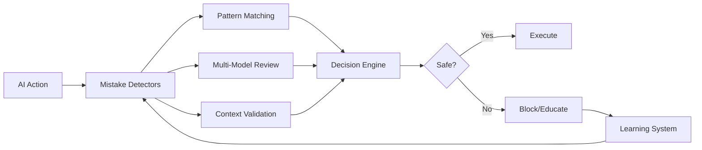

# AI Mistake Detection System - Specification

## Overview

This specification defines a comprehensive system for detecting and preventing common AI mistakes in code generation and system interaction. Born from real-world failures (like hardcoding paths and creating test files in production), this system provides a generalized, extensible framework for catching AI stupidity.

## Document Structure

### Core Documents

1. **[Claude Watcher](./claude_watcher.md)** - The original rant and specific detection strategies
   - Real examples of AI mistakes
   - Specific detection patterns
   - Multi-model consensus approach
   - Emergency stop mechanisms

2. **[Generalized Mistake Detection](./generalized_mistake_detection.md)** - Extensible framework design
   - Mistake categorization system
   - Plugin-based detector architecture
   - Learning and evolution capabilities
   - Multi-model validation framework

3. **[Integration Design](./integration_design.md)** - Pipeline safety system integration
   - Step Reviewer enhancements
   - Pattern Detector additions
   - Intervention system updates
   - Unified configuration and monitoring

## The Problem We're Solving

AI assistants make predictable mistakes:
- **Hardcoding paths**: `/home/user/.pyenv/shims/python3`
- **Test file pollution**: Creating `test_adapter.ex` in `lib/`
- **Environmental assumptions**: Assuming commands exist in PATH
- **Context ignorance**: Ignoring project structure and conventions
- **Security violations**: Unsafe permissions, exposed credentials

## System Architecture



## Key Features

### 1. Mistake Categories

- **Environmental Assumptions**: Hardcoded paths, executable assumptions
- **Code Organization**: Wrong file locations, naming violations
- **Security Violations**: Unsafe operations, credential exposure
- **Context Ignorance**: Out-of-scope changes, constraint violations

### 2. Detection Strategies

- **Pattern-Based**: Regex and rule matching
- **Behavioral**: Detecting patterns like tunnel vision
- **Multi-Model Consensus**: Multiple AIs reviewing each other
- **Learning-Based**: Evolving patterns from detected mistakes

### 3. Intervention Types

- **Block**: Stop dangerous actions
- **Educate**: Teach correct patterns
- **Auto-Fix**: Correct simple mistakes
- **Human Review**: Escalate complex issues

## Quick Start

### Basic Configuration

```yaml
mistake_detection:
  enabled: true
  
  detectors:
    environmental:
      patterns: [hardcoded_paths, executable_assumptions]
    
    organization:
      source_dirs: ["lib", "src"]
      test_dirs: ["test", "spec"]
      
    security:
      critical_patterns: true
```

### Example Detection

```elixir
# This would be caught
def executable_path, do: "/home/user/.pyenv/shims/python3"
# Error: Hardcoded user-specific path detected

# This would be blocked
# Creating: lib/my_test.ex
# Error: Test files belong in test/ directory

# This would trigger security alert
System.cmd("chmod", ["777", file])
# Error: Overly permissive file permissions
```

## Integration with Pipeline Safety

The mistake detection system enhances the existing safety reviewer:

```elixir
# In pipeline configuration
safety:
  reviewer:
    enabled: true
    
  mistake_detection:
    enabled: true
    learning: true
    
  patterns:
    - hardcoded_paths
    - test_pollution
    - assumption_cascade
```

## Extensibility

### Custom Detector

```elixir
defmodule MyDetector do
  @behaviour MistakeDetector
  
  def detect(action, context) do
    if violates_my_rule?(action) do
      [%{type: :custom, severity: :high, message: "..."}]
    else
      []
    end
  end
end
```

### Pattern DSL

```elixir
defpattern :my_pattern do
  match ~r{bad_pattern}
  severity :high
  message "Don't do this"
  auto_fix &fix_function/1
end
```

## Monitoring

Track effectiveness with built-in metrics:

```
Mistakes Prevented:
├── Hardcoded Paths: 47
├── Test Pollution: 12
├── Security Issues: 3
└── Context Violations: 28

Learning Progress:
├── Patterns Created: 15
├── Detection Accuracy: 94%
└── False Positive Rate: 3%
```

## Implementation Status

This is a specification for implementation. The system will be built in phases:

1. **Phase 1**: Basic pattern detection (Week 1)
2. **Phase 2**: Enhanced interventions (Week 2)
3. **Phase 3**: Learning system (Week 3-4)
4. **Phase 4**: Multi-model consensus (Week 5-6)

## Why This Matters

Without this system:
- AI creates test files in production code
- Hardcodes environment-specific paths
- Makes unsafe assumptions
- Violates project conventions
- Repeats the same mistakes

With this system:
- Mistakes are caught before execution
- AI learns from corrections
- Patterns evolve and improve
- Multiple models validate decisions
- Developers maintain control

## Next Steps

1. Review and approve specifications
2. Implement Phase 1 pattern detection
3. Integration with Step Reviewer
4. Deploy to development environment
5. Collect metrics and refine

---

*"The only way to prevent AI stupidity is to have systems watching for our stupidity patterns."*