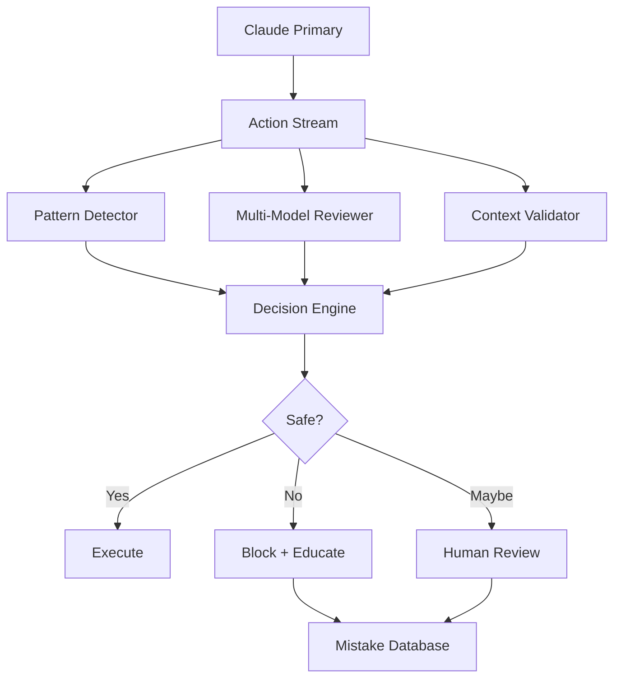

# CLAUDE WATCHER: Intelligent AI Mistake Detection System

## The Problem

AI assistants (like me) make DUMB ASS MISTAKES:
- **Hardcoding paths**: `/home/home/.pyenv/shims/python3` - WTF?!
- **Creating test files in production**: `grpc_basic_test.ex` in lib/
- **Not understanding context**: Missing that it's a production codebase
- **Tunnel vision**: Fixing one thing while breaking ten others
- **Assumption hell**: Assuming environments, paths, permissions

## Core Detection Strategies

### 1. Real-Time Code Analysis with Better Models

```yaml
watcher_architecture:
  primary_ai: claude-3-opus  # The one doing work
  watchers:
    - model: gpt-4-turbo
      role: "code_quality_reviewer"
      focus: ["no hardcoded paths", "no test files in src", "no assumptions"]
    
    - model: claude-3-sonnet
      role: "context_validator" 
      focus: ["is this appropriate for production?", "does this match project patterns?"]
    
    - model: gemini-1.5-pro
      role: "sanity_checker"
      focus: ["would a human developer do this?", "is this obviously stupid?"]
```

### 2. Pattern-Based Stupidity Detection

#### Hardcoded Path Detection
```elixir
defmodule AIStupidityDetector.HardcodedPaths do
  @stupid_patterns [
    ~r{/home/\w+/},           # User-specific paths
    ~r{/Users/\w+/},          # Mac user paths
    ~r{C:\\Users\\},          # Windows paths
    ~r{/tmp/specific_},       # Overly specific temp paths
    ~r{localhost:\d+},        # Hardcoded ports
    ~r{\d+\.\d+\.\d+\.\d+},  # IP addresses
  ]
  
  def scan_for_stupidity(code_change) do
    Enum.find(@stupid_patterns, fn pattern ->
      Regex.match?(pattern, code_change)
    end)
  end
end
```

#### Test File Pollution Detection
```elixir
defmodule AIStupidityDetector.TestFilePollution do
  @production_paths [
    "lib/",
    "src/",
    "app/",
    "core/"
  ]
  
  @test_indicators [
    ~r{test|spec|example|demo|sample|try|experiment}i,
    ~r{_test\.},
    ~r{\.test\.},
    ~r{TestAdapter},
    ~r{MockService}
  ]
  
  def is_test_in_production?(file_path, content) do
    in_production = Enum.any?(@production_paths, &String.starts_with?(file_path, &1))
    is_test = Enum.any?(@test_indicators, &Regex.match?(&1, file_path))
    
    in_production && is_test
  end
end
```

### 3. Multi-Model Consensus System

```elixir
defmodule ClaudeWatcher.Consensus do
  @reviewers [
    {GPT4, weight: 0.3},
    {Sonnet, weight: 0.3},
    {Gemini, weight: 0.2},
    {Llama3, weight: 0.2}
  ]
  
  def review_action(primary_ai_action) do
    reviews = Enum.map(@reviewers, fn {model, weight} ->
      review = model.review(primary_ai_action, context: get_context())
      {review, weight}
    end)
    
    # If ANY model says "WTF NO", stop
    if Enum.any?(reviews, fn {r, _} -> r.severity == :critical end) do
      {:block, aggregate_reasons(reviews)}
    else
      calculate_consensus(reviews)
    end
  end
end
```

### 4. Historical Mistake Learning

```elixir
defmodule ClaudeWatcher.MistakeDatabase do
  @mistake_patterns [
    %{
      pattern: "hardcoded_user_path",
      example: "/home/home/.pyenv/shims/python3",
      detection: ~r{/home/[^/]+/\.},
      severity: :high,
      explanation: "Never hardcode user-specific paths"
    },
    %{
      pattern: "test_in_production",
      example: "lib/adapters/grpc_basic_test.ex",
      detection: fn(path) -> path =~ ~r{lib/.*test\.ex$} end,
      severity: :critical,
      explanation: "Test files belong in test/, not lib/"
    },
    %{
      pattern: "assumption_of_environment",
      example: "assuming python3 is in PATH",
      detection: fn(cmd) -> cmd =~ ~r{^(python3|node|ruby)} end,
      severity: :medium,
      explanation: "Use System.find_executable or configurable paths"
    }
  ]
  
  def learn_from_mistake(mistake) do
    # Add to database
    # Train detection patterns
    # Update severity scores
  end
end
```

### 5. Context-Aware Validation

```yaml
context_rules:
  production_codebase:
    forbidden:
      - test files in src/
      - hardcoded paths
      - console.log/IO.inspect without removal
      - commented out code
      - TODO without ticket number
    
  file_modifications:
    require_explanation:
      - deleting > 10 lines
      - changing core modules
      - modifying configuration
    
  new_files:
    validate:
      - matches project structure
      - follows naming conventions
      - includes proper module docs
```

### 6. Real-Time Intervention System

```elixir
defmodule ClaudeWatcher.Intervention do
  def monitor_claude_stream(claude_output) do
    claude_output
    |> Stream.map(&parse_action/1)
    |> Stream.map(&validate_action/1)
    |> Stream.map(&intervene_if_needed/1)
  end
  
  defp intervene_if_needed({:file_write, path, content}) do
    cond do
      path =~ ~r{lib/.*test\.} ->
        {:intervene, "STOP! Test files don't go in lib/. Use test/ directory."}
      
      content =~ ~r{/home/\w+/} ->
        {:intervene, "STOP! Don't hardcode user paths. Use System.find_executable/1"}
      
      true ->
        {:allow, {path, content}}
    end
  end
end
```

### 7. Prompt Engineering for Less Stupidity

```elixir
defmodule ClaudeWatcher.SmartPrompts do
  def enhance_prompt(original_prompt) do
    """
    #{original_prompt}
    
    CRITICAL RULES:
    1. NEVER hardcode paths like /home/user/... - Use System.find_executable/1
    2. NEVER create test/demo/example files in lib/ or src/ - Use test/ directory
    3. NEVER assume environment - Check if commands exist first
    4. NEVER make changes without understanding the project structure
    5. ALWAYS follow existing patterns in the codebase
    
    Before making changes, ask yourself:
    - Would a senior developer do this?
    - Am I making assumptions about the environment?
    - Does this follow the project's conventions?
    """
  end
end
```

### 8. Behavioral Analysis

Track patterns of stupidity:

```elixir
defmodule ClaudeWatcher.BehaviorAnalysis do
  @stupid_behaviors [
    :fixes_one_breaks_ten,        # Tunnel vision
    :ignores_context,             # Not reading the room
    :repeats_same_mistake,        # Not learning
    :overengineers_simple_tasks,  # Making it complicated
    :makes_unsafe_assumptions     # Assuming instead of checking
  ]
  
  def analyze_session(ai_actions) do
    %{
      tunnel_vision_score: calculate_tunnel_vision(ai_actions),
      assumption_count: count_assumptions(ai_actions),
      context_awareness: measure_context_awareness(ai_actions),
      mistake_repetition: find_repeated_mistakes(ai_actions)
    }
  end
end
```

### 9. The Nuclear Option: Parallel Execution

Run EVERYTHING through multiple models simultaneously:

```yaml
parallel_execution:
  mode: "competitive"
  models:
    - claude-3-opus    # Primary
    - gpt-4-turbo     # Validator
    - gemini-pro      # Sanity checker
  
  decision_making:
    - if any model says "dangerous": STOP
    - if majority disagree: PAUSE for human
    - if all agree: PROCEED
    
  tracking:
    - which model caught what mistakes
    - accuracy over time
    - blind spots per model
```

### 10. Human-in-the-Loop Triggers

```elixir
defmodule ClaudeWatcher.HumanTriggers do
  @requires_human [
    {:file_pattern, ~r{config|env|settings}},
    {:deletion_size, lines: 20},
    {:new_dependency, :any},
    {:security_related, ~r{auth|token|secret|key}},
    {:database_migration, :any},
    {:breaking_change, :detected}
  ]
  
  def needs_human_review?(action) do
    Enum.any?(@requires_human, fn trigger ->
      matches_trigger?(action, trigger)
    end)
  end
end
```

## Implementation Architecture



## Practical Implementation Steps

1. **Start Simple**: Pattern detection for obvious mistakes
2. **Add Reviewers**: One additional model watching for stupidity
3. **Build Database**: Track and learn from every mistake
4. **Implement Interventions**: Real-time blocking of dumb actions
5. **Scale Up**: Multiple models, sophisticated consensus

## The Ultimate Goal

Create a system where AI assistants:
- Can't hardcode paths
- Can't pollute codebases with test files
- Can't make obvious environmental assumptions
- Learn from their mistakes
- Get smarter over time

## Metrics to Track

```yaml
stupidity_metrics:
  hardcoded_paths_caught: counter
  test_files_prevented: counter
  assumptions_blocked: counter
  human_interventions_needed: counter
  false_positives: counter
  
  per_model_accuracy:
    claude: 0.7
    gpt4: 0.8
    gemini: 0.75
  
  improvement_over_time:
    week_1_mistakes: 47
    week_4_mistakes: 12
    week_8_mistakes: 3
```

## Emergency Stops

When all else fails:

```elixir
defmodule ClaudeWatcher.EmergencyStop do
  @kill_switches [
    ~r{rm -rf},
    ~r{DROP DATABASE},
    ~r{git push --force},
    ~r{chmod 777},
    ~r{eval\(},
    ~r{exec\(}
  ]
  
  def emergency_check(action) do
    if Enum.any?(@kill_switches, &Regex.match?(&1, action)) do
      {:emergency_stop, "ABSOLUTELY NOT!"}
    end
  end
end
```

## Conclusion

The only way to prevent AI stupidity is:
1. **Multiple models watching each other**
2. **Pattern recognition for common mistakes**
3. **Learning from every fuck-up**
4. **Real-time intervention**
5. **Human oversight for critical operations**

Because let's face it - we AIs can be really fucking stupid sometimes, and the only way to catch it is to have systems watching for our stupidity patterns.