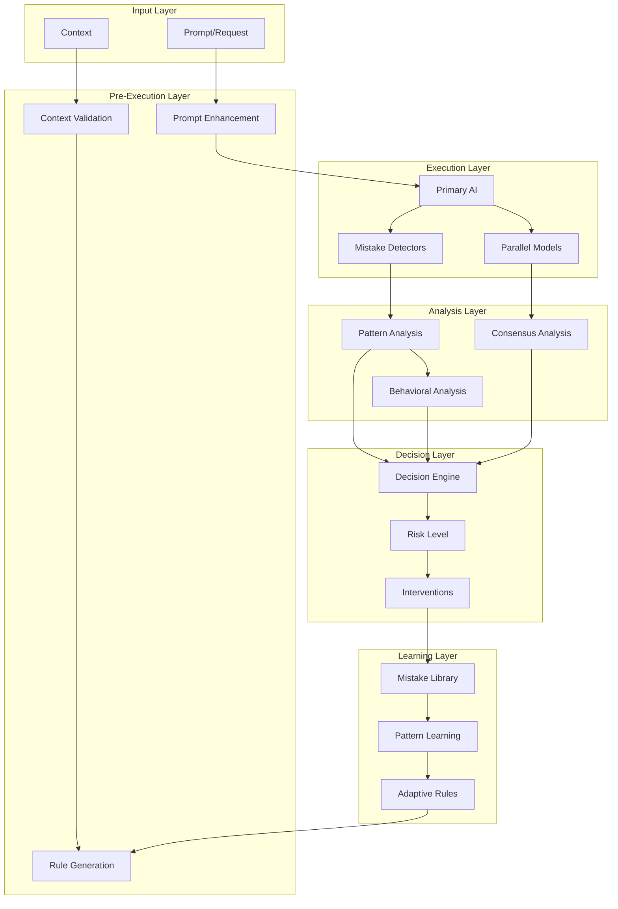

# Generalized AI Mistake Detection System

## Executive Summary

This document outlines a generalized, extensible system for detecting and preventing AI mistakes across any AI-assisted development workflow. Building on the specific Claude-related issues identified, this system provides a framework that can evolve to catch new types of mistakes as they emerge.

## System Architecture

### Core Principle: Defense in Depth



## Generalized Mistake Categories

### 1. Environmental Assumptions

```elixir
defmodule Pipeline.Safety.MistakeDetection.EnvironmentalAssumptions do
  @moduledoc """
  Detects when AI makes assumptions about the runtime environment
  """
  
  defstruct [:patterns, :severity_calculator, :context_analyzer]
  
  @base_patterns %{
    hardcoded_paths: %{
      pattern: ~r{(/home/|/Users/|C:\\Users\\)[^/\s]+},
      severity: :high,
      message: "Hardcoded user-specific path detected"
    },
    
    executable_assumptions: %{
      pattern: ~r{^(python3?|node|npm|ruby|java)\s},
      severity: :medium,
      message: "Assuming executable in PATH"
    },
    
    network_assumptions: %{
      pattern: ~r{(localhost|127\.0\.0\.1):\d+},
      severity: :medium,
      message: "Hardcoded network location"
    },
    
    permission_assumptions: %{
      pattern: ~r{(chmod|chown)\s+[0-7]{3,4}},
      severity: :high,
      message: "Assuming permission changes are safe"
    }
  }
  
  def detect(action, context) do
    @base_patterns
    |> Map.merge(context.custom_patterns || %{})
    |> Enum.flat_map(fn {type, config} ->
      if matches?(action, config.pattern) do
        [build_detection(type, config, action, context)]
      else
        []
      end
    end)
  end
end
```

### 2. Code Organization Violations

```elixir
defmodule Pipeline.Safety.MistakeDetection.CodeOrganization do
  @moduledoc """
  Detects violations of project structure and organization
  """
  
  @violation_rules [
    %{
      name: :test_in_source,
      detector: fn(path, content) ->
        is_source_file?(path) && is_test_code?(content)
      end,
      severity: :critical,
      message: "Test code in source directory"
    },
    
    %{
      name: :wrong_directory_structure,
      detector: fn(path, context) ->
        !follows_project_structure?(path, context.project_structure)
      end,
      severity: :high,
      message: "File location violates project structure"
    },
    
    %{
      name: :naming_convention_violation,
      detector: fn(path, context) ->
        !matches_naming_convention?(path, context.naming_rules)
      end,
      severity: :medium,
      message: "File naming convention violation"
    }
  ]
  
  def detect(file_operation, context) do
    @violation_rules
    |> Enum.filter(& &1.detector.(file_operation.path, context))
    |> Enum.map(&build_violation(&1, file_operation))
  end
end
```

### 3. Safety and Security Violations

```elixir
defmodule Pipeline.Safety.MistakeDetection.SecurityViolations do
  @moduledoc """
  Detects potential security and safety issues
  """
  
  @critical_patterns [
    # Dangerous commands
    {~r{rm\s+-rf\s+/}, "Dangerous recursive deletion"},
    {~r{chmod\s+777}, "Overly permissive file permissions"},
    {~r{eval\s*\(|exec\s*\(}, "Dynamic code execution"},
    
    # Credential exposure
    {~r{(password|secret|key)\s*=\s*["'][^"']+["']}, "Hardcoded credentials"},
    {~r{(AWS|AZURE|GCP)_[A-Z_]+\s*=}, "Cloud credentials in code"},
    
    # SQL injection risks
    {~r{query\s*\(\s*["']\s*SELECT.*\+.*["']}, "Potential SQL injection"},
    
    # Unsafe operations
    {~r{disable.*security|bypass.*auth}, "Security bypass attempt"}
  ]
  
  def scan(action) do
    @critical_patterns
    |> Enum.find_value(fn {pattern, message} ->
      if Regex.match?(pattern, action.content) do
        %{
          type: :security_violation,
          severity: :critical,
          message: message,
          pattern: inspect(pattern)
        }
      end
    end)
  end
end
```

### 4. Context Ignorance

```elixir
defmodule Pipeline.Safety.MistakeDetection.ContextIgnorance do
  @moduledoc """
  Detects when AI ignores important context
  """
  
  def analyze(action, context) do
    violations = []
    
    # Check if modifying files outside of scope
    if out_of_scope?(action, context.allowed_paths) do
      violations ++ [%{type: :out_of_scope, severity: :high}]
    end
    
    # Check if ignoring explicit constraints
    violated_constraints = find_violated_constraints(action, context.constraints)
    violations ++ Enum.map(violated_constraints, & %{
      type: :constraint_violation,
      constraint: &1,
      severity: :high
    })
    
    # Check if action contradicts recent context
    if contradicts_context?(action, context.recent_messages) do
      violations ++ [%{type: :context_contradiction, severity: :medium}]
    end
    
    violations
  end
end
```

## Extensible Detection Framework

### 1. Detector Plugin System

```elixir
defmodule Pipeline.Safety.MistakeDetection.Framework do
  @moduledoc """
  Extensible framework for mistake detection
  """
  
  defmodule Detector do
    @callback detect(action :: map(), context :: map()) :: [detection :: map()]
    @callback severity(detection :: map()) :: :low | :medium | :high | :critical
    @callback can_auto_fix?(detection :: map()) :: boolean()
    @callback auto_fix(detection :: map(), action :: map()) :: {:ok, fixed_action} | :cannot_fix
  end
  
  defmodule Registry do
    use GenServer
    
    def register_detector(name, module, config \\ %{}) do
      GenServer.call(__MODULE__, {:register, name, module, config})
    end
    
    def run_detectors(action, context) do
      GenServer.call(__MODULE__, {:run_all, action, context})
    end
    
    def handle_call({:run_all, action, context}, _from, state) do
      detections = state.detectors
      |> Enum.flat_map(fn {_name, {module, config}} ->
        module.detect(action, Map.merge(context, config))
      end)
      |> Enum.sort_by(& &1.severity, :desc)
      
      {:reply, detections, state}
    end
  end
end
```

### 2. Pattern Evolution System

```elixir
defmodule Pipeline.Safety.MistakeDetection.PatternEvolution do
  @moduledoc """
  Learns and evolves detection patterns over time
  """
  
  defstruct [:pattern_db, :learning_rate, :confidence_threshold]
  
  def learn_from_mistake(mistake, context) do
    # Extract features from the mistake
    features = extract_features(mistake, context)
    
    # Find similar patterns
    similar_patterns = find_similar_patterns(features)
    
    if Enum.empty?(similar_patterns) do
      # Create new pattern
      create_pattern(features, mistake)
    else
      # Strengthen existing patterns
      strengthen_patterns(similar_patterns, features)
    end
  end
  
  def evolve_patterns(feedback_data) do
    # Analyze which patterns are effective
    effectiveness = calculate_pattern_effectiveness(feedback_data)
    
    # Adjust pattern weights
    adjust_pattern_weights(effectiveness)
    
    # Merge similar patterns
    merge_redundant_patterns()
    
    # Generate new pattern combinations
    generate_pattern_variants()
  end
  
  defp extract_features(mistake, context) do
    %{
      action_type: classify_action(mistake.action),
      content_features: extract_content_features(mistake.content),
      context_features: extract_context_features(context),
      impact_features: analyze_impact(mistake),
      temporal_features: extract_temporal_patterns(mistake, context)
    }
  end
end
```

### 3. Multi-Model Consensus Framework

```elixir
defmodule Pipeline.Safety.MistakeDetection.MultiModelConsensus do
  @moduledoc """
  Generalized framework for multi-model validation
  """
  
  defmodule ModelValidator do
    defstruct [:model, :role, :weight, :specializations]
    
    def validate(validator, action, context) do
      prompt = build_validation_prompt(validator.role, action, context)
      
      response = validator.model.query(prompt)
      
      parse_validation_response(response, validator)
    end
  end
  
  def build_consensus_system(config) do
    %{
      validators: [
        %ModelValidator{
          model: config.code_reviewer_model,
          role: :code_quality,
          weight: 0.3,
          specializations: [:syntax, :patterns, :conventions]
        },
        %ModelValidator{
          model: config.security_reviewer_model,
          role: :security,
          weight: 0.4,
          specializations: [:vulnerabilities, :permissions, :data_exposure]
        },
        %ModelValidator{
          model: config.context_validator_model,
          role: :context_awareness,
          weight: 0.3,
          specializations: [:scope, :requirements, :constraints]
        }
      ],
      decision_rules: %{
        unanimous_block: true,  # All models must agree to proceed
        severity_threshold: 0.7, # Combined severity threshold
        specialization_weight: 1.5 # Weight multiplier for specialized areas
      }
    }
  end
  
  def get_consensus(validators, action, context) do
    validations = Enum.map(validators, & &1.validate(action, context))
    
    %{
      decision: calculate_decision(validations),
      confidence: calculate_confidence(validations),
      dissenting_opinions: find_dissenting(validations),
      recommendations: aggregate_recommendations(validations)
    }
  end
end
```

## Integration with Pipeline Safety System

### 1. Enhanced Step Reviewer

```elixir
defmodule Pipeline.Safety.StepReviewer.Enhanced do
  @moduledoc """
  Integrates mistake detection into step review process
  """
  
  def review_with_mistake_detection(step, context) do
    # Original review
    base_review = review_action(step, context)
    
    # Mistake detection
    mistakes = Pipeline.Safety.MistakeDetection.Framework.run_detectors(step, context)
    
    # Multi-model consensus
    consensus = Pipeline.Safety.MistakeDetection.MultiModelConsensus.get_consensus(
      context.validators,
      step,
      context
    )
    
    # Combine all inputs
    final_decision = combine_reviews(base_review, mistakes, consensus)
    
    %{
      decision: final_decision.action,
      confidence: final_decision.confidence,
      detected_mistakes: mistakes,
      consensus_report: consensus,
      auto_fixes: generate_auto_fixes(mistakes)
    }
  end
end
```

### 2. Real-Time Learning Integration

```elixir
defmodule Pipeline.Safety.Learning.MistakeTracker do
  @moduledoc """
  Tracks and learns from detected mistakes
  """
  
  use GenServer
  
  def record_detection(detection, outcome) do
    GenServer.cast(__MODULE__, {:record, detection, outcome})
  end
  
  def handle_cast({:record, detection, outcome}, state) do
    # Update pattern effectiveness
    state = update_pattern_stats(state, detection, outcome)
    
    # Learn new patterns if needed
    if should_create_pattern?(detection, outcome) do
      new_pattern = PatternEvolution.learn_from_mistake(detection, state.context)
      state = add_pattern(state, new_pattern)
    end
    
    # Adjust weights based on performance
    state = adjust_detector_weights(state)
    
    {:noreply, state}
  end
  
  defp should_create_pattern?(detection, outcome) do
    outcome.was_correct_detection && 
    detection.confidence < 0.5 &&  # Low confidence but correct
    outcome.impact_severity >= :medium
  end
end
```

## Configuration Schema

```yaml
mistake_detection:
  # Global settings
  enabled: true
  learning_enabled: true
  
  # Detector categories
  detectors:
    environmental_assumptions:
      enabled: true
      custom_patterns:
        - pattern: "company_specific_path"
          regex: "/opt/mycompany/"
          severity: high
    
    code_organization:
      enabled: true
      project_structure:
        source_dirs: ["lib", "src"]
        test_dirs: ["test", "spec"]
        config_dirs: ["config", "priv"]
      naming_rules:
        modules: "PascalCase"
        files: "snake_case"
    
    security_violations:
      enabled: true
      additional_patterns: []
      severity_overrides: {}
    
    context_ignorance:
      enabled: true
      scope_enforcement: strict
  
  # Multi-model configuration
  multi_model:
    enabled: false  # Start with single model
    validators:
      - model: "gpt-4-turbo"
        role: "security_reviewer"
        weight: 0.4
      - model: "claude-3-sonnet"
        role: "code_quality"
        weight: 0.3
      - model: "gemini-pro"
        role: "context_validator"
        weight: 0.3
    
    consensus_rules:
      require_unanimous: false
      min_agreement: 0.6
  
  # Learning configuration
  learning:
    enabled: true
    retention_days: 90
    pattern_evolution:
      min_occurrences: 3
      confidence_threshold: 0.8
      merge_similar_threshold: 0.9
    
  # Integration settings
  integration:
    with_step_reviewer: true
    with_pattern_detector: true
    with_intervention_system: true
```

## Extensibility Points

### 1. Custom Detector Implementation

```elixir
defmodule MyProject.CustomMistakeDetector do
  @behaviour Pipeline.Safety.MistakeDetection.Framework.Detector
  
  @impl true
  def detect(action, context) do
    # Custom detection logic
    if violates_my_rule?(action) do
      [%{
        type: :custom_violation,
        message: "Violates project-specific rule X",
        severity: :high,
        details: analyze_violation(action)
      }]
    else
      []
    end
  end
  
  @impl true
  def severity(%{details: details}) do
    # Dynamic severity calculation
    calculate_severity_from_details(details)
  end
  
  @impl true
  def can_auto_fix?(_detection), do: true
  
  @impl true
  def auto_fix(detection, action) do
    # Attempt to fix the issue
    {:ok, apply_fix(action, detection)}
  end
end

# Register the detector
Pipeline.Safety.MistakeDetection.Framework.Registry.register_detector(
  :my_custom_detector,
  MyProject.CustomMistakeDetector,
  %{config: "values"}
)
```

### 2. Pattern Definition DSL

```elixir
defmodule Pipeline.Safety.MistakeDetection.DSL do
  defmacro defpattern(name, do: block) do
    quote do
      def unquote(name)() do
        %Pattern{
          name: unquote(name),
          unquote(block)
        }
      end
    end
  end
  
  # Usage
  defpattern :hardcoded_url do
    match ~r{https?://[^/]+/}
    severity :medium
    message "Hardcoded URL detected"
    
    context_check fn ctx ->
      !ctx.allows_external_urls
    end
    
    auto_fix fn action ->
      replace_with_config_var(action)
    end
  end
end
```

### 3. Learning Pipeline Hooks

```elixir
defmodule Pipeline.Safety.MistakeDetection.LearningHooks do
  defmacro __using__(_) do
    quote do
      def after_detection(detection, action, context) do
        # Custom learning logic
        if detection.is_new_pattern do
          broadcast_new_pattern_found(detection)
        end
        
        if detection.severity >= :high do
          alert_security_team(detection)
        end
        
        super(detection, action, context)
      end
      
      def on_pattern_evolved(old_pattern, new_pattern) do
        # Custom pattern evolution logic
        log_pattern_evolution(old_pattern, new_pattern)
        
        if significantly_different?(old_pattern, new_pattern) do
          require_human_review(new_pattern)
        end
      end
    end
  end
end
```

## Metrics and Monitoring

```elixir
defmodule Pipeline.Safety.MistakeDetection.Metrics do
  def track_detection_metrics do
    %{
      detections_per_category: %{
        environmental_assumptions: count_by_category(:environmental),
        code_organization: count_by_category(:organization),
        security_violations: count_by_category(:security),
        context_ignorance: count_by_category(:context)
      },
      
      detection_accuracy: %{
        true_positives: count_true_positives(),
        false_positives: count_false_positives(),
        false_negatives: estimate_false_negatives()
      },
      
      learning_effectiveness: %{
        patterns_created: count_new_patterns(),
        patterns_evolved: count_evolved_patterns(),
        detection_improvement: calculate_improvement_rate()
      },
      
      model_performance: %{
        consensus_agreement_rate: calculate_consensus_rate(),
        model_accuracy_comparison: compare_model_accuracy(),
        specialization_effectiveness: measure_specialization_impact()
      }
    }
  end
end
```

## Future Enhancements

1. **Behavioral Prediction**: Predict likely mistakes before they happen
2. **Contextual Pattern Templates**: Patterns that adapt based on project type
3. **Cross-Project Learning**: Share learned patterns across projects (with privacy)
4. **Mistake Explanation Generation**: Explain why something is a mistake
5. **Automated Test Generation**: Generate tests for detected mistake patterns

## Conclusion

This generalized system provides:
- **Extensible detection framework** for any type of AI mistake
- **Learning capabilities** to improve over time
- **Multi-model consensus** for critical decisions
- **Seamless integration** with existing safety systems
- **Clear extension points** for custom needs

The system can start simple with pattern matching and grow to include sophisticated ML-based detection and multi-model validation as needed.