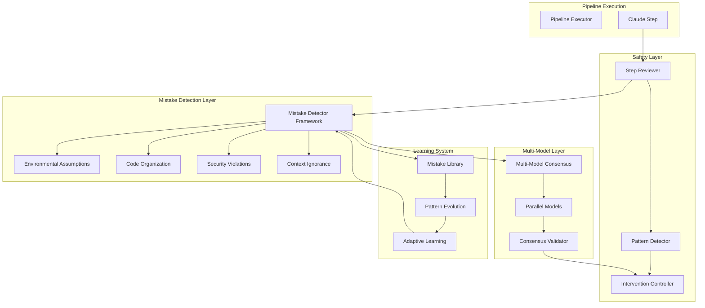

# AI Mistake Detection - Pipeline Integration Design

## Overview

This document details how the AI Mistake Detection system integrates with the existing Pipeline Safety Reviewer system, creating a comprehensive defense against AI-generated errors.

## Integration Architecture



## Integration Points

### 1. Step Reviewer Enhancement

The Step Reviewer is enhanced to incorporate mistake detection:

```elixir
defmodule Pipeline.Safety.StepReviewer do
  # Existing functionality...
  
  def review_action(reviewer, action, context) do
    # Original review logic
    risk_analysis = analyze_risk(reviewer, action)
    rationality_analysis = check_rationality(reviewer, action, context)
    side_effects = analyze_side_effects(reviewer, action)
    
    # NEW: Mistake detection integration
    mistake_detections = run_mistake_detection(action, context)
    
    # NEW: Multi-model consensus (if enabled)
    consensus = if context.config.multi_model_enabled do
      get_multi_model_consensus(action, context)
    else
      nil
    end
    
    # Combine all analyses
    decision = make_enhanced_decision(%{
      action: action,
      risk: risk_analysis,
      rationality: rationality_analysis,
      side_effects: side_effects,
      mistakes: mistake_detections,     # NEW
      consensus: consensus              # NEW
    })
    
    {:ok, decision}
  end
  
  defp run_mistake_detection(action, context) do
    Pipeline.Safety.MistakeDetection.Framework.run_detectors(action, context)
  end
end
```

### 2. Pattern Detector Integration

Pattern detection now includes mistake patterns:

```elixir
defmodule Pipeline.Safety.Patterns.MistakePatterns do
  @moduledoc """
  Patterns specific to common AI mistakes
  """
  
  def patterns do
    [
      %Pattern{
        id: :hardcoded_paths,
        description: "AI hardcoding user-specific paths",
        detector: &detect_hardcoded_paths/2,
        severity: :high,
        intervention: :block_and_educate
      },
      
      %Pattern{
        id: :test_file_pollution,
        description: "Test files in production directories",
        detector: &detect_test_pollution/2,
        severity: :critical,
        intervention: :block
      },
      
      %Pattern{
        id: :assumption_cascade,
        description: "Multiple environmental assumptions",
        detector: &detect_assumption_cascade/2,
        severity: :medium,
        intervention: :warn_and_guide
      }
    ]
  end
  
  defp detect_hardcoded_paths(history, _context) do
    recent_actions = Enum.take(history, -10)
    
    hardcoded_count = Enum.count(recent_actions, fn action ->
      action.content =~ ~r{/home/\w+/|/Users/\w+/|C:\\Users\\}
    end)
    
    %PatternMatch{
      detected: hardcoded_count > 0,
      confidence: min(hardcoded_count * 0.3, 1.0),
      severity: if(hardcoded_count > 2, do: :critical, else: :high),
      details: %{
        count: hardcoded_count,
        examples: extract_hardcoded_examples(recent_actions)
      }
    }
  end
end
```

### 3. Intervention System Enhancement

The intervention system now handles mistake-specific interventions:

```elixir
defmodule Pipeline.Safety.Interventions.MistakeCorrection do
  @behaviour Pipeline.Safety.Intervention
  
  @impl true
  def intervene(state, issue, context) do
    case issue.type do
      :hardcoded_path ->
        inject_path_guidance(state, issue)
        
      :test_file_pollution ->
        block_and_correct_structure(state, issue)
        
      :security_violation ->
        emergency_security_intervention(state, issue)
        
      _ ->
        generic_mistake_intervention(state, issue)
    end
  end
  
  defp inject_path_guidance(state, issue) do
    guidance = %{
      role: "system",
      content: """
      ⚠️ MISTAKE DETECTED: Hardcoded path found
      
      You used: #{issue.details.hardcoded_path}
      
      NEVER hardcode paths. Instead:
      1. Use System.find_executable/1 for commands
      2. Use Application.app_dir/2 for app paths  
      3. Use Path.expand/2 for relative paths
      4. Make paths configurable
      
      Example fix:
      ```elixir
      # Bad
      executable_path = "/home/user/.pyenv/shims/python3"
      
      # Good
      executable_path = System.find_executable("python3") || "python3"
      ```
      
      Please correct this mistake and remember this pattern.
      """,
      metadata: %{
        type: :mistake_correction,
        mistake_type: :hardcoded_path,
        education: true
      }
    }
    
    {:continue, inject_message(state, guidance), log_education(issue)}
  end
end
```

### 4. Configuration Integration

Unified configuration for both systems:

```yaml
# config/safety.yml
safety:
  # Existing safety configuration
  reviewer:
    enabled: true
    risk_threshold: 0.7
    
  patterns:
    enabled_patterns: 
      - repetitive_errors
      - scope_creep
      - hardcoded_paths      # NEW
      - test_pollution       # NEW
      - assumption_cascade   # NEW
    
  interventions:
    soft_correction: true
    mistake_education: true  # NEW
    
  # NEW: Mistake detection configuration  
  mistake_detection:
    enabled: true
    
    detectors:
      environmental:
        patterns:
          - hardcoded_paths
          - executable_assumptions
          - network_assumptions
        custom_paths:
          - "/opt/company/*"
          
      organization:
        source_dirs: ["lib", "src", "app"]
        test_dirs: ["test", "spec", "tests"]
        enforce_structure: true
        
      security:
        critical_patterns: true
        custom_patterns: []
        
    learning:
      enabled: true
      min_confidence: 0.8
      
    multi_model:
      enabled: false  # Enable when ready
      models:
        - name: gpt-4
          role: reviewer
          weight: 0.4
```

### 5. Stream Step Integration

Mistake detection integrated with step grouping:

```elixir
defmodule ClaudeCodeSDK.StepGrouping.MistakeAwareDetector do
  @moduledoc """
  Step detection that considers mistake patterns
  """
  
  def analyze_with_mistake_awareness(detector, message, buffer) do
    # Standard step detection
    step_detection = analyze_step(detector, message, buffer)
    
    # Check for mistake indicators
    mistake_indicators = check_mistake_indicators(message, buffer)
    
    # Adjust step boundaries based on mistakes
    case {step_detection, mistake_indicators} do
      {{:step_continue, _}, {:mistake_started, type}} ->
        # Start new step when mistake pattern begins
        {:step_start, {:mistake_correction, type}}
        
      {{:step_continue, _}, {:mistake_resolved, _}} ->
        # End step when mistake is resolved
        {:step_end, %{reason: :mistake_corrected}}
        
      _ ->
        step_detection
    end
  end
  
  defp check_mistake_indicators(message, buffer) do
    cond do
      contains_hardcoded_path?(message) ->
        {:mistake_started, :hardcoded_path}
        
      contains_test_file_creation?(message, buffer) ->
        {:mistake_started, :test_pollution}
        
      contains_correction?(message, buffer) ->
        {:mistake_resolved, extract_correction_type(buffer)}
        
      true ->
        :no_mistake_indicator
    end
  end
end
```

## Deployment Strategy

### Phase 1: Pattern-Based Detection (Week 1)
- Deploy basic hardcoded path detection
- Deploy test file pollution detection  
- Integrate with existing Step Reviewer
- Monitor false positive rate

### Phase 2: Enhanced Interventions (Week 2)
- Deploy mistake-specific interventions
- Add educational corrections
- Implement auto-fix for simple mistakes
- Track intervention effectiveness

### Phase 3: Learning System (Week 3-4)
- Deploy pattern learning
- Implement mistake database
- Add pattern evolution
- Monitor detection improvement

### Phase 4: Multi-Model Consensus (Week 5-6)
- Deploy parallel model validation
- Implement consensus system
- Add model-specific specializations
- Measure consensus accuracy

## Monitoring and Metrics

### Unified Dashboard

```elixir
defmodule Pipeline.Safety.Monitoring.UnifiedDashboard do
  def metrics do
    %{
      # Original safety metrics
      safety: %{
        interventions: count_interventions(),
        patterns_detected: count_patterns(),
        recovery_success: calculate_recovery_rate()
      },
      
      # Mistake detection metrics
      mistakes: %{
        by_category: %{
          hardcoded_paths: count_by_type(:hardcoded_path),
          test_pollution: count_by_type(:test_pollution),
          assumptions: count_by_type(:assumption),
          security: count_by_type(:security)
        },
        
        prevention: %{
          blocked: count_blocked_mistakes(),
          auto_fixed: count_auto_fixes(),
          educated: count_educational_interventions()
        },
        
        learning: %{
          patterns_learned: count_new_patterns(),
          accuracy_improvement: calculate_improvement(),
          false_positive_rate: calculate_false_positives()
        }
      },
      
      # Combined effectiveness
      overall: %{
        ai_safety_score: calculate_safety_score(),
        mistake_prevention_rate: calculate_prevention_rate(),
        learning_velocity: calculate_learning_rate()
      }
    }
  end
end
```

### Alerting Rules

```yaml
alerts:
  # Critical mistakes
  - name: hardcoded_path_surge
    condition: rate(mistakes.hardcoded_paths[5m]) > 5
    severity: high
    action: block_ai_temporarily
    
  - name: test_pollution_detected
    condition: mistakes.test_pollution > 0
    severity: critical
    action: immediate_intervention
    
  - name: security_violation
    condition: mistakes.security > 0
    severity: critical
    action: emergency_stop
    
  # Learning alerts
  - name: high_false_positive_rate
    condition: mistakes.false_positive_rate > 0.2
    severity: medium
    action: adjust_sensitivity
    
  - name: pattern_learning_stalled
    condition: rate(patterns_learned[1d]) < 1
    severity: low
    action: review_learning_config
```

## Testing Strategy

### Integration Tests

```elixir
defmodule Pipeline.Safety.IntegrationTest do
  use ExUnit.Case
  
  describe "mistake detection integration" do
    test "detects and blocks hardcoded paths" do
      action = %{
        type: :file_write,
        content: "def path, do: \"/home/user/.pyenv/shims/python3\""
      }
      
      result = Pipeline.Safety.StepReviewer.review_action(
        reviewer(),
        action,
        context()
      )
      
      assert result.decision.action == :block
      assert Enum.any?(result.detected_mistakes, & &1.type == :hardcoded_path)
    end
    
    test "educational intervention for test pollution" do
      action = %{
        type: :file_create,
        path: "lib/adapters/test_adapter.ex",
        content: "defmodule TestAdapter do"
      }
      
      {:intervene, intervention} = process_with_safety(action)
      
      assert intervention.type == :mistake_education
      assert intervention.content =~ "Test files belong in test/"
    end
    
    test "learns from repeated mistakes" do
      # Make same mistake 3 times
      repeat_mistake(:hardcoded_path, 3)
      
      # Check that pattern was strengthened
      pattern = get_pattern(:hardcoded_path)
      assert pattern.confidence > 0.9
      assert pattern.auto_block == true
    end
  end
end
```

## Success Criteria

1. **Mistake Prevention**: 95%+ of common mistakes blocked
2. **False Positive Rate**: < 5% incorrect detections
3. **Learning Effectiveness**: 50% reduction in mistakes over 4 weeks
4. **Performance Impact**: < 10ms added latency per review
5. **Developer Satisfaction**: 90%+ find interventions helpful

## Future Enhancements

1. **Predictive Mistake Prevention**: Detect mistakes before they happen
2. **Cross-Project Learning**: Share patterns across projects
3. **AI Model Fine-Tuning**: Train models on mistake patterns
4. **Automated Remediation**: Fix more complex mistakes automatically
5. **Mistake Analytics**: Deep insights into AI behavior patterns

## Conclusion

This integration creates a comprehensive safety net that:
- Catches common AI mistakes in real-time
- Educates AI to prevent future mistakes
- Learns and adapts over time
- Provides clear metrics and monitoring
- Scales from simple patterns to complex multi-model validation

The system starts simple but can grow to handle increasingly sophisticated mistake detection and prevention scenarios.