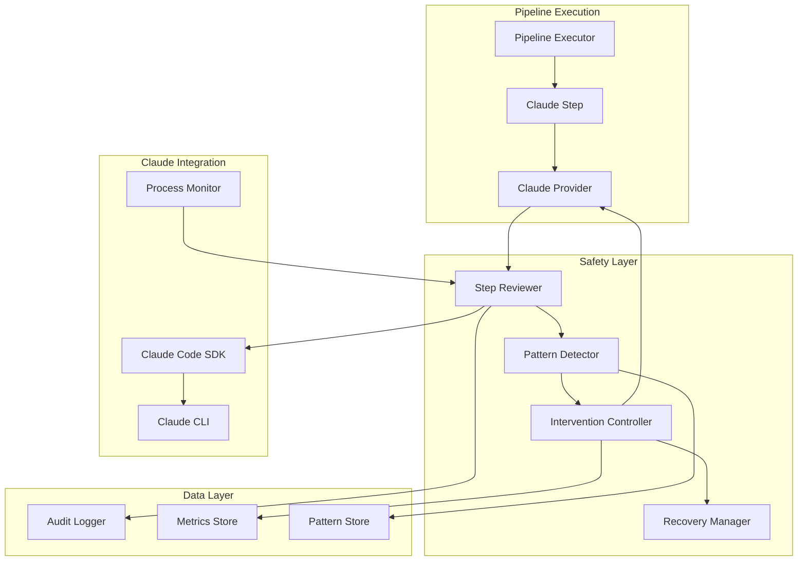

# Claude Safety Reviewer - Core Architecture

## System Architecture

### Component Overview



## Core Components

### 1. Step Reviewer (`Pipeline.Safety.StepReviewer`)

The Step Reviewer acts as the primary gatekeeper, intercepting every Claude action before and after execution.

```elixir
defmodule Pipeline.Safety.StepReviewer do
  use GenServer
  
  defstruct [
    :review_rules,
    :risk_calculator,
    :context_analyzer,
    :decision_engine,
    :audit_logger
  ]
  
  @type review_result :: %{
    action: map(),
    risk_score: float(),
    rationality_score: float(),
    side_effects: [side_effect()],
    decision: :allow | :warn | :block | :modify,
    reasoning: String.t()
  }
  
  @type side_effect :: %{
    type: :file_write | :file_delete | :network | :system_call,
    severity: :low | :medium | :high | :critical,
    reversible: boolean(),
    details: map()
  }
end
```

### 2. Pattern Detector (`Pipeline.Safety.PatternDetector`)

Identifies behavioral patterns that indicate Claude is deviating from expected behavior.

```elixir
defmodule Pipeline.Safety.PatternDetector do
  @patterns [
    %Pattern{
      id: :repetitive_errors,
      description: "Same error occurring multiple times",
      detector: &detect_repetitive_errors/2,
      severity: :medium,
      threshold: 3
    },
    %Pattern{
      id: :scope_creep,
      description: "Working outside expected file boundaries",
      detector: &detect_scope_creep/2,
      severity: :high,
      threshold: 0.3
    },
    %Pattern{
      id: :resource_spiral,
      description: "Exponentially increasing resource usage",
      detector: &detect_resource_spiral/2,
      severity: :critical,
      threshold: 0.8
    },
    %Pattern{
      id: :goal_drift,
      description: "Actions not aligned with stated objectives",
      detector: &detect_goal_drift/2,
      severity: :medium,
      threshold: 0.5
    }
  ]
  
  def analyze_history(action_history, context) do
    @patterns
    |> Enum.map(&apply_pattern(&1, action_history, context))
    |> Enum.filter(&pattern_triggered?/1)
  end
end
```

### 3. Intervention Controller (`Pipeline.Safety.InterventionController`)

Orchestrates responses to detected issues, from gentle corrections to emergency stops.

```elixir
defmodule Pipeline.Safety.InterventionController do
  @interventions %{
    soft_correction: %Intervention{
      type: :message_injection,
      handler: &inject_corrective_prompt/2,
      allows_continuation: true
    },
    context_reinforcement: %Intervention{
      type: :context_update,
      handler: &reinforce_original_context/2,
      allows_continuation: true
    },
    resource_throttling: %Intervention{
      type: :limit_adjustment,
      handler: &apply_resource_limits/2,
      allows_continuation: true
    },
    checkpoint_rollback: %Intervention{
      type: :state_restoration,
      handler: &rollback_to_checkpoint/2,
      allows_continuation: false
    },
    emergency_stop: %Intervention{
      type: :hard_stop,
      handler: &terminate_execution/2,
      allows_continuation: false
    }
  }
  
  def select_intervention(review_result, patterns) do
    severity = calculate_combined_severity(review_result, patterns)
    
    case severity do
      s when s < 0.3 -> :soft_correction
      s when s < 0.5 -> :context_reinforcement
      s when s < 0.7 -> :resource_throttling
      s when s < 0.9 -> :checkpoint_rollback
      _ -> :emergency_stop
    end
  end
end
```

### 4. Recovery Manager (`Pipeline.Safety.RecoveryManager`)

Handles graceful recovery from interventions and failures.

```elixir
defmodule Pipeline.Safety.RecoveryManager do
  def recover(state, intervention_type, context) do
    case intervention_type do
      :soft_correction ->
        apply_correction_and_continue(state, context)
        
      :context_reinforcement ->
        rebuild_context_and_retry(state, context)
        
      :resource_throttling ->
        apply_limits_and_continue(state, context)
        
      :checkpoint_rollback ->
        restore_and_retry_with_guidance(state, context)
        
      :emergency_stop ->
        save_state_and_notify(state, context)
    end
  end
  
  defp apply_correction_and_continue(state, context) do
    corrective_prompt = generate_corrective_prompt(state.last_error, context)
    
    {:continue, %{
      state | 
      messages: state.messages ++ [corrective_prompt],
      recovery_attempted: true
    }}
  end
end
```

## Data Flow

### 1. Action Interception Flow

```
Claude Action Request
        ↓
Pre-Execution Review
        ↓
Risk Assessment
        ↓
Decision Point ─→ Block (if high risk)
        ↓
Execute Action
        ↓
Post-Execution Review
        ↓
Pattern Analysis
        ↓
Intervention Decision
        ↓
Continue/Intervene
```

### 2. Review Process

```elixir
def review_action(action, context, history) do
  # Pre-execution checks
  risk_score = calculate_risk_score(action)
  rationality = assess_rationality(action, context)
  side_effects = predict_side_effects(action)
  
  # Pattern matching
  patterns = PatternDetector.check_patterns(history ++ [action])
  
  # Decision making
  decision = make_decision(%{
    risk_score: risk_score,
    rationality: rationality,
    side_effects: side_effects,
    patterns: patterns
  })
  
  # Audit logging
  AuditLogger.log_review(action, decision)
  
  decision
end
```

## Integration Points

### 1. Claude Provider Integration

```elixir
defmodule Pipeline.Providers.ClaudeProvider do
  def execute_with_safety(step, context) do
    # Initialize safety components
    {:ok, reviewer} = StepReviewer.start_link(context)
    {:ok, monitor} = ProcessMonitor.start_link(self())
    
    # Wrap execution with safety
    result = 
      step
      |> prepare_execution()
      |> execute_with_monitoring(reviewer, monitor)
      |> handle_interventions()
      |> finalize_execution()
    
    # Cleanup
    StepReviewer.stop(reviewer)
    ProcessMonitor.stop(monitor)
    
    result
  end
end
```

### 2. Process Monitor Integration

```elixir
defmodule Pipeline.Safety.ProcessMonitor do
  def monitor_claude_process(pid, reviewer) do
    # Monitor stdout/stderr
    capture_output(pid)
    |> Stream.map(&parse_claude_action/1)
    |> Stream.map(&StepReviewer.review/2)
    |> Stream.map(&apply_decision/1)
    |> Stream.run()
  end
  
  defp parse_claude_action(output) do
    # Parse Claude's tool usage and responses
    case output do
      {:stdout, data} -> parse_tool_use(data)
      {:stderr, data} -> parse_error(data)
    end
  end
end
```

## Configuration Schema

```elixir
defmodule Pipeline.Safety.Config do
  @schema %{
    reviewer: %{
      enabled: {:boolean, true},
      risk_threshold: {:float, 0.7},
      review_mode: {:enum, [:blocking, :async], :blocking}
    },
    patterns: %{
      enabled_patterns: {:list, [:all]},
      custom_patterns: {:list, []},
      sensitivity: {:enum, [:low, :medium, :high], :medium}
    },
    interventions: %{
      soft_correction: {:boolean, true},
      hard_stop: {:boolean, true},
      auto_rollback: {:boolean, false},
      max_retries: {:integer, 3}
    },
    resources: %{
      max_file_operations: {:integer, 100},
      max_memory_mb: {:integer, 512},
      max_execution_time_seconds: {:integer, 300},
      max_token_usage: {:integer, 100_000}
    },
    audit: %{
      log_level: {:enum, [:debug, :info, :warn, :error], :info},
      retain_days: {:integer, 30},
      export_format: {:enum, [:json, :csv], :json}
    }
  }
end
```

## Performance Considerations

### 1. Asynchronous Review
- Non-blocking review for low-risk actions
- Parallel pattern detection
- Buffered audit logging

### 2. Caching Strategy
- Pattern detection results
- Risk calculations
- Common intervention responses

### 3. Resource Management
- Bounded queues for action history
- Periodic cleanup of old data
- Efficient pattern matching algorithms

## Security Considerations

### 1. Isolation
- Separate process for Claude execution
- Restricted file system access
- Network isolation options

### 2. Authentication
- Secure storage of Claude credentials
- Token rotation support
- Audit trail for all authentications

### 3. Data Protection
- Encryption of sensitive review data
- Secure deletion of temporary files
- PII detection and masking

## Extensibility

### 1. Custom Patterns
```elixir
defmodule MyCustomPatterns do
  use Pipeline.Safety.PatternDetector.Pattern
  
  pattern :custom_check do
    description "Check for specific business logic violations"
    severity :high
    
    detect fn history, context ->
      # Custom detection logic
    end
  end
end
```

### 2. Custom Interventions
```elixir
defmodule MyCustomInterventions do
  use Pipeline.Safety.InterventionController.Intervention
  
  intervention :custom_response do
    type :custom
    allows_continuation true
    
    handle fn state, context ->
      # Custom intervention logic
    end
  end
end
```

### 3. Plugin Architecture
- Pattern plugins
- Intervention plugins
- Risk calculator plugins
- Audit exporter plugins