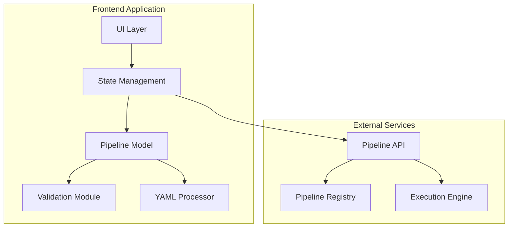

# Pipeline Visual Editor - Technical Architecture

## System Architecture

### Overview

The Pipeline Visual Editor is a React-based single-page application that provides a comprehensive interface for creating and managing pipeline_ex workflows. It follows a modular, event-driven architecture with clear separation of concerns.



## Core Modules

### 1. UI Layer

#### Graph Editor Module
```typescript
interface GraphEditorModule {
  // React Flow wrapper with custom nodes and edges
  nodes: {
    StepNode: React.FC<StepNodeProps>
    ParallelGroupNode: React.FC<ParallelGroupNodeProps>
    LoopNode: React.FC<LoopNodeProps>
    ConditionalNode: React.FC<ConditionalNodeProps>
    NestedPipelineNode: React.FC<NestedPipelineNodeProps>
  }
  
  edges: {
    DataFlowEdge: React.FC<EdgeProps>
    ConditionalEdge: React.FC<ConditionalEdgeProps>
    LoopBackEdge: React.FC<LoopBackEdgeProps>
  }
  
  handlers: {
    onNodeDragStop: (event: MouseEvent, node: Node) => void
    onConnect: (connection: Connection) => void
    onNodesDelete: (nodes: Node[]) => void
    onEdgesDelete: (edges: Edge[]) => void
  }
}
```

#### Configuration Panel Module
```typescript
interface ConfigPanelModule {
  // Dynamic form generation based on step type
  forms: {
    StepConfigForm: React.FC<StepConfigProps>
    PromptBuilder: React.FC<PromptBuilderProps>
    ConditionBuilder: React.FC<ConditionBuilderProps>
    LoopConfigForm: React.FC<LoopConfigProps>
  }
  
  fieldComponents: {
    TokenBudgetField: React.FC<TokenBudgetProps>
    ProviderSelector: React.FC<ProviderProps>
    ToolSelector: React.FC<ToolSelectorProps>
    SchemaEditor: React.FC<SchemaEditorProps>
  }
}
```

#### Code Editor Module
```typescript
interface CodeEditorModule {
  // Monaco Editor integration
  editor: {
    YamlEditor: React.FC<EditorProps>
    DiffViewer: React.FC<DiffViewerProps>
    ValidationPanel: React.FC<ValidationPanelProps>
  }
  
  features: {
    syntaxHighlighting: YamlLanguageDefinition
    autoComplete: CompletionProvider
    validation: ValidationProvider
    folding: FoldingProvider
  }
}
```

### 2. State Management Layer

Using Zustand for state management with modular stores:

```typescript
// Main Pipeline Store
interface PipelineStore {
  // Pipeline data
  pipeline: Pipeline
  nodes: Node[]
  edges: Edge[]
  
  // UI state
  selectedNodeId: string | null
  selectedEdgeId: string | null
  viewMode: 'graph' | 'code' | 'split'
  validationErrors: ValidationError[]
  
  // Actions
  actions: {
    // Pipeline operations
    loadPipeline: (yaml: string) => void
    savePipeline: () => string
    validatePipeline: () => ValidationResult
    
    // Node operations
    addNode: (type: NodeType, position: XYPosition) => void
    updateNode: (id: string, data: Partial<NodeData>) => void
    deleteNode: (id: string) => void
    
    // Edge operations
    connectNodes: (source: string, target: string) => void
    deleteEdge: (id: string) => void
    
    // UI operations
    selectNode: (id: string | null) => void
    setViewMode: (mode: ViewMode) => void
  }
}

// UI Preferences Store
interface UIStore {
  theme: 'light' | 'dark' | 'system'
  layout: LayoutConfig
  shortcuts: KeyboardShortcuts
  recentPipelines: RecentPipeline[]
  
  actions: {
    setTheme: (theme: Theme) => void
    updateLayout: (config: Partial<LayoutConfig>) => void
    addRecentPipeline: (pipeline: Pipeline) => void
  }
}

// Runtime Store (for execution monitoring)
interface RuntimeStore {
  executions: Execution[]
  activeExecution: Execution | null
  logs: ExecutionLog[]
  
  actions: {
    startExecution: (pipelineId: string) => void
    updateExecutionStatus: (id: string, status: ExecutionStatus) => void
    appendLog: (executionId: string, log: LogEntry) => void
  }
}
```

### 3. Pipeline Model

Core data structures representing the pipeline:

```typescript
// Base Pipeline Structure
interface Pipeline {
  workflow: {
    name: string
    description?: string
    version?: string
    checkpoint_enabled?: boolean
    workspace_dir?: string
    checkpoint_dir?: string
    
    defaults?: {
      gemini_model?: string
      gemini_token_budget?: TokenBudget
      claude_output_format?: string
      output_dir?: string
    }
    
    gemini_functions?: Record<string, FunctionDefinition>
    
    steps: Step[]
  }
}

// Step Types
type Step = 
  | GeminiStep
  | ClaudeStep
  | ClaudeSmartStep
  | ClaudeSessionStep
  | ClaudeExtractStep
  | ClaudeBatchStep
  | ClaudeRobustStep
  | ParallelClaudeStep
  | PipelineStep
  | ForLoopStep
  | WhileLoopStep
  | SwitchStep
  | FileOpsStep
  | DataTransformStep
  | CodebaseQueryStep
  | SetVariableStep
  | CheckpointStep

// Enhanced Step Interfaces
interface BaseStep {
  name: string
  type: StepType
  condition?: string | ConditionExpression
  output_to_file?: string
}

interface ClaudeStep extends BaseStep {
  type: 'claude'
  claude_options?: ClaudeOptions
  prompt: PromptElement[]
}

interface NestedPipelineStep extends BaseStep {
  type: 'pipeline'
  pipeline_file?: string
  pipeline_ref?: string
  pipeline?: Pipeline
  inputs?: Record<string, any>
  outputs?: OutputMapping[]
  config?: NestedPipelineConfig
}

interface ForLoopStep extends BaseStep {
  type: 'for_loop'
  iterator: string
  data_source: string
  parallel?: boolean
  max_parallel?: number
  steps: Step[]
}

interface ConditionalStep extends BaseStep {
  condition: ConditionExpression
}

// Condition Expression Types
type ConditionExpression = 
  | SimpleCondition
  | AndCondition
  | OrCondition
  | NotCondition

interface SimpleCondition {
  type: 'simple'
  expression: string
}

interface AndCondition {
  type: 'and'
  conditions: ConditionExpression[]
}

// Prompt Types
type PromptElement = 
  | StaticPrompt
  | FilePrompt
  | PreviousResponsePrompt
  | SessionContextPrompt
  | ClaudeContinuePrompt

interface StaticPrompt {
  type: 'static'
  content: string
}

interface PreviousResponsePrompt {
  type: 'previous_response'
  step: string
  extract?: string
  extract_with?: 'content_extractor'
  summary?: boolean
  max_length?: number
}
```

### 4. Validation Engine

Comprehensive validation system:

```typescript
interface ValidationEngine {
  // Schema validators
  validatePipelineSchema(pipeline: unknown): ValidationResult
  validateStepSchema(step: unknown, type: StepType): ValidationResult
  
  // Semantic validators
  validateStepReferences(pipeline: Pipeline): ValidationResult
  validateConditions(pipeline: Pipeline): ValidationResult
  validateLoops(pipeline: Pipeline): ValidationResult
  validateNestedPipelines(pipeline: Pipeline): ValidationResult
  
  // Resource validators
  estimateTokenUsage(pipeline: Pipeline): TokenEstimate
  checkResourceLimits(pipeline: Pipeline): ResourceCheck
  
  // Type checking
  validateConnections(nodes: Node[], edges: Edge[]): ConnectionValidation
  validateDataFlow(pipeline: Pipeline): DataFlowValidation
}

interface ValidationResult {
  valid: boolean
  errors: ValidationError[]
  warnings: ValidationWarning[]
  suggestions: ValidationSuggestion[]
}

interface ValidationError {
  path: string[]
  message: string
  type: ErrorType
  severity: 'error' | 'critical'
  fix?: QuickFix
}
```

### 5. YAML Processing

Bidirectional YAML conversion with preservation of formatting:

```typescript
interface YamlProcessor {
  // Parsing with location tracking
  parse(yaml: string): {
    data: Pipeline
    sourceMap: SourceMap
    comments: Comment[]
  }
  
  // Generation with formatting
  generate(pipeline: Pipeline, options?: GenerateOptions): string
  
  // Incremental updates
  updateYaml(
    original: string,
    path: string[],
    value: any
  ): string
  
  // Format preservation
  preserveFormatting: boolean
  indentSize: number
  quotingStyle: 'single' | 'double' | 'auto'
}
```

## Component Architecture

### Custom React Flow Nodes

```typescript
// Step Node Component
export const StepNode: React.FC<NodeProps<StepNodeData>> = ({ data, selected }) => {
  const { updateNode } = usePipelineStore()
  const validation = useNodeValidation(data)
  
  return (
    <div className={cn(
      "step-node",
      selected && "selected",
      validation.hasErrors && "error",
      stepTypeStyles[data.stepType]
    )}>
      <Handle type="target" position={Position.Top} />
      
      <div className="step-header">
        <StepIcon type={data.stepType} />
        <span className="step-name">{data.name}</span>
        <StepStatus status={data.executionStatus} />
      </div>
      
      <div className="step-body">
        <StepSummary data={data} />
        {validation.hasErrors && (
          <ValidationIndicator errors={validation.errors} />
        )}
      </div>
      
      <Handle type="source" position={Position.Bottom} />
    </div>
  )
}

// Parallel Group Node
export const ParallelGroupNode: React.FC<NodeProps<ParallelGroupData>> = ({ data }) => {
  return (
    <div className="parallel-group-node">
      <div className="parallel-header">
        <ParallelIcon />
        <span>Parallel Tasks ({data.tasks.length})</span>
      </div>
      
      <div className="parallel-lanes">
        {data.tasks.map((task, index) => (
          <div key={task.id} className="parallel-lane">
            <Handle
              type="target"
              position={Position.Top}
              id={`${task.id}-target`}
              style={{ left: calculateLanePosition(index, data.tasks.length) }}
            />
            <TaskSummary task={task} />
            <Handle
              type="source"
              position={Position.Bottom}
              id={`${task.id}-source`}
              style={{ left: calculateLanePosition(index, data.tasks.length) }}
            />
          </div>
        ))}
      </div>
    </div>
  )
}
```

### Dynamic Form Generation

```typescript
// Form generation based on step type
export const StepConfigForm: React.FC<StepConfigFormProps> = ({ step, onChange }) => {
  const schema = getStepSchema(step.type)
  const formConfig = getFormConfig(step.type)
  
  return (
    <Formik
      initialValues={step}
      validationSchema={schema}
      onSubmit={onChange}
      validateOnChange
    >
      {({ values, errors, touched }) => (
        <Form className="step-config-form">
          {formConfig.sections.map(section => (
            <FormSection key={section.id} title={section.title}>
              {section.fields.map(field => (
                <DynamicField
                  key={field.name}
                  field={field}
                  value={values[field.name]}
                  error={errors[field.name]}
                  touched={touched[field.name]}
                />
              ))}
            </FormSection>
          ))}
        </Form>
      )}
    </Formik>
  )
}

// Dynamic field component
const DynamicField: React.FC<DynamicFieldProps> = ({ field, value, error, touched }) => {
  switch (field.type) {
    case 'text':
      return <TextField {...field} value={value} error={error} touched={touched} />
    
    case 'select':
      return <SelectField {...field} value={value} options={field.options} />
    
    case 'token_budget':
      return <TokenBudgetField value={value} onChange={field.onChange} />
    
    case 'prompt_builder':
      return <PromptBuilder prompts={value} onChange={field.onChange} />
    
    case 'condition_builder':
      return <ConditionBuilder condition={value} onChange={field.onChange} />
    
    case 'schema_editor':
      return <SchemaEditor schema={value} onChange={field.onChange} />
    
    default:
      return <TextField {...field} value={value} />
  }
}
```

## Performance Optimization

### 1. React Flow Optimization
- Virtual rendering for large graphs
- Node lazy loading
- Edge batching
- Viewport culling

### 2. State Management
- Atomic updates
- Selective subscriptions
- Memoized selectors
- Middleware for persistence

### 3. YAML Processing
- Incremental parsing
- Diff-based updates
- Web Worker processing
- Caching strategies

### 4. Validation
- Debounced validation
- Incremental validation
- Async validation
- Result caching

## Security Considerations

### 1. Input Sanitization
- YAML injection prevention
- XSS protection
- Path traversal prevention

### 2. Authentication & Authorization
- JWT token validation
- Role-based access control
- Pipeline ownership

### 3. Data Protection
- Sensitive data masking
- Secure storage
- Audit logging

## Testing Architecture

### 1. Unit Tests
- Component testing with React Testing Library
- Store testing with Zustand
- Validation logic testing
- YAML processing tests

### 2. Integration Tests
- Graph interaction tests
- Form submission tests
- State synchronization tests

### 3. E2E Tests
- Full workflow creation
- Import/export cycles
- Error scenarios
- Performance benchmarks

## Deployment Architecture

### 1. Build Pipeline
```yaml
# GitHub Actions workflow
name: Build and Deploy
on:
  push:
    branches: [main]

jobs:
  build:
    steps:
      - uses: actions/checkout@v3
      - name: Install dependencies
        run: npm ci
      - name: Type check
        run: npm run type-check
      - name: Run tests
        run: npm run test
      - name: Build application
        run: npm run build
      - name: Deploy to CDN
        run: npm run deploy
```

### 2. Infrastructure
- Static hosting on CDN
- API Gateway for backend
- WebSocket for real-time updates
- Redis for session storage

### 3. Monitoring
- Error tracking with Sentry
- Analytics with Mixpanel
- Performance monitoring
- User session recording

## Future Considerations

### 1. Scalability
- Micro-frontend architecture
- Module federation
- Lazy loading strategies
- CDN optimization

### 2. Extensibility
- Plugin system design
- Custom node types
- Theme marketplace
- Integration ecosystem

### 3. AI Enhancement
- Smart suggestions
- Auto-completion
- Error prediction
- Performance optimization

This architecture provides a solid foundation for building a powerful, scalable, and user-friendly visual editor for the pipeline_ex system.