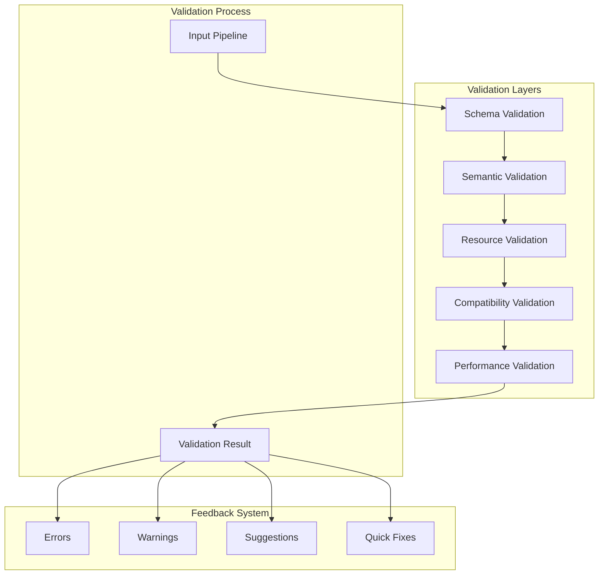

# Pipeline Visual Editor - Validation Engine

## Overview

The Validation Engine provides comprehensive, real-time validation for pipeline configurations, ensuring that pipelines are syntactically correct, semantically valid, and resource-efficient before execution.

## Validation Architecture



## Validation Layers

### 1. Schema Validation

Validates the structural correctness of the pipeline using JSON Schema.

```typescript
class SchemaValidator {
  private ajv: Ajv
  private schemas: Map<string, ValidateFunction>
  
  constructor() {
    this.ajv = new Ajv({
      allErrors: true,
      verbose: true,
      strict: false,
      validateFormats: true
    })
    
    // Add custom formats
    this.ajv.addFormat('step-name', /^[a-zA-Z][a-zA-Z0-9_-]*$/)
    this.ajv.addFormat('file-path', /^[^<>:"|?*]+$/)
    this.ajv.addFormat('semver', /^\d+\.\d+\.\d+(-[a-zA-Z0-9.-]+)?$/)
    
    // Load schemas
    this.loadSchemas()
  }
  
  validatePipeline(pipeline: unknown): SchemaValidationResult {
    const validate = this.schemas.get('pipeline')
    const valid = validate(pipeline)
    
    if (!valid) {
      return {
        valid: false,
        errors: this.formatErrors(validate.errors)
      }
    }
    
    return { valid: true, errors: [] }
  }
  
  validateStep(step: unknown, type: StepType): SchemaValidationResult {
    const validate = this.schemas.get(`step-${type}`)
    if (!validate) {
      return {
        valid: false,
        errors: [{
          path: ['type'],
          message: `Unknown step type: ${type}`
        }]
      }
    }
    
    const valid = validate(step)
    if (!valid) {
      return {
        valid: false,
        errors: this.formatErrors(validate.errors)
      }
    }
    
    return { valid: true, errors: [] }
  }
  
  private formatErrors(errors: ErrorObject[]): ValidationError[] {
    return errors.map(err => ({
      path: err.instancePath.split('/').filter(Boolean),
      message: this.humanizeError(err),
      type: 'schema',
      severity: 'error',
      fix: this.suggestFix(err)
    }))
  }
  
  private humanizeError(error: ErrorObject): string {
    switch (error.keyword) {
      case 'required':
        return `Missing required field: ${error.params.missingProperty}`
      case 'type':
        return `Invalid type: expected ${error.params.type}, got ${typeof error.data}`
      case 'pattern':
        return `Invalid format: ${error.data} does not match pattern ${error.params.pattern}`
      case 'enum':
        return `Invalid value: must be one of ${error.params.allowedValues.join(', ')}`
      default:
        return error.message || 'Invalid value'
    }
  }
}
```

### 2. Semantic Validation

Validates the logical correctness and relationships within the pipeline.

```typescript
class SemanticValidator {
  validatePipeline(pipeline: Pipeline): SemanticValidationResult {
    const errors: ValidationError[] = []
    const warnings: ValidationWarning[] = []
    
    // Check step name uniqueness
    const stepNames = new Set<string>()
    pipeline.workflow.steps.forEach(step => {
      if (stepNames.has(step.name)) {
        errors.push({
          path: ['workflow', 'steps', step.name],
          message: `Duplicate step name: ${step.name}`,
          type: 'duplicate',
          severity: 'error'
        })
      }
      stepNames.add(step.name)
    })
    
    // Validate step references
    pipeline.workflow.steps.forEach(step => {
      const refs = this.extractStepReferences(step)
      refs.forEach(ref => {
        if (!stepNames.has(ref)) {
          errors.push({
            path: ['workflow', 'steps', step.name],
            message: `Reference to non-existent step: ${ref}`,
            type: 'reference',
            severity: 'error',
            fix: {
              type: 'suggestion',
              description: `Did you mean: ${this.findSimilarStepName(ref, stepNames)}?`
            }
          })
        }
      })
    })
    
    // Check for circular dependencies
    const cycles = this.detectCycles(pipeline)
    cycles.forEach(cycle => {
      errors.push({
        path: ['workflow', 'steps'],
        message: `Circular dependency detected: ${cycle.join(' → ')} → ${cycle[0]}`,
        type: 'circular',
        severity: 'error'
      })
    })
    
    // Validate condition references
    pipeline.workflow.steps.forEach(step => {
      if (step.condition) {
        const conditionRefs = this.extractConditionReferences(step.condition)
        conditionRefs.forEach(ref => {
          const [stepName, ...path] = ref.split('.')
          if (!stepNames.has(stepName)) {
            errors.push({
              path: ['workflow', 'steps', step.name, 'condition'],
              message: `Condition references non-existent step: ${stepName}`,
              type: 'reference',
              severity: 'error'
            })
          }
        })
      }
    })
    
    // Check for orphaned steps
    const reachableSteps = this.findReachableSteps(pipeline)
    pipeline.workflow.steps.forEach(step => {
      if (!reachableSteps.has(step.name)) {
        warnings.push({
          path: ['workflow', 'steps', step.name],
          message: `Step "${step.name}" is not reachable from any entry point`,
          type: 'orphaned',
          severity: 'warning'
        })
      }
    })
    
    return { errors, warnings }
  }
  
  private extractStepReferences(step: Step): string[] {
    const refs: string[] = []
    
    // Extract from prompts
    if ('prompt' in step && Array.isArray(step.prompt)) {
      step.prompt.forEach(prompt => {
        if (prompt.type === 'previous_response') {
          refs.push(prompt.step)
        }
      })
    }
    
    // Extract from data sources
    if ('data_source' in step && typeof step.data_source === 'string') {
      const match = step.data_source.match(/^previous_response:(\w+)/)
      if (match) refs.push(match[1])
    }
    
    // Extract from inputs (nested pipelines)
    if ('inputs' in step && step.inputs) {
      Object.values(step.inputs).forEach(value => {
        if (typeof value === 'string') {
          const matches = value.matchAll(/\{\{steps\.(\w+)\./g)
          for (const match of matches) {
            refs.push(match[1])
          }
        }
      })
    }
    
    return [...new Set(refs)]
  }
  
  private detectCycles(pipeline: Pipeline): string[][] {
    const graph = this.buildDependencyGraph(pipeline)
    const cycles: string[][] = []
    const visited = new Set<string>()
    const stack = new Set<string>()
    
    const dfs = (node: string, path: string[] = []): void => {
      if (stack.has(node)) {
        const cycleStart = path.indexOf(node)
        cycles.push(path.slice(cycleStart))
        return
      }
      
      if (visited.has(node)) return
      
      visited.add(node)
      stack.add(node)
      
      const neighbors = graph.get(node) || []
      neighbors.forEach(neighbor => {
        dfs(neighbor, [...path, node])
      })
      
      stack.delete(node)
    }
    
    graph.forEach((_, node) => {
      if (!visited.has(node)) {
        dfs(node)
      }
    })
    
    return cycles
  }
}
```

### 3. Resource Validation

Validates resource usage and constraints.

```typescript
class ResourceValidator {
  private tokenPricing = {
    'claude': { input: 0.015, output: 0.075 },
    'claude_smart': { input: 0.015, output: 0.075 },
    'gemini-2.5-flash': { input: 0.0001, output: 0.0003 },
    'gemini-2.5-pro': { input: 0.001, output: 0.003 }
  }
  
  validateResources(pipeline: Pipeline): ResourceValidationResult {
    const warnings: ValidationWarning[] = []
    const suggestions: ValidationSuggestion[] = []
    
    // Estimate token usage
    const tokenEstimate = this.estimateTokenUsage(pipeline)
    
    if (tokenEstimate.total > 50000) {
      warnings.push({
        severity: 'warning',
        message: `High token usage estimated: ${tokenEstimate.total.toLocaleString()} tokens`,
        type: 'resource',
        details: {
          breakdown: tokenEstimate.breakdown,
          estimatedCost: tokenEstimate.cost
        }
      })
    }
    
    // Check for inefficient patterns
    const inefficiencies = this.detectInefficiencies(pipeline)
    inefficiencies.forEach(issue => {
      suggestions.push({
        type: 'optimization',
        message: issue.message,
        impact: issue.impact,
        solution: issue.solution
      })
    })
    
    // Validate parallel execution limits
    const parallelSteps = this.findParallelSteps(pipeline)
    parallelSteps.forEach(step => {
      if ('parallel_tasks' in step && step.parallel_tasks.length > 10) {
        warnings.push({
          severity: 'warning',
          message: `High parallel task count (${step.parallel_tasks.length}) may cause rate limiting`,
          type: 'resource',
          path: ['workflow', 'steps', step.name]
        })
      }
    })
    
    // Check memory usage for loops
    const loops = this.findLoops(pipeline)
    loops.forEach(loop => {
      const iterationEstimate = this.estimateIterations(loop)
      if (iterationEstimate > 1000) {
        warnings.push({
          severity: 'warning',
          message: `Loop may execute ${iterationEstimate}+ times, consider adding limits`,
          type: 'resource',
          path: ['workflow', 'steps', loop.name]
        })
      }
    })
    
    return { warnings, suggestions }
  }
  
  private estimateTokenUsage(pipeline: Pipeline): TokenEstimate {
    const breakdown: Record<string, number> = {}
    let total = 0
    
    pipeline.workflow.steps.forEach(step => {
      const estimate = this.estimateStepTokens(step)
      breakdown[step.name] = estimate
      total += estimate
    })
    
    const cost = this.estimateCost(pipeline, breakdown)
    
    return { total, breakdown, cost }
  }
  
  private estimateStepTokens(step: Step): number {
    let tokens = 0
    
    // Base tokens for step type
    switch (step.type) {
      case 'claude':
      case 'claude_smart':
      case 'claude_session':
        tokens += 1000 // Base conversation overhead
        break
      case 'gemini':
        tokens += 500
        break
    }
    
    // Add prompt tokens
    if ('prompt' in step && Array.isArray(step.prompt)) {
      step.prompt.forEach(prompt => {
        if (prompt.type === 'static') {
          tokens += this.countTokens(prompt.content)
        } else if (prompt.type === 'file') {
          tokens += 2000 // Estimate for file content
        } else if (prompt.type === 'previous_response') {
          tokens += 1500 // Estimate for previous response
        }
      })
    }
    
    // Add output tokens
    if (step.type === 'gemini' && step.token_budget?.max_output_tokens) {
      tokens += step.token_budget.max_output_tokens
    } else if (step.type.startsWith('claude') && step.claude_options?.max_turns) {
      tokens += step.claude_options.max_turns * 2000
    }
    
    return tokens
  }
  
  private countTokens(text: string): number {
    // Rough estimation: 1 token ≈ 4 characters
    return Math.ceil(text.length / 4)
  }
}
```

### 4. Compatibility Validation

Validates compatibility between connected steps.

```typescript
class CompatibilityValidator {
  validateCompatibility(pipeline: Pipeline): CompatibilityValidationResult {
    const errors: ValidationError[] = []
    const warnings: ValidationWarning[] = []
    
    const typeSystem = new PipelineTypeSystem()
    const connections = this.extractConnections(pipeline)
    
    connections.forEach(conn => {
      const sourceType = typeSystem.getStepOutputType(conn.source)
      const targetType = typeSystem.getStepInputType(conn.target)
      
      if (!typeSystem.areTypesCompatible(sourceType, targetType)) {
        errors.push({
          path: ['workflow', 'steps', conn.target.name],
          message: `Type mismatch: ${conn.source.name} outputs ${sourceType}, but ${conn.target.name} expects ${targetType}`,
          type: 'compatibility',
          severity: 'error',
          fix: {
            type: 'transformation',
            description: `Add a data transformation step to convert ${sourceType} to ${targetType}`
          }
        })
      }
    })
    
    // Check provider compatibility
    pipeline.workflow.steps.forEach(step => {
      if (step.type === 'gemini' && step.functions) {
        step.functions.forEach(func => {
          if (!pipeline.workflow.gemini_functions?.[func]) {
            errors.push({
              path: ['workflow', 'steps', step.name, 'functions'],
              message: `Function "${func}" is not defined in gemini_functions`,
              type: 'compatibility',
              severity: 'error'
            })
          }
        })
      }
    })
    
    // Check tool availability
    const claudeSteps = pipeline.workflow.steps.filter(s => 
      s.type.startsWith('claude')
    )
    
    claudeSteps.forEach(step => {
      if ('claude_options' in step && step.claude_options?.allowed_tools) {
        const hasFileTools = step.claude_options.allowed_tools.some(tool =>
          ['Write', 'Edit', 'Read'].includes(tool)
        )
        
        if (hasFileTools && !pipeline.workflow.workspace_dir) {
          warnings.push({
            path: ['workflow', 'workspace_dir'],
            message: `Step "${step.name}" uses file tools but no workspace_dir is configured`,
            type: 'compatibility',
            severity: 'warning'
          })
        }
      }
    })
    
    return { errors, warnings }
  }
}
```

### 5. Performance Validation

Analyzes and suggests performance improvements.

```typescript
class PerformanceValidator {
  validatePerformance(pipeline: Pipeline): PerformanceValidationResult {
    const suggestions: ValidationSuggestion[] = []
    const metrics = this.calculateMetrics(pipeline)
    
    // Check for sequential steps that could be parallel
    const parallelizableGroups = this.findParallelizableSteps(pipeline)
    parallelizableGroups.forEach(group => {
      suggestions.push({
        type: 'performance',
        message: `Steps ${group.map(s => s.name).join(', ')} can run in parallel`,
        impact: 'high',
        solution: 'Convert to parallel_claude or use parallel execution',
        estimatedTimeSaving: `${group.length * 5}s`
      })
    })
    
    // Check for redundant operations
    const redundancies = this.findRedundancies(pipeline)
    redundancies.forEach(redundancy => {
      suggestions.push({
        type: 'performance',
        message: redundancy.message,
        impact: 'medium',
        solution: redundancy.solution
      })
    })
    
    // Check for caching opportunities
    const cacheableSteps = this.findCacheableSteps(pipeline)
    cacheableSteps.forEach(step => {
      suggestions.push({
        type: 'performance',
        message: `Step "${step.name}" performs deterministic operations and could be cached`,
        impact: 'medium',
        solution: 'Enable caching for this step'
      })
    })
    
    // Analyze token budget efficiency
    const tokenAnalysis = this.analyzeTokenUsage(pipeline)
    if (tokenAnalysis.inefficiencies.length > 0) {
      tokenAnalysis.inefficiencies.forEach(issue => {
        suggestions.push({
          type: 'performance',
          message: issue.message,
          impact: issue.impact,
          solution: issue.solution
        })
      })
    }
    
    return {
      metrics,
      suggestions,
      estimatedDuration: this.estimateDuration(pipeline),
      estimatedCost: this.estimateCost(pipeline)
    }
  }
  
  private findParallelizableSteps(pipeline: Pipeline): Step[][] {
    const groups: Step[][] = []
    const graph = this.buildDependencyGraph(pipeline)
    const levels = this.topologicalLevels(graph)
    
    levels.forEach(level => {
      if (level.length > 1) {
        const independentSteps = level.filter(stepName => {
          const step = pipeline.workflow.steps.find(s => s.name === stepName)
          return step && this.canRunInParallel(step)
        })
        
        if (independentSteps.length > 1) {
          groups.push(independentSteps.map(name => 
            pipeline.workflow.steps.find(s => s.name === name)!
          ))
        }
      }
    })
    
    return groups
  }
}
```

## Validation Result Types

```typescript
interface ValidationResult {
  valid: boolean
  errors: ValidationError[]
  warnings: ValidationWarning[]
  suggestions: ValidationSuggestion[]
  metrics?: ValidationMetrics
}

interface ValidationError {
  path: string[]
  message: string
  type: ErrorType
  severity: 'error' | 'critical'
  fix?: QuickFix
  details?: any
}

interface ValidationWarning {
  path?: string[]
  message: string
  type: WarningType
  severity: 'warning'
  details?: any
}

interface ValidationSuggestion {
  type: SuggestionType
  message: string
  impact: 'high' | 'medium' | 'low'
  solution: string
  estimatedBenefit?: string
  details?: any
}

interface QuickFix {
  type: 'replacement' | 'addition' | 'deletion' | 'transformation' | 'suggestion'
  description: string
  apply?: () => void
}

interface ValidationMetrics {
  stepCount: number
  maxDepth: number
  parallelism: number
  estimatedTokens: number
  estimatedDuration: number
  estimatedCost: number
  complexity: ComplexityScore
}

type ErrorType = 
  | 'schema'
  | 'reference'
  | 'circular'
  | 'duplicate'
  | 'compatibility'
  | 'resource'
  | 'syntax'

type WarningType = 
  | 'performance'
  | 'resource'
  | 'deprecation'
  | 'convention'
  | 'orphaned'

type SuggestionType = 
  | 'optimization'
  | 'performance'
  | 'security'
  | 'best-practice'
  | 'modernization'
```

## Real-Time Validation

```typescript
class RealtimeValidator {
  private validators: Map<ValidationLayer, Validator>
  private debounceTimers: Map<string, NodeJS.Timeout>
  private validationCache: Map<string, ValidationResult>
  
  constructor() {
    this.validators = new Map([
      ['schema', new SchemaValidator()],
      ['semantic', new SemanticValidator()],
      ['resource', new ResourceValidator()],
      ['compatibility', new CompatibilityValidator()],
      ['performance', new PerformanceValidator()]
    ])
  }
  
  validateField(
    fieldPath: string[],
    value: any,
    context: ValidationContext
  ): FieldValidationResult {
    // Quick synchronous validation for immediate feedback
    const quickResult = this.quickValidate(fieldPath, value, context)
    
    // Schedule full validation
    this.scheduleFullValidation(fieldPath, value, context)
    
    return quickResult
  }
  
  private quickValidate(
    fieldPath: string[],
    value: any,
    context: ValidationContext
  ): FieldValidationResult {
    const errors: ValidationError[] = []
    
    // Basic format validation
    if (fieldPath.includes('name')) {
      if (!value || !value.match(/^[a-zA-Z][a-zA-Z0-9_-]*$/)) {
        errors.push({
          path: fieldPath,
          message: 'Invalid name format',
          type: 'schema',
          severity: 'error'
        })
      }
    }
    
    // Reference validation
    if (fieldPath.includes('step') && context.availableSteps) {
      if (!context.availableSteps.includes(value)) {
        errors.push({
          path: fieldPath,
          message: `Unknown step: ${value}`,
          type: 'reference',
          severity: 'error'
        })
      }
    }
    
    return { errors }
  }
  
  private scheduleFullValidation(
    fieldPath: string[],
    value: any,
    context: ValidationContext
  ): void {
    const key = fieldPath.join('.')
    
    // Clear existing timer
    if (this.debounceTimers.has(key)) {
      clearTimeout(this.debounceTimers.get(key)!)
    }
    
    // Schedule new validation
    const timer = setTimeout(() => {
      this.runFullValidation(context.pipeline)
      this.debounceTimers.delete(key)
    }, 500)
    
    this.debounceTimers.set(key, timer)
  }
}
```

## Validation UI Integration

```typescript
class ValidationUI {
  renderInlineError(error: ValidationError): React.ReactNode {
    return (
      <div className="inline-error">
        <ErrorIcon />
        <span>{error.message}</span>
        {error.fix && (
          <button
            className="quick-fix-btn"
            onClick={() => this.applyQuickFix(error.fix!)}
          >
            Fix
          </button>
        )}
      </div>
    )
  }
  
  renderValidationPanel(result: ValidationResult): React.ReactNode {
    return (
      <div className="validation-panel">
        <div className="validation-summary">
          {result.valid ? (
            <div className="validation-success">
              <CheckIcon /> Pipeline is valid
            </div>
          ) : (
            <div className="validation-errors">
              <ErrorIcon /> {result.errors.length} errors found
            </div>
          )}
        </div>
        
        {result.errors.length > 0 && (
          <div className="validation-section">
            <h3>Errors</h3>
            {result.errors.map((error, i) => (
              <ValidationItem key={i} item={error} type="error" />
            ))}
          </div>
        )}
        
        {result.warnings.length > 0 && (
          <div className="validation-section">
            <h3>Warnings</h3>
            {result.warnings.map((warning, i) => (
              <ValidationItem key={i} item={warning} type="warning" />
            ))}
          </div>
        )}
        
        {result.suggestions.length > 0 && (
          <div className="validation-section">
            <h3>Suggestions</h3>
            {result.suggestions.map((suggestion, i) => (
              <SuggestionItem key={i} suggestion={suggestion} />
            ))}
          </div>
        )}
      </div>
    )
  }
}
```

## Best Practices

### Performance
- Cache validation results
- Use Web Workers for heavy validation
- Debounce real-time validation
- Progressive validation (quick → full)

### User Experience
- Immediate feedback for basic errors
- Clear, actionable error messages
- Quick fix suggestions
- Contextual help links

### Extensibility
- Plugin system for custom validators
- Configurable validation rules
- Custom error messages
- Domain-specific validation

This validation engine ensures pipeline configurations are correct, efficient, and ready for execution while providing helpful feedback to users.