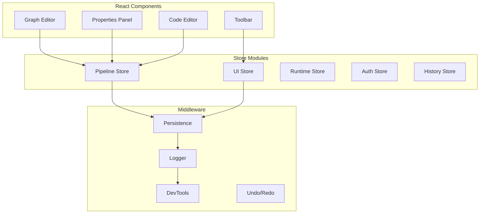

# Pipeline Visual Editor - State Management

## Overview

The state management system for the Pipeline Visual Editor uses Zustand for its simplicity, TypeScript support, and excellent performance. The architecture follows a modular store pattern with clear separation of concerns.

## Store Architecture



## Core Stores

### Pipeline Store

The main store managing pipeline data and operations.

```typescript
import { create } from 'zustand'
import { subscribeWithSelector } from 'zustand/middleware'
import { immer } from 'zustand/middleware/immer'
import { devtools, persist } from 'zustand/middleware'

interface PipelineState {
  // Pipeline data
  pipeline: Pipeline
  originalYaml: string
  
  // Graph representation
  nodes: Node[]
  edges: Edge[]
  
  // Selection state
  selectedNodeIds: string[]
  selectedEdgeIds: string[]
  
  // Validation state
  validationResult: ValidationResult
  validationInProgress: boolean
  
  // Edit state
  isDirty: boolean
  lastSaved: Date | null
  
  // Clipboard
  clipboard: ClipboardData | null
}

interface PipelineActions {
  // Pipeline operations
  loadPipeline: (yaml: string) => Promise<void>
  savePipeline: () => Promise<string>
  resetPipeline: () => void
  importPipeline: (file: File) => Promise<void>
  exportPipeline: (format: 'yaml' | 'json') => void
  
  // Step operations
  addStep: (type: StepType, position: XYPosition) => string
  updateStep: (stepId: string, updates: Partial<Step>) => void
  deleteSteps: (stepIds: string[]) => void
  duplicateSteps: (stepIds: string[]) => void
  
  // Node operations
  updateNodePosition: (nodeId: string, position: XYPosition) => void
  updateNodesPositions: (updates: Array<{id: string, position: XYPosition}>) => void
  
  // Edge operations
  addConnection: (connection: Connection) => void
  deleteEdges: (edgeIds: string[]) => void
  
  // Selection
  selectNodes: (nodeIds: string[], mode: 'set' | 'add' | 'toggle') => void
  selectEdges: (edgeIds: string[], mode: 'set' | 'add' | 'toggle') => void
  clearSelection: () => void
  selectAll: () => void
  
  // Validation
  validatePipeline: () => Promise<ValidationResult>
  clearValidation: () => void
  
  // Clipboard
  copy: () => void
  cut: () => void
  paste: (position?: XYPosition) => void
  
  // Utils
  generateStepName: (type: StepType) => string
  findStep: (stepId: string) => Step | undefined
  getConnectedSteps: (stepId: string) => { sources: string[], targets: string[] }
}

type PipelineStore = PipelineState & PipelineActions

export const usePipelineStore = create<PipelineStore>()(
  devtools(
    persist(
      immer(
        subscribeWithSelector((set, get) => ({
          // Initial state
          pipeline: createEmptyPipeline(),
          originalYaml: '',
          nodes: [],
          edges: [],
          selectedNodeIds: [],
          selectedEdgeIds: [],
          validationResult: { valid: true, errors: [], warnings: [], suggestions: [] },
          validationInProgress: false,
          isDirty: false,
          lastSaved: null,
          clipboard: null,
          
          // Actions implementation
          loadPipeline: async (yaml: string) => {
            try {
              const pipeline = await parsePipelineYaml(yaml)
              const { nodes, edges } = pipelineToGraph(pipeline)
              
              set(state => {
                state.pipeline = pipeline
                state.originalYaml = yaml
                state.nodes = nodes
                state.edges = edges
                state.selectedNodeIds = []
                state.selectedEdgeIds = []
                state.isDirty = false
                state.validationResult = { valid: true, errors: [], warnings: [], suggestions: [] }
              })
              
              // Trigger validation
              get().validatePipeline()
            } catch (error) {
              throw new Error(`Failed to load pipeline: ${error.message}`)
            }
          },
          
          addStep: (type: StepType, position: XYPosition) => {
            const stepName = get().generateStepName(type)
            const step = createDefaultStep(type, stepName)
            const nodeId = generateNodeId()
            
            set(state => {
              // Add to pipeline
              state.pipeline.workflow.steps.push(step)
              
              // Add to graph
              state.nodes.push({
                id: nodeId,
                type: getNodeType(step.type),
                position,
                data: {
                  step,
                  validation: { valid: true, errors: [], warnings: [] }
                }
              })
              
              state.isDirty = true
            })
            
            // Select the new node
            get().selectNodes([nodeId], 'set')
            
            return nodeId
          },
          
          updateStep: (stepId: string, updates: Partial<Step>) => {
            set(state => {
              const node = state.nodes.find(n => n.id === stepId)
              if (!node) return
              
              const step = node.data.step
              const stepIndex = state.pipeline.workflow.steps.findIndex(
                s => s.name === step.name
              )
              
              if (stepIndex === -1) return
              
              // Update step
              Object.assign(state.pipeline.workflow.steps[stepIndex], updates)
              Object.assign(node.data.step, updates)
              
              // Mark as dirty
              state.isDirty = true
            })
            
            // Revalidate
            get().validatePipeline()
          },
          
          addConnection: (connection: Connection) => {
            const { source, target, sourceHandle, targetHandle } = connection
            
            // Validate connection
            const sourceNode = get().nodes.find(n => n.id === source)
            const targetNode = get().nodes.find(n => n.id === target)
            
            if (!sourceNode || !targetNode) return
            
            // Check for existing connection
            const exists = get().edges.some(
              e => e.source === source && e.target === target
            )
            if (exists) return
            
            // Check for cycles
            if (wouldCreateCycle(get().edges, source, target)) {
              // Show error
              return
            }
            
            set(state => {
              state.edges.push({
                id: generateEdgeId(),
                source,
                target,
                sourceHandle,
                targetHandle,
                type: 'dataFlow'
              })
              
              state.isDirty = true
            })
            
            // Update dependencies in pipeline
            updateStepDependencies(get(), sourceNode, targetNode)
          },
          
          validatePipeline: async () => {
            set(state => {
              state.validationInProgress = true
            })
            
            const pipeline = get().pipeline
            const validator = new PipelineValidator()
            const result = await validator.validate(pipeline)
            
            set(state => {
              state.validationResult = result
              state.validationInProgress = false
              
              // Update node validation states
              state.nodes.forEach(node => {
                const stepErrors = result.errors.filter(
                  e => e.path[0] === 'workflow' && 
                       e.path[1] === 'steps' && 
                       e.path[2] === node.data.step.name
                )
                const stepWarnings = result.warnings.filter(
                  w => w.path?.[0] === 'workflow' && 
                       w.path?.[1] === 'steps' && 
                       w.path?.[2] === node.data.step.name
                )
                
                node.data.validation = {
                  valid: stepErrors.length === 0,
                  errors: stepErrors,
                  warnings: stepWarnings
                }
              })
            })
            
            return result
          },
          
          copy: () => {
            const selectedNodes = get().nodes.filter(
              n => get().selectedNodeIds.includes(n.id)
            )
            const selectedEdges = get().edges.filter(
              e => get().selectedEdgeIds.includes(e.id)
            )
            
            if (selectedNodes.length === 0) return
            
            set(state => {
              state.clipboard = {
                nodes: selectedNodes,
                edges: selectedEdges,
                timestamp: Date.now()
              }
            })
          },
          
          paste: (position?: XYPosition) => {
            const clipboard = get().clipboard
            if (!clipboard) return
            
            const offset = position || { x: 50, y: 50 }
            const nodeIdMap = new Map<string, string>()
            const newNodes: Node[] = []
            const newEdges: Edge[] = []
            
            // Clone nodes with new IDs
            clipboard.nodes.forEach(node => {
              const newId = generateNodeId()
              nodeIdMap.set(node.id, newId)
              
              const newStep = cloneStep(node.data.step)
              newStep.name = get().generateStepName(newStep.type)
              
              newNodes.push({
                ...node,
                id: newId,
                position: {
                  x: node.position.x + offset.x,
                  y: node.position.y + offset.y
                },
                data: {
                  ...node.data,
                  step: newStep
                }
              })
            })
            
            // Clone edges with mapped IDs
            clipboard.edges.forEach(edge => {
              const newSource = nodeIdMap.get(edge.source)
              const newTarget = nodeIdMap.get(edge.target)
              
              if (newSource && newTarget) {
                newEdges.push({
                  ...edge,
                  id: generateEdgeId(),
                  source: newSource,
                  target: newTarget
                })
              }
            })
            
            set(state => {
              // Add to pipeline
              newNodes.forEach(node => {
                state.pipeline.workflow.steps.push(node.data.step)
              })
              
              // Add to graph
              state.nodes.push(...newNodes)
              state.edges.push(...newEdges)
              
              state.isDirty = true
            })
            
            // Select pasted nodes
            get().selectNodes(newNodes.map(n => n.id), 'set')
          },
          
          generateStepName: (type: StepType) => {
            const baseName = getStepBaseName(type)
            const existingNames = get().pipeline.workflow.steps.map(s => s.name)
            
            let counter = 1
            let name = baseName
            while (existingNames.includes(name)) {
              name = `${baseName}_${counter}`
              counter++
            }
            
            return name
          }
        }))
      ),
      {
        name: 'pipeline-store',
        partialize: (state) => ({
          pipeline: state.pipeline,
          nodes: state.nodes,
          edges: state.edges
        })
      }
    )
  )
)
```

### UI Store

Manages UI preferences and view state.

```typescript
interface UIState {
  // View settings
  viewMode: 'graph' | 'code' | 'split'
  splitPosition: number // 0-100
  
  // Panel states
  leftPanelOpen: boolean
  rightPanelOpen: boolean
  bottomPanelOpen: boolean
  
  // Graph settings
  gridSnap: boolean
  gridSize: number
  showMinimap: boolean
  autoLayout: boolean
  
  // Editor settings
  theme: 'light' | 'dark' | 'system'
  fontSize: number
  wordWrap: boolean
  
  // Recent items
  recentPipelines: RecentPipeline[]
  recentSteps: StepType[]
  
  // Preferences
  autoSave: boolean
  autoValidate: boolean
  showValidationInline: boolean
}

interface UIActions {
  setViewMode: (mode: UIState['viewMode']) => void
  setSplitPosition: (position: number) => void
  togglePanel: (panel: 'left' | 'right' | 'bottom') => void
  updateGraphSettings: (settings: Partial<GraphSettings>) => void
  updateEditorSettings: (settings: Partial<EditorSettings>) => void
  addRecentPipeline: (pipeline: RecentPipeline) => void
  addRecentStep: (stepType: StepType) => void
  setTheme: (theme: UIState['theme']) => void
}

export const useUIStore = create<UIState & UIActions>()(
  persist(
    (set) => ({
      // Initial state
      viewMode: 'graph',
      splitPosition: 50,
      leftPanelOpen: true,
      rightPanelOpen: true,
      bottomPanelOpen: false,
      gridSnap: true,
      gridSize: 20,
      showMinimap: true,
      autoLayout: false,
      theme: 'system',
      fontSize: 14,
      wordWrap: true,
      recentPipelines: [],
      recentSteps: [],
      autoSave: true,
      autoValidate: true,
      showValidationInline: true,
      
      // Actions
      setViewMode: (mode) => set({ viewMode: mode }),
      setSplitPosition: (position) => set({ splitPosition: position }),
      togglePanel: (panel) => set(state => ({
        [`${panel}PanelOpen`]: !state[`${panel}PanelOpen`]
      })),
      updateGraphSettings: (settings) => set(state => ({
        ...state,
        ...settings
      })),
      updateEditorSettings: (settings) => set(state => ({
        ...state,
        ...settings
      })),
      addRecentPipeline: (pipeline) => set(state => ({
        recentPipelines: [
          pipeline,
          ...state.recentPipelines.filter(p => p.id !== pipeline.id)
        ].slice(0, 10)
      })),
      addRecentStep: (stepType) => set(state => ({
        recentSteps: [
          stepType,
          ...state.recentSteps.filter(t => t !== stepType)
        ].slice(0, 5)
      })),
      setTheme: (theme) => set({ theme })
    }),
    {
      name: 'ui-preferences'
    }
  )
)
```

### Runtime Store

Manages pipeline execution and monitoring.

```typescript
interface Execution {
  id: string
  pipelineId: string
  status: ExecutionStatus
  startTime: Date
  endTime?: Date
  currentStep?: string
  logs: LogEntry[]
  results: Record<string, any>
  error?: ExecutionError
}

interface RuntimeState {
  executions: Execution[]
  activeExecutionId: string | null
  connectionStatus: 'connected' | 'disconnected' | 'connecting'
}

interface RuntimeActions {
  startExecution: (pipeline: Pipeline) => Promise<string>
  stopExecution: (executionId: string) => void
  updateExecutionStatus: (executionId: string, update: Partial<Execution>) => void
  appendLog: (executionId: string, log: LogEntry) => void
  clearExecutions: () => void
  connectToRuntime: () => Promise<void>
  disconnectFromRuntime: () => void
}

export const useRuntimeStore = create<RuntimeState & RuntimeActions>()(
  devtools(
    subscribeWithSelector((set, get) => ({
      executions: [],
      activeExecutionId: null,
      connectionStatus: 'disconnected',
      
      startExecution: async (pipeline) => {
        const executionId = generateExecutionId()
        const execution: Execution = {
          id: executionId,
          pipelineId: pipeline.workflow.name,
          status: 'pending',
          startTime: new Date(),
          logs: [],
          results: {}
        }
        
        set(state => {
          state.executions.unshift(execution)
          state.activeExecutionId = executionId
        })
        
        // Start WebSocket connection for real-time updates
        await get().connectToRuntime()
        
        // Send execution request
        await sendExecutionRequest(pipeline, executionId)
        
        return executionId
      },
      
      updateExecutionStatus: (executionId, update) => {
        set(state => {
          const execution = state.executions.find(e => e.id === executionId)
          if (execution) {
            Object.assign(execution, update)
          }
        })
      },
      
      appendLog: (executionId, log) => {
        set(state => {
          const execution = state.executions.find(e => e.id === executionId)
          if (execution) {
            execution.logs.push(log)
          }
        })
      }
    }))
  )
)
```

### History Store

Manages undo/redo functionality.

```typescript
interface HistoryState {
  past: PipelineSnapshot[]
  present: PipelineSnapshot | null
  future: PipelineSnapshot[]
  maxHistorySize: number
}

interface HistoryActions {
  pushState: (snapshot: PipelineSnapshot) => void
  undo: () => void
  redo: () => void
  clearHistory: () => void
  canUndo: () => boolean
  canRedo: () => boolean
}

export const useHistoryStore = create<HistoryState & HistoryActions>()((set, get) => ({
  past: [],
  present: null,
  future: [],
  maxHistorySize: 50,
  
  pushState: (snapshot) => {
    set(state => ({
      past: [...state.past, state.present].filter(Boolean).slice(-state.maxHistorySize),
      present: snapshot,
      future: []
    }))
  },
  
  undo: () => {
    const { past, present, future } = get()
    if (past.length === 0) return
    
    const previous = past[past.length - 1]
    const newPast = past.slice(0, past.length - 1)
    
    set({
      past: newPast,
      present: previous,
      future: present ? [present, ...future] : future
    })
    
    // Apply the state
    applySnapshot(previous)
  },
  
  redo: () => {
    const { past, present, future } = get()
    if (future.length === 0) return
    
    const next = future[0]
    const newFuture = future.slice(1)
    
    set({
      past: present ? [...past, present] : past,
      present: next,
      future: newFuture
    })
    
    // Apply the state
    applySnapshot(next)
  },
  
  canUndo: () => get().past.length > 0,
  canRedo: () => get().future.length > 0
}))
```

## Middleware

### Persistence Middleware

```typescript
const persistenceMiddleware = (config: StateCreator<PipelineStore>) => (
  set: SetState<PipelineStore>,
  get: GetState<PipelineStore>,
  api: StoreApi<PipelineStore>
) => {
  const enhancedSet: SetState<PipelineStore> = (partial, replace) => {
    set(partial, replace)
    
    // Auto-save if enabled
    const state = get()
    if (state.isDirty && useUIStore.getState().autoSave) {
      debouncedAutoSave(state)
    }
  }
  
  return config(enhancedSet, get, api)
}

const debouncedAutoSave = debounce(async (state: PipelineStore) => {
  try {
    await savePipelineToLocalStorage(state.pipeline)
    state.lastSaved = new Date()
    state.isDirty = false
  } catch (error) {
    console.error('Auto-save failed:', error)
  }
}, 2000)
```

### Logger Middleware

```typescript
const loggerMiddleware = (config: StateCreator<any>) => (set, get, api) =>
  config(
    (args) => {
      const prevState = get()
      set(args)
      const nextState = get()
      
      if (import.meta.env.DEV) {
        console.group(`State Update: ${new Date().toISOString()}`)
        console.log('Previous State:', prevState)
        console.log('Next State:', nextState)
        console.log('Changes:', diff(prevState, nextState))
        console.groupEnd()
      }
    },
    get,
    api
  )
```

## Selectors and Hooks

### Computed Selectors

```typescript
// Memoized selectors for expensive computations
export const useStepByName = (stepName: string) => 
  usePipelineStore(state => 
    state.pipeline.workflow.steps.find(s => s.name === stepName)
  )

export const useNodesByType = (type: StepType) =>
  usePipelineStore(state =>
    state.nodes.filter(n => n.data.step.type === type)
  )

export const useValidationErrors = () =>
  usePipelineStore(state => state.validationResult.errors)

export const useIsStepSelected = (stepId: string) =>
  usePipelineStore(state => state.selectedNodeIds.includes(stepId))

export const useCanConnect = (sourceId: string, targetId: string) =>
  usePipelineStore(state => {
    const sourceNode = state.nodes.find(n => n.id === sourceId)
    const targetNode = state.nodes.find(n => n.id === targetId)
    
    if (!sourceNode || !targetNode) return false
    
    // Check if connection would create cycle
    if (wouldCreateCycle(state.edges, sourceId, targetId)) return false
    
    // Check if connection already exists
    if (state.edges.some(e => e.source === sourceId && e.target === targetId)) return false
    
    // Check type compatibility
    return areNodesCompatible(sourceNode, targetNode)
  })
```

### Custom Hooks

```typescript
export const useAutoSave = () => {
  const { pipeline, isDirty, savePipeline } = usePipelineStore()
  const { autoSave } = useUIStore()
  
  useEffect(() => {
    if (!autoSave || !isDirty) return
    
    const timer = setTimeout(() => {
      savePipeline()
    }, 2000)
    
    return () => clearTimeout(timer)
  }, [pipeline, isDirty, autoSave, savePipeline])
}

export const useKeyboardShortcuts = () => {
  const pipelineStore = usePipelineStore()
  const historyStore = useHistoryStore()
  
  useEffect(() => {
    const handleKeyPress = (e: KeyboardEvent) => {
      // Undo/Redo
      if ((e.metaKey || e.ctrlKey) && e.key === 'z') {
        e.preventDefault()
        if (e.shiftKey) {
          historyStore.redo()
        } else {
          historyStore.undo()
        }
      }
      
      // Save
      if ((e.metaKey || e.ctrlKey) && e.key === 's') {
        e.preventDefault()
        pipelineStore.savePipeline()
      }
      
      // Copy/Cut/Paste
      if ((e.metaKey || e.ctrlKey) && e.key === 'c') {
        e.preventDefault()
        pipelineStore.copy()
      }
      
      if ((e.metaKey || e.ctrlKey) && e.key === 'x') {
        e.preventDefault()
        pipelineStore.cut()
      }
      
      if ((e.metaKey || e.ctrlKey) && e.key === 'v') {
        e.preventDefault()
        pipelineStore.paste()
      }
      
      // Delete
      if (e.key === 'Delete' || e.key === 'Backspace') {
        if (pipelineStore.selectedNodeIds.length > 0) {
          e.preventDefault()
          pipelineStore.deleteSteps(pipelineStore.selectedNodeIds)
        }
      }
      
      // Select All
      if ((e.metaKey || e.ctrlKey) && e.key === 'a') {
        e.preventDefault()
        pipelineStore.selectAll()
      }
    }
    
    window.addEventListener('keydown', handleKeyPress)
    return () => window.removeEventListener('keydown', handleKeyPress)
  }, [pipelineStore, historyStore])
}
```

## State Synchronization

### Cross-Store Communication

```typescript
// Subscribe to pipeline changes and update history
usePipelineStore.subscribe(
  state => state.pipeline,
  (pipeline) => {
    const snapshot = createSnapshot(usePipelineStore.getState())
    useHistoryStore.getState().pushState(snapshot)
  }
)

// Subscribe to theme changes and update document
useUIStore.subscribe(
  state => state.theme,
  (theme) => {
    const actualTheme = theme === 'system' 
      ? window.matchMedia('(prefers-color-scheme: dark)').matches ? 'dark' : 'light'
      : theme
    
    document.documentElement.setAttribute('data-theme', actualTheme)
  }
)

// Subscribe to validation changes and show notifications
usePipelineStore.subscribe(
  state => state.validationResult,
  (result) => {
    if (!result.valid && result.errors.length > 0) {
      showNotification({
        type: 'error',
        title: 'Validation Failed',
        message: `${result.errors.length} errors found`
      })
    }
  }
)
```

### WebSocket Integration

```typescript
class WebSocketManager {
  private ws: WebSocket | null = null
  private reconnectTimer: NodeJS.Timeout | null = null
  
  connect() {
    const ws = new WebSocket(getWebSocketUrl())
    
    ws.onopen = () => {
      useRuntimeStore.setState({ connectionStatus: 'connected' })
    }
    
    ws.onmessage = (event) => {
      const message = JSON.parse(event.data)
      this.handleMessage(message)
    }
    
    ws.onclose = () => {
      useRuntimeStore.setState({ connectionStatus: 'disconnected' })
      this.scheduleReconnect()
    }
    
    this.ws = ws
  }
  
  private handleMessage(message: WSMessage) {
    switch (message.type) {
      case 'execution.status':
        useRuntimeStore.getState().updateExecutionStatus(
          message.executionId,
          { status: message.status }
        )
        break
        
      case 'execution.log':
        useRuntimeStore.getState().appendLog(
          message.executionId,
          message.log
        )
        break
        
      case 'step.started':
        useRuntimeStore.getState().updateExecutionStatus(
          message.executionId,
          { currentStep: message.stepName }
        )
        break
    }
  }
}
```

## Performance Optimization

### Selective Subscriptions

```typescript
// Subscribe only to specific state slices
const selectedNodes = usePipelineStore(
  state => state.selectedNodeIds,
  shallow // Use shallow equality for arrays
)

// Subscribe with selector
const stepCount = usePipelineStore(
  state => state.pipeline.workflow.steps.length
)

// Combine selectors
const validationSummary = usePipelineStore(
  state => ({
    isValid: state.validationResult.valid,
    errorCount: state.validationResult.errors.length,
    warningCount: state.validationResult.warnings.length
  }),
  shallow
)
```

### Memoization

```typescript
// Memoize expensive computations
const useGraphStats = () => {
  const nodes = usePipelineStore(state => state.nodes)
  const edges = usePipelineStore(state => state.edges)
  
  return useMemo(() => {
    const stats = {
      nodeCount: nodes.length,
      edgeCount: edges.length,
      nodeTypes: groupBy(nodes, n => n.data.step.type),
      maxDepth: calculateMaxDepth(nodes, edges),
      parallelGroups: findParallelGroups(nodes, edges)
    }
    
    return stats
  }, [nodes, edges])
}
```

### Batched Updates

```typescript
// Batch multiple state updates
const batchedUpdate = () => {
  usePipelineStore.setState(state => {
    // Multiple updates in single render
    state.nodes.push(...newNodes)
    state.edges.push(...newEdges)
    state.isDirty = true
  })
}
```

## Testing

### Store Testing

```typescript
describe('PipelineStore', () => {
  beforeEach(() => {
    // Reset stores to initial state
    usePipelineStore.setState(initialPipelineState)
    useUIStore.setState(initialUIState)
  })
  
  it('should add a step', () => {
    const { addStep, nodes } = usePipelineStore.getState()
    
    const nodeId = addStep('claude', { x: 100, y: 100 })
    
    const state = usePipelineStore.getState()
    expect(state.nodes).toHaveLength(1)
    expect(state.nodes[0].id).toBe(nodeId)
    expect(state.pipeline.workflow.steps).toHaveLength(1)
    expect(state.isDirty).toBe(true)
  })
  
  it('should validate connections before adding', () => {
    const { addConnection, nodes, edges } = usePipelineStore.getState()
    
    // Add nodes
    const node1 = addStep('claude', { x: 0, y: 0 })
    const node2 = addStep('gemini', { x: 200, y: 0 })
    
    // Add connection
    addConnection({
      source: node1,
      target: node2,
      sourceHandle: null,
      targetHandle: null
    })
    
    const state = usePipelineStore.getState()
    expect(state.edges).toHaveLength(1)
  })
})
```

This state management architecture provides a robust, scalable foundation for the Pipeline Visual Editor with excellent developer experience and performance.