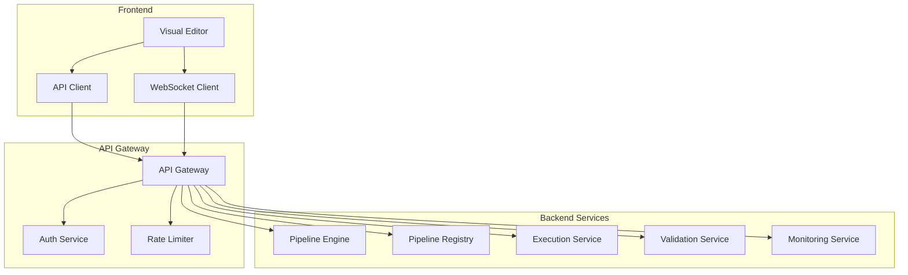

# Pipeline Visual Editor - Integration API

## Overview

The Integration API enables the Visual Editor to communicate with backend services, including pipeline execution, registry access, authentication, and real-time monitoring. This document defines the API contracts, protocols, and integration patterns.

## API Architecture



## REST API Endpoints

### Authentication

```typescript
// POST /api/auth/login
interface LoginRequest {
  email: string
  password: string
}

interface LoginResponse {
  accessToken: string
  refreshToken: string
  user: {
    id: string
    email: string
    name: string
    role: UserRole
    permissions: Permission[]
  }
  expiresIn: number
}

// POST /api/auth/refresh
interface RefreshRequest {
  refreshToken: string
}

interface RefreshResponse {
  accessToken: string
  expiresIn: number
}

// POST /api/auth/logout
interface LogoutRequest {
  refreshToken: string
}

// GET /api/auth/me
interface MeResponse {
  user: User
  organization?: Organization
  quotas: {
    pipelines: QuotaInfo
    executions: QuotaInfo
    storage: QuotaInfo
  }
}
```

### Pipeline Management

```typescript
// GET /api/pipelines
interface ListPipelinesRequest {
  page?: number
  limit?: number
  search?: string
  category?: string
  tags?: string[]
  author?: string
  sortBy?: 'name' | 'created' | 'updated' | 'popularity'
  sortOrder?: 'asc' | 'desc'
}

interface ListPipelinesResponse {
  pipelines: PipelineSummary[]
  total: number
  page: number
  limit: number
}

// GET /api/pipelines/:id
interface GetPipelineResponse {
  id: string
  name: string
  description?: string
  version: string
  author: User
  yaml: string
  metadata: {
    created: Date
    updated: Date
    category: string
    tags: string[]
    complexity: ComplexityLevel
    estimatedTokens: number
    providers: Provider[]
  }
  stats: {
    views: number
    executions: number
    forks: number
    stars: number
  }
  permissions: {
    canEdit: boolean
    canDelete: boolean
    canExecute: boolean
    canShare: boolean
  }
}

// POST /api/pipelines
interface CreatePipelineRequest {
  name: string
  description?: string
  yaml: string
  category: string
  tags?: string[]
  visibility: 'private' | 'team' | 'public'
}

interface CreatePipelineResponse {
  id: string
  version: string
}

// PUT /api/pipelines/:id
interface UpdatePipelineRequest {
  name?: string
  description?: string
  yaml?: string
  category?: string
  tags?: string[]
  visibility?: 'private' | 'team' | 'public'
}

interface UpdatePipelineResponse {
  version: string
  updated: Date
}

// DELETE /api/pipelines/:id

// POST /api/pipelines/:id/fork
interface ForkPipelineRequest {
  name: string
  description?: string
}

interface ForkPipelineResponse {
  id: string
  originalId: string
}

// POST /api/pipelines/:id/star
// DELETE /api/pipelines/:id/star

// GET /api/pipelines/:id/versions
interface ListVersionsResponse {
  versions: PipelineVersion[]
}

// GET /api/pipelines/:id/versions/:version
interface GetVersionResponse {
  version: string
  yaml: string
  changelog?: string
  created: Date
  author: User
}
```

### Pipeline Validation

```typescript
// POST /api/validate
interface ValidatePipelineRequest {
  yaml: string
  level?: 'syntax' | 'semantic' | 'full'
  context?: {
    availableModels?: string[]
    availableTools?: string[]
    resourceLimits?: ResourceLimits
  }
}

interface ValidatePipelineResponse {
  valid: boolean
  errors: ValidationError[]
  warnings: ValidationWarning[]
  suggestions: ValidationSuggestion[]
  metrics?: {
    estimatedTokens: number
    estimatedCost: CostEstimate
    estimatedDuration: number
    complexity: ComplexityScore
  }
}

// POST /api/validate/step
interface ValidateStepRequest {
  step: Step
  context: {
    availableSteps: string[]
    pipelineContext?: Pipeline
  }
}

interface ValidateStepResponse {
  valid: boolean
  errors: ValidationError[]
  warnings: ValidationWarning[]
}
```

### Pipeline Execution

```typescript
// POST /api/executions
interface StartExecutionRequest {
  pipelineId: string
  version?: string
  inputs?: Record<string, any>
  options?: {
    mode?: 'test' | 'production'
    timeout?: number
    priority?: 'low' | 'normal' | 'high'
    callbacks?: {
      onComplete?: string
      onError?: string
    }
  }
}

interface StartExecutionResponse {
  executionId: string
  status: 'queued' | 'starting'
  estimatedDuration?: number
  position?: number // Queue position
}

// GET /api/executions/:id
interface GetExecutionResponse {
  id: string
  pipelineId: string
  status: ExecutionStatus
  started: Date
  ended?: Date
  currentStep?: string
  progress?: {
    stepsCompleted: number
    totalSteps: number
    percentage: number
  }
  results?: Record<string, any>
  error?: ExecutionError
  logs: LogEntry[]
  metrics: {
    duration: number
    tokensUsed: number
    cost: number
  }
}

// POST /api/executions/:id/cancel
interface CancelExecutionResponse {
  status: 'cancelling' | 'cancelled'
}

// GET /api/executions
interface ListExecutionsRequest {
  pipelineId?: string
  status?: ExecutionStatus[]
  startDate?: Date
  endDate?: Date
  page?: number
  limit?: number
}

interface ListExecutionsResponse {
  executions: ExecutionSummary[]
  total: number
  page: number
  limit: number
}

// GET /api/executions/:id/logs
interface GetExecutionLogsRequest {
  level?: LogLevel[]
  stepName?: string
  startTime?: Date
  endTime?: Date
  limit?: number
  offset?: number
}

interface GetExecutionLogsResponse {
  logs: LogEntry[]
  total: number
  hasMore: boolean
}
```

### Pipeline Registry

```typescript
// GET /api/registry/search
interface SearchRegistryRequest {
  query?: string
  category?: string[]
  tags?: string[]
  providers?: Provider[]
  complexity?: ComplexityLevel[]
  author?: string
  sortBy?: 'relevance' | 'popularity' | 'recent'
  page?: number
  limit?: number
}

interface SearchRegistryResponse {
  results: RegistryPipeline[]
  facets: {
    categories: FacetCount[]
    tags: FacetCount[]
    providers: FacetCount[]
    complexity: FacetCount[]
  }
  total: number
  page: number
  limit: number
}

// GET /api/registry/featured
interface GetFeaturedResponse {
  pipelines: RegistryPipeline[]
}

// GET /api/registry/categories
interface GetCategoriesResponse {
  categories: Category[]
}

// POST /api/registry/publish
interface PublishPipelineRequest {
  pipelineId: string
  version: string
  changelog?: string
  documentation?: string
  examples?: Example[]
  license?: string
}

interface PublishPipelineResponse {
  registryId: string
  publishedAt: Date
}
```

### Templates and Components

```typescript
// GET /api/templates
interface ListTemplatesRequest {
  type?: 'pipeline' | 'step' | 'prompt'
  category?: string
  page?: number
  limit?: number
}

interface ListTemplatesResponse {
  templates: Template[]
  total: number
}

// GET /api/components
interface ListComponentsRequest {
  type?: ComponentType
  compatible?: StepType[]
  page?: number
  limit?: number
}

interface ListComponentsResponse {
  components: Component[]
  total: number
}

// POST /api/templates/instantiate
interface InstantiateTemplateRequest {
  templateId: string
  variables: Record<string, any>
  name: string
}

interface InstantiateTemplateResponse {
  pipelineId: string
  yaml: string
}
```

## WebSocket API

### Connection Protocol

```typescript
// WebSocket URL: wss://api.pipeline.dev/ws

// Client -> Server: Authentication
interface WSAuthMessage {
  type: 'auth'
  token: string
}

// Server -> Client: Authentication Response
interface WSAuthResponse {
  type: 'auth.success' | 'auth.failed'
  sessionId?: string
  error?: string
}

// Client -> Server: Subscribe to Events
interface WSSubscribeMessage {
  type: 'subscribe'
  events: EventType[]
  filters?: {
    executionId?: string
    pipelineId?: string
  }
}

// Server -> Client: Subscription Confirmation
interface WSSubscribeResponse {
  type: 'subscribed'
  events: EventType[]
}
```

### Real-Time Events

```typescript
// Execution Events
interface ExecutionStartedEvent {
  type: 'execution.started'
  executionId: string
  pipelineId: string
  timestamp: Date
}

interface ExecutionStatusEvent {
  type: 'execution.status'
  executionId: string
  status: ExecutionStatus
  timestamp: Date
}

interface StepStartedEvent {
  type: 'step.started'
  executionId: string
  stepName: string
  stepType: StepType
  timestamp: Date
}

interface StepCompletedEvent {
  type: 'step.completed'
  executionId: string
  stepName: string
  duration: number
  tokensUsed?: number
  timestamp: Date
}

interface StepErrorEvent {
  type: 'step.error'
  executionId: string
  stepName: string
  error: ExecutionError
  timestamp: Date
}

interface ExecutionLogEvent {
  type: 'execution.log'
  executionId: string
  log: LogEntry
}

interface ExecutionCompletedEvent {
  type: 'execution.completed'
  executionId: string
  status: 'success' | 'failed' | 'cancelled'
  duration: number
  results?: Record<string, any>
  error?: ExecutionError
  metrics: ExecutionMetrics
  timestamp: Date
}

// Collaboration Events
interface PipelineUpdatedEvent {
  type: 'pipeline.updated'
  pipelineId: string
  version: string
  author: User
  changes: ChangeSet
  timestamp: Date
}

interface UserJoinedEvent {
  type: 'user.joined'
  pipelineId: string
  user: User
  timestamp: Date
}

interface UserLeftEvent {
  type: 'user.left'
  pipelineId: string
  userId: string
  timestamp: Date
}

interface CursorMovedEvent {
  type: 'cursor.moved'
  pipelineId: string
  userId: string
  nodeId?: string
  position?: XYPosition
  timestamp: Date
}
```

## API Client Implementation

### Base HTTP Client

```typescript
class APIClient {
  private baseURL: string
  private authToken: string | null = null
  private refreshToken: string | null = null
  
  constructor(baseURL: string) {
    this.baseURL = baseURL
    this.setupInterceptors()
  }
  
  private setupInterceptors() {
    // Request interceptor
    axios.interceptors.request.use(
      (config) => {
        if (this.authToken) {
          config.headers.Authorization = `Bearer ${this.authToken}`
        }
        return config
      },
      (error) => Promise.reject(error)
    )
    
    // Response interceptor
    axios.interceptors.response.use(
      (response) => response,
      async (error) => {
        const originalRequest = error.config
        
        if (error.response?.status === 401 && !originalRequest._retry) {
          originalRequest._retry = true
          
          try {
            await this.refreshAccessToken()
            originalRequest.headers.Authorization = `Bearer ${this.authToken}`
            return axios(originalRequest)
          } catch (refreshError) {
            this.logout()
            return Promise.reject(refreshError)
          }
        }
        
        return Promise.reject(error)
      }
    )
  }
  
  async login(email: string, password: string): Promise<LoginResponse> {
    const response = await axios.post(`${this.baseURL}/auth/login`, {
      email,
      password
    })
    
    this.authToken = response.data.accessToken
    this.refreshToken = response.data.refreshToken
    
    return response.data
  }
  
  async refreshAccessToken(): Promise<void> {
    if (!this.refreshToken) throw new Error('No refresh token')
    
    const response = await axios.post(`${this.baseURL}/auth/refresh`, {
      refreshToken: this.refreshToken
    })
    
    this.authToken = response.data.accessToken
  }
}
```

### Pipeline API Service

```typescript
class PipelineAPIService {
  constructor(private client: APIClient) {}
  
  async listPipelines(params?: ListPipelinesRequest): Promise<ListPipelinesResponse> {
    const response = await this.client.get('/pipelines', { params })
    return response.data
  }
  
  async getPipeline(id: string): Promise<GetPipelineResponse> {
    const response = await this.client.get(`/pipelines/${id}`)
    return response.data
  }
  
  async createPipeline(data: CreatePipelineRequest): Promise<CreatePipelineResponse> {
    const response = await this.client.post('/pipelines', data)
    return response.data
  }
  
  async updatePipeline(id: string, data: UpdatePipelineRequest): Promise<UpdatePipelineResponse> {
    const response = await this.client.put(`/pipelines/${id}`, data)
    return response.data
  }
  
  async deletePipeline(id: string): Promise<void> {
    await this.client.delete(`/pipelines/${id}`)
  }
  
  async validatePipeline(data: ValidatePipelineRequest): Promise<ValidatePipelineResponse> {
    const response = await this.client.post('/validate', data)
    return response.data
  }
}
```

### WebSocket Service

```typescript
class WebSocketService {
  private ws: WebSocket | null = null
  private reconnectAttempts = 0
  private maxReconnectAttempts = 5
  private eventHandlers = new Map<string, Set<EventHandler>>()
  
  connect(url: string, authToken: string) {
    this.ws = new WebSocket(url)
    
    this.ws.onopen = () => {
      console.log('WebSocket connected')
      this.reconnectAttempts = 0
      this.authenticate(authToken)
    }
    
    this.ws.onmessage = (event) => {
      const message = JSON.parse(event.data)
      this.handleMessage(message)
    }
    
    this.ws.onerror = (error) => {
      console.error('WebSocket error:', error)
    }
    
    this.ws.onclose = () => {
      console.log('WebSocket disconnected')
      this.attemptReconnect()
    }
  }
  
  private authenticate(token: string) {
    this.send({
      type: 'auth',
      token
    })
  }
  
  subscribe(events: EventType[], filters?: any) {
    this.send({
      type: 'subscribe',
      events,
      filters
    })
  }
  
  on(event: string, handler: EventHandler) {
    if (!this.eventHandlers.has(event)) {
      this.eventHandlers.set(event, new Set())
    }
    this.eventHandlers.get(event)!.add(handler)
  }
  
  off(event: string, handler: EventHandler) {
    this.eventHandlers.get(event)?.delete(handler)
  }
  
  private handleMessage(message: any) {
    const handlers = this.eventHandlers.get(message.type)
    if (handlers) {
      handlers.forEach(handler => handler(message))
    }
    
    // Global handler for all events
    const globalHandlers = this.eventHandlers.get('*')
    if (globalHandlers) {
      globalHandlers.forEach(handler => handler(message))
    }
  }
  
  private attemptReconnect() {
    if (this.reconnectAttempts >= this.maxReconnectAttempts) {
      console.error('Max reconnection attempts reached')
      return
    }
    
    this.reconnectAttempts++
    const delay = Math.min(1000 * Math.pow(2, this.reconnectAttempts), 30000)
    
    setTimeout(() => {
      console.log(`Attempting reconnection ${this.reconnectAttempts}/${this.maxReconnectAttempts}`)
      this.connect(this.url, this.authToken)
    }, delay)
  }
}
```

## React Query Integration

### Query Hooks

```typescript
// Pipeline queries
export const usePipelinesQuery = (params?: ListPipelinesRequest) => {
  return useQuery({
    queryKey: ['pipelines', params],
    queryFn: () => pipelineAPI.listPipelines(params),
    staleTime: 5 * 60 * 1000, // 5 minutes
  })
}

export const usePipelineQuery = (id: string) => {
  return useQuery({
    queryKey: ['pipeline', id],
    queryFn: () => pipelineAPI.getPipeline(id),
    enabled: !!id,
  })
}

// Mutations
export const useCreatePipelineMutation = () => {
  const queryClient = useQueryClient()
  
  return useMutation({
    mutationFn: (data: CreatePipelineRequest) => pipelineAPI.createPipeline(data),
    onSuccess: () => {
      queryClient.invalidateQueries({ queryKey: ['pipelines'] })
    },
  })
}

export const useUpdatePipelineMutation = (id: string) => {
  const queryClient = useQueryClient()
  
  return useMutation({
    mutationFn: (data: UpdatePipelineRequest) => pipelineAPI.updatePipeline(id, data),
    onSuccess: () => {
      queryClient.invalidateQueries({ queryKey: ['pipeline', id] })
      queryClient.invalidateQueries({ queryKey: ['pipelines'] })
    },
  })
}

// Validation
export const useValidatePipeline = () => {
  return useMutation({
    mutationFn: (data: ValidatePipelineRequest) => pipelineAPI.validatePipeline(data),
  })
}

// Execution queries
export const useExecutionQuery = (id: string) => {
  return useQuery({
    queryKey: ['execution', id],
    queryFn: () => executionAPI.getExecution(id),
    enabled: !!id,
    refetchInterval: (data) => {
      // Refetch every 2 seconds while running
      if (data?.status === 'running') return 2000
      return false
    },
  })
}

export const useStartExecutionMutation = () => {
  const queryClient = useQueryClient()
  
  return useMutation({
    mutationFn: (data: StartExecutionRequest) => executionAPI.startExecution(data),
    onSuccess: (data) => {
      queryClient.setQueryData(['execution', data.executionId], {
        id: data.executionId,
        status: data.status,
      })
    },
  })
}
```

### WebSocket Integration Hook

```typescript
export const useExecutionWebSocket = (executionId: string) => {
  const queryClient = useQueryClient()
  const [isConnected, setIsConnected] = useState(false)
  
  useEffect(() => {
    if (!executionId) return
    
    const ws = new WebSocketService()
    
    ws.on('auth.success', () => {
      setIsConnected(true)
      ws.subscribe(['execution.*'], { executionId })
    })
    
    ws.on('execution.status', (event: ExecutionStatusEvent) => {
      queryClient.setQueryData(['execution', executionId], (old: any) => ({
        ...old,
        status: event.status,
      }))
    })
    
    ws.on('step.started', (event: StepStartedEvent) => {
      queryClient.setQueryData(['execution', executionId], (old: any) => ({
        ...old,
        currentStep: event.stepName,
      }))
    })
    
    ws.on('execution.log', (event: ExecutionLogEvent) => {
      queryClient.setQueryData(['execution', executionId], (old: any) => ({
        ...old,
        logs: [...(old.logs || []), event.log],
      }))
    })
    
    ws.on('execution.completed', (event: ExecutionCompletedEvent) => {
      queryClient.setQueryData(['execution', executionId], (old: any) => ({
        ...old,
        status: event.status,
        results: event.results,
        error: event.error,
        metrics: event.metrics,
        ended: event.timestamp,
      }))
    })
    
    const authToken = getAuthToken()
    ws.connect(getWebSocketUrl(), authToken)
    
    return () => {
      ws.disconnect()
    }
  }, [executionId, queryClient])
  
  return { isConnected }
}
```

## Error Handling

### API Error Types

```typescript
interface APIError {
  code: string
  message: string
  details?: any
  timestamp: Date
  requestId: string
}

class APIErrorHandler {
  static handle(error: AxiosError): never {
    if (error.response) {
      const apiError = error.response.data as APIError
      
      switch (error.response.status) {
        case 400:
          throw new ValidationError(apiError.message, apiError.details)
        case 401:
          throw new AuthenticationError(apiError.message)
        case 403:
          throw new AuthorizationError(apiError.message)
        case 404:
          throw new NotFoundError(apiError.message)
        case 409:
          throw new ConflictError(apiError.message)
        case 429:
          throw new RateLimitError(apiError.message)
        case 500:
          throw new ServerError(apiError.message)
        default:
          throw new UnknownError(apiError.message)
      }
    } else if (error.request) {
      throw new NetworkError('Network error - please check your connection')
    } else {
      throw new UnknownError(error.message)
    }
  }
}
```

## Rate Limiting

```typescript
class RateLimiter {
  private queue: Array<() => Promise<any>> = []
  private running = 0
  private maxConcurrent: number
  private minDelay: number
  
  constructor(maxConcurrent = 5, minDelay = 100) {
    this.maxConcurrent = maxConcurrent
    this.minDelay = minDelay
  }
  
  async execute<T>(fn: () => Promise<T>): Promise<T> {
    while (this.running >= this.maxConcurrent) {
      await new Promise(resolve => setTimeout(resolve, this.minDelay))
    }
    
    this.running++
    
    try {
      const result = await fn()
      await new Promise(resolve => setTimeout(resolve, this.minDelay))
      return result
    } finally {
      this.running--
    }
  }
}
```

## Offline Support

```typescript
class OfflineManager {
  private pendingRequests: PendingRequest[] = []
  
  async executeWithOfflineSupport<T>(
    request: () => Promise<T>,
    offlineHandler?: () => T
  ): Promise<T> {
    if (navigator.onLine) {
      try {
        return await request()
      } catch (error) {
        if (error instanceof NetworkError && offlineHandler) {
          return offlineHandler()
        }
        throw error
      }
    } else if (offlineHandler) {
      return offlineHandler()
    } else {
      this.queueRequest(request)
      throw new OfflineError('Operation queued for when connection is restored')
    }
  }
  
  private queueRequest(request: () => Promise<any>) {
    this.pendingRequests.push({
      request,
      timestamp: Date.now(),
      retries: 0
    })
  }
  
  async syncPendingRequests() {
    const requests = [...this.pendingRequests]
    this.pendingRequests = []
    
    for (const pending of requests) {
      try {
        await pending.request()
      } catch (error) {
        pending.retries++
        if (pending.retries < 3) {
          this.pendingRequests.push(pending)
        }
      }
    }
  }
}
```

This Integration API provides a comprehensive interface for the Visual Editor to interact with backend services, ensuring reliable, real-time, and efficient communication.