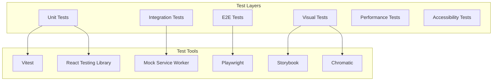

# Pipeline Visual Editor - Testing Strategy

## Overview

This document outlines the comprehensive testing strategy for the Pipeline Visual Editor, covering unit tests, integration tests, end-to-end tests, visual regression tests, and performance testing.

## Testing Architecture



## Test Structure

```
tests/
├── unit/                    # Unit tests
│   ├── components/         # Component tests
│   ├── stores/            # State management tests
│   ├── hooks/             # Custom hook tests
│   ├── utils/             # Utility function tests
│   └── validation/        # Validation logic tests
├── integration/           # Integration tests
│   ├── api/              # API integration tests
│   ├── workflows/        # Workflow tests
│   └── features/         # Feature integration tests
├── e2e/                  # End-to-end tests
│   ├── smoke/           # Critical path tests
│   ├── features/        # Feature scenarios
│   └── regression/      # Regression tests
├── visual/              # Visual regression tests
│   └── snapshots/       # Visual snapshots
├── performance/         # Performance tests
│   ├── benchmarks/      # Performance benchmarks
│   └── load/           # Load testing
├── fixtures/           # Test data and mocks
├── mocks/             # Mock implementations
└── utils/             # Test utilities
```

## Unit Testing

### Component Testing

```typescript
// tests/unit/components/StepNode.test.tsx
import { render, screen, fireEvent } from '@testing-library/react'
import userEvent from '@testing-library/user-event'
import { StepNode } from '@/components/nodes/StepNode'
import { mockStep, mockValidation } from '@/tests/fixtures'

describe('StepNode', () => {
  const defaultProps = {
    data: {
      step: mockStep('claude'),
      validation: mockValidation(),
      executionStatus: undefined
    },
    selected: false,
    dragging: false
  }
  
  it('renders step information correctly', () => {
    render(<StepNode {...defaultProps} />)
    
    expect(screen.getByText(defaultProps.data.step.name)).toBeInTheDocument()
    expect(screen.getByTestId('step-icon-claude')).toBeInTheDocument()
  })
  
  it('shows validation errors when present', () => {
    const propsWithErrors = {
      ...defaultProps,
      data: {
        ...defaultProps.data,
        validation: mockValidation({
          errors: [{ message: 'Invalid configuration' }]
        })
      }
    }
    
    render(<StepNode {...propsWithErrors} />)
    
    expect(screen.getByTestId('error-indicator')).toBeInTheDocument()
    expect(screen.getByText('1 error')).toBeInTheDocument()
  })
  
  it('displays execution status', () => {
    const propsWithStatus = {
      ...defaultProps,
      data: {
        ...defaultProps.data,
        executionStatus: 'running'
      }
    }
    
    render(<StepNode {...propsWithStatus} />)
    
    expect(screen.getByTestId('execution-status-running')).toBeInTheDocument()
    expect(screen.getByTestId('step-node')).toHaveClass('step-node--executing')
  })
  
  it('handles selection state', () => {
    const { rerender } = render(<StepNode {...defaultProps} />)
    
    expect(screen.getByTestId('step-node')).not.toHaveClass('step-node--selected')
    
    rerender(<StepNode {...defaultProps} selected={true} />)
    
    expect(screen.getByTestId('step-node')).toHaveClass('step-node--selected')
  })
  
  it('opens context menu on right click', async () => {
    const user = userEvent.setup()
    render(<StepNode {...defaultProps} />)
    
    await user.pointer({
      keys: '[MouseRight]',
      target: screen.getByTestId('step-node')
    })
    
    expect(screen.getByRole('menu')).toBeInTheDocument()
    expect(screen.getByText('Copy')).toBeInTheDocument()
    expect(screen.getByText('Delete')).toBeInTheDocument()
  })
})
```

### Store Testing

```typescript
// tests/unit/stores/pipelineStore.test.ts
import { renderHook, act } from '@testing-library/react'
import { usePipelineStore } from '@/stores/pipelineStore'
import { mockPipeline, mockStep } from '@/tests/fixtures'

describe('PipelineStore', () => {
  beforeEach(() => {
    // Reset store to initial state
    usePipelineStore.setState(usePipelineStore.getInitialState())
  })
  
  describe('loadPipeline', () => {
    it('loads pipeline from YAML', async () => {
      const yaml = 'workflow:\n  name: test\n  steps: []'
      const { result } = renderHook(() => usePipelineStore())
      
      await act(async () => {
        await result.current.loadPipeline(yaml)
      })
      
      expect(result.current.pipeline.workflow.name).toBe('test')
      expect(result.current.originalYaml).toBe(yaml)
      expect(result.current.isDirty).toBe(false)
    })
    
    it('converts pipeline to graph representation', async () => {
      const pipeline = mockPipeline({
        steps: [
          mockStep('claude', { name: 'step1' }),
          mockStep('gemini', { name: 'step2' })
        ]
      })
      
      const { result } = renderHook(() => usePipelineStore())
      
      await act(async () => {
        await result.current.loadPipeline(yamlStringify(pipeline))
      })
      
      expect(result.current.nodes).toHaveLength(2)
      expect(result.current.nodes[0].data.step.name).toBe('step1')
      expect(result.current.nodes[1].data.step.name).toBe('step2')
    })
  })
  
  describe('addStep', () => {
    it('adds a new step to the pipeline', () => {
      const { result } = renderHook(() => usePipelineStore())
      
      act(() => {
        const nodeId = result.current.addStep('claude', { x: 100, y: 100 })
        expect(nodeId).toBeDefined()
      })
      
      expect(result.current.nodes).toHaveLength(1)
      expect(result.current.pipeline.workflow.steps).toHaveLength(1)
      expect(result.current.isDirty).toBe(true)
    })
    
    it('generates unique step names', () => {
      const { result } = renderHook(() => usePipelineStore())
      
      act(() => {
        result.current.addStep('claude', { x: 0, y: 0 })
        result.current.addStep('claude', { x: 100, y: 0 })
        result.current.addStep('claude', { x: 200, y: 0 })
      })
      
      const stepNames = result.current.pipeline.workflow.steps.map(s => s.name)
      expect(stepNames).toEqual(['claude_step', 'claude_step_2', 'claude_step_3'])
    })
  })
  
  describe('updateStep', () => {
    it('updates step configuration', () => {
      const { result } = renderHook(() => usePipelineStore())
      
      act(() => {
        const nodeId = result.current.addStep('claude', { x: 0, y: 0 })
        result.current.updateStep(nodeId, {
          claude_options: { max_turns: 10 }
        })
      })
      
      const step = result.current.nodes[0].data.step
      expect(step.claude_options?.max_turns).toBe(10)
    })
    
    it('triggers revalidation after update', async () => {
      const { result } = renderHook(() => usePipelineStore())
      const validateSpy = vi.spyOn(result.current, 'validatePipeline')
      
      act(() => {
        const nodeId = result.current.addStep('claude', { x: 0, y: 0 })
        result.current.updateStep(nodeId, { name: 'updated_step' })
      })
      
      expect(validateSpy).toHaveBeenCalled()
    })
  })
  
  describe('connections', () => {
    it('creates valid connections between nodes', () => {
      const { result } = renderHook(() => usePipelineStore())
      
      act(() => {
        const node1 = result.current.addStep('claude', { x: 0, y: 0 })
        const node2 = result.current.addStep('gemini', { x: 200, y: 0 })
        
        result.current.addConnection({
          source: node1,
          target: node2,
          sourceHandle: null,
          targetHandle: null
        })
      })
      
      expect(result.current.edges).toHaveLength(1)
      expect(result.current.edges[0].source).toBeDefined()
      expect(result.current.edges[0].target).toBeDefined()
    })
    
    it('prevents circular dependencies', () => {
      const { result } = renderHook(() => usePipelineStore())
      
      act(() => {
        const node1 = result.current.addStep('claude', { x: 0, y: 0 })
        const node2 = result.current.addStep('gemini', { x: 200, y: 0 })
        
        // Create forward connection
        result.current.addConnection({
          source: node1,
          target: node2,
          sourceHandle: null,
          targetHandle: null
        })
        
        // Try to create backward connection (circular)
        result.current.addConnection({
          source: node2,
          target: node1,
          sourceHandle: null,
          targetHandle: null
        })
      })
      
      // Should only have one edge (circular prevented)
      expect(result.current.edges).toHaveLength(1)
    })
  })
})
```

### Hook Testing

```typescript
// tests/unit/hooks/useValidation.test.ts
import { renderHook } from '@testing-library/react'
import { useValidation } from '@/hooks/useValidation'
import { mockStep } from '@/tests/fixtures'

describe('useValidation', () => {
  it('validates step configuration', () => {
    const step = mockStep('claude', {
      name: 'test_step',
      prompt: []
    })
    
    const { result } = renderHook(() => useValidation(step))
    
    expect(result.current.errors).toContainEqual(
      expect.objectContaining({
        message: 'Prompt cannot be empty'
      })
    )
  })
  
  it('validates step references', () => {
    const step = mockStep('claude', {
      prompt: [{
        type: 'previous_response',
        step: 'non_existent_step'
      }]
    })
    
    const { result } = renderHook(() => 
      useValidation(step, { availableSteps: ['step1', 'step2'] })
    )
    
    expect(result.current.errors).toContainEqual(
      expect.objectContaining({
        message: 'Reference to non-existent step: non_existent_step'
      })
    )
  })
  
  it('memoizes validation results', () => {
    const step = mockStep('claude')
    const { result, rerender } = renderHook(() => useValidation(step))
    
    const firstResult = result.current
    
    // Rerender with same props
    rerender()
    
    expect(result.current).toBe(firstResult) // Same reference
  })
})
```

## Integration Testing

### API Integration Tests

```typescript
// tests/integration/api/pipelineAPI.test.ts
import { setupServer } from 'msw/node'
import { rest } from 'msw'
import { pipelineAPI } from '@/services/api'
import { mockPipelineResponse } from '@/tests/fixtures'

const server = setupServer(
  rest.get('/api/pipelines/:id', (req, res, ctx) => {
    const { id } = req.params
    return res(ctx.json(mockPipelineResponse({ id })))
  }),
  
  rest.post('/api/pipelines', async (req, res, ctx) => {
    const body = await req.json()
    return res(
      ctx.status(201),
      ctx.json({
        id: 'new-pipeline-id',
        version: '1.0.0'
      })
    )
  })
)

beforeAll(() => server.listen())
afterEach(() => server.resetHandlers())
afterAll(() => server.close())

describe('Pipeline API', () => {
  it('fetches pipeline by ID', async () => {
    const pipeline = await pipelineAPI.getPipeline('test-id')
    
    expect(pipeline.id).toBe('test-id')
    expect(pipeline.yaml).toBeDefined()
  })
  
  it('creates new pipeline', async () => {
    const result = await pipelineAPI.createPipeline({
      name: 'New Pipeline',
      yaml: 'workflow:\n  name: new_pipeline',
      category: 'data'
    })
    
    expect(result.id).toBe('new-pipeline-id')
    expect(result.version).toBe('1.0.0')
  })
  
  it('handles API errors', async () => {
    server.use(
      rest.get('/api/pipelines/:id', (req, res, ctx) => {
        return res(
          ctx.status(404),
          ctx.json({
            code: 'NOT_FOUND',
            message: 'Pipeline not found'
          })
        )
      })
    )
    
    await expect(pipelineAPI.getPipeline('missing')).rejects.toThrow('Pipeline not found')
  })
})
```

### Feature Integration Tests

```typescript
// tests/integration/features/pipelineCreation.test.tsx
import { render, screen, waitFor } from '@testing-library/react'
import userEvent from '@testing-library/user-event'
import { App } from '@/App'
import { TestProviders } from '@/tests/utils'

describe('Pipeline Creation Feature', () => {
  it('creates pipeline from drag and drop', async () => {
    const user = userEvent.setup()
    
    render(
      <TestProviders>
        <App />
      </TestProviders>
    )
    
    // Drag Claude step from library
    const claudeStep = screen.getByText('Claude')
    const canvas = screen.getByTestId('graph-canvas')
    
    await user.drag(claudeStep, canvas)
    
    // Verify node created
    await waitFor(() => {
      expect(screen.getByTestId('step-node')).toBeInTheDocument()
    })
    
    // Configure step
    const stepNode = screen.getByTestId('step-node')
    await user.click(stepNode)
    
    // Properties panel should open
    expect(screen.getByText('Claude Properties')).toBeInTheDocument()
    
    // Add prompt
    const promptInput = screen.getByPlaceholderText('Enter prompt...')
    await user.type(promptInput, 'Analyze this code')
    
    // Save pipeline
    await user.keyboard('{Control>}s{/Control}')
    
    // Verify save dialog
    expect(screen.getByText('Save Pipeline')).toBeInTheDocument()
  })
})
```

## End-to-End Testing

### Critical Path Tests

```typescript
// tests/e2e/smoke/criticalPaths.spec.ts
import { test, expect } from '@playwright/test'
import { createPipeline, loginUser } from '../helpers'

test.describe('Critical User Paths', () => {
  test.beforeEach(async ({ page }) => {
    await loginUser(page)
  })
  
  test('create and execute simple pipeline', async ({ page }) => {
    await page.goto('/editor')
    
    // Create new pipeline
    await page.click('[data-testid="new-pipeline-btn"]')
    
    // Add Claude step
    await page.dragAndDrop(
      '[data-testid="step-claude"]',
      '[data-testid="graph-canvas"]'
    )
    
    // Configure step
    await page.click('[data-testid="step-node"]')
    await page.fill('[name="prompt"]', 'Hello, Claude!')
    
    // Save pipeline
    await page.keyboard.press('Control+S')
    await page.fill('[name="pipeline-name"]', 'Test Pipeline')
    await page.click('[data-testid="save-btn"]')
    
    // Execute pipeline
    await page.click('[data-testid="run-pipeline-btn"]')
    
    // Wait for execution to complete
    await expect(page.locator('[data-testid="execution-status"]'))
      .toHaveText('Completed', { timeout: 30000 })
  })
  
  test('import and modify existing pipeline', async ({ page }) => {
    await page.goto('/editor')
    
    // Import pipeline
    await page.click('[data-testid="import-btn"]')
    await page.setInputFiles('input[type="file"]', 'fixtures/sample-pipeline.yaml')
    
    // Verify pipeline loaded
    await expect(page.locator('[data-testid="pipeline-name"]'))
      .toHaveText('Sample Pipeline')
    
    // Modify pipeline
    await page.click('[data-testid="step-node-analyze"]')
    await page.fill('[name="max_turns"]', '10')
    
    // Validate changes
    await page.click('[data-testid="validate-btn"]')
    await expect(page.locator('[data-testid="validation-status"]'))
      .toHaveText('Valid')
  })
})
```

### Visual Testing

```typescript
// tests/e2e/visual/components.spec.ts
import { test, expect } from '@playwright/test'

test.describe('Visual Regression', () => {
  test('graph editor appearance', async ({ page }) => {
    await page.goto('/editor')
    await createPipeline(page, 'complex')
    
    // Wait for graph to stabilize
    await page.waitForTimeout(1000)
    
    // Take screenshot
    await expect(page.locator('[data-testid="graph-canvas"]'))
      .toHaveScreenshot('graph-editor-complex.png')
  })
  
  test('dark mode', async ({ page }) => {
    await page.goto('/editor')
    
    // Switch to dark mode
    await page.click('[data-testid="theme-toggle"]')
    await page.click('[data-testid="theme-dark"]')
    
    await expect(page).toHaveScreenshot('editor-dark-mode.png', {
      fullPage: true
    })
  })
  
  test('responsive layouts', async ({ page }) => {
    const viewports = [
      { width: 1920, height: 1080, name: 'desktop' },
      { width: 1024, height: 768, name: 'tablet' },
      { width: 375, height: 667, name: 'mobile' }
    ]
    
    for (const viewport of viewports) {
      await page.setViewportSize(viewport)
      await page.goto('/editor')
      
      await expect(page).toHaveScreenshot(`editor-${viewport.name}.png`, {
        fullPage: true
      })
    }
  })
})
```

## Performance Testing

### Component Performance

```typescript
// tests/performance/components.bench.ts
import { bench, describe } from 'vitest'
import { render } from '@testing-library/react'
import { GraphCanvas } from '@/components/GraphCanvas'
import { generateLargePipeline } from '@/tests/fixtures'

describe('Component Performance', () => {
  bench('render graph with 100 nodes', () => {
    const pipeline = generateLargePipeline(100)
    render(<GraphCanvas pipeline={pipeline} />)
  })
  
  bench('render graph with 500 nodes', () => {
    const pipeline = generateLargePipeline(500)
    render(<GraphCanvas pipeline={pipeline} />)
  })
  
  bench('update node position', () => {
    const { rerender } = render(<GraphCanvas pipeline={pipeline} />)
    
    // Simulate position update
    const updatedPipeline = {
      ...pipeline,
      nodes: pipeline.nodes.map((n, i) => 
        i === 0 ? { ...n, position: { x: 100, y: 100 } } : n
      )
    }
    
    rerender(<GraphCanvas pipeline={updatedPipeline} />)
  })
})
```

### Load Testing

```typescript
// tests/performance/load.test.ts
import { test } from '@playwright/test'
import { measurePerformance } from '../helpers'

test.describe('Load Testing', () => {
  test('handles large pipelines', async ({ page }) => {
    const metrics = await measurePerformance(page, async () => {
      await page.goto('/editor')
      
      // Load large pipeline
      await page.evaluate(() => {
        window.loadPipeline(generateLargePipeline(1000))
      })
      
      // Wait for render
      await page.waitForSelector('[data-testid="step-node"]')
    })
    
    expect(metrics.renderTime).toBeLessThan(3000) // 3 seconds
    expect(metrics.memoryUsage).toBeLessThan(100 * 1024 * 1024) // 100MB
  })
  
  test('parallel operations performance', async ({ page }) => {
    await page.goto('/editor')
    
    const startTime = Date.now()
    
    // Perform multiple operations in parallel
    await Promise.all([
      page.click('[data-testid="validate-btn"]'),
      page.click('[data-testid="auto-layout-btn"]'),
      page.evaluate(() => window.recalculateMetrics())
    ])
    
    const duration = Date.now() - startTime
    expect(duration).toBeLessThan(1000) // Complete within 1 second
  })
})
```

## Accessibility Testing

```typescript
// tests/accessibility/a11y.test.tsx
import { render } from '@testing-library/react'
import { axe, toHaveNoViolations } from 'jest-axe'
import { App } from '@/App'
import { TestProviders } from '@/tests/utils'

expect.extend(toHaveNoViolations)

describe('Accessibility', () => {
  it('has no accessibility violations', async () => {
    const { container } = render(
      <TestProviders>
        <App />
      </TestProviders>
    )
    
    const results = await axe(container)
    expect(results).toHaveNoViolations()
  })
  
  it('supports keyboard navigation', async () => {
    const { getByTestId } = render(
      <TestProviders>
        <App />
      </TestProviders>
    )
    
    // Tab through interface
    const focusableElements = [
      'new-pipeline-btn',
      'step-library-search',
      'graph-canvas',
      'properties-panel'
    ]
    
    for (const testId of focusableElements) {
      const element = getByTestId(testId)
      element.focus()
      expect(document.activeElement).toBe(element)
    }
  })
  
  it('announces state changes to screen readers', async () => {
    const { getByRole } = render(
      <TestProviders>
        <App />
      </TestProviders>
    )
    
    // Check for ARIA live regions
    expect(getByRole('status')).toBeInTheDocument()
    expect(getByRole('alert')).toBeInTheDocument()
  })
})
```

## Test Utilities

### Mock Factories

```typescript
// tests/fixtures/factories.ts
import { Factory } from 'fishery'
import { faker } from '@faker-js/faker'

export const stepFactory = Factory.define<Step>(({ sequence }) => ({
  name: `step_${sequence}`,
  type: faker.helpers.arrayElement(['claude', 'gemini']),
  prompt: [{
    type: 'static',
    content: faker.lorem.sentence()
  }]
}))

export const pipelineFactory = Factory.define<Pipeline>(() => ({
  workflow: {
    name: faker.system.fileName(),
    description: faker.lorem.sentence(),
    steps: stepFactory.buildList(3)
  }
}))

export const validationErrorFactory = Factory.define<ValidationError>(() => ({
  path: ['workflow', 'steps', faker.number.int({ min: 0, max: 5 })],
  message: faker.lorem.sentence(),
  type: 'error',
  severity: 'error'
}))
```

### Test Providers

```typescript
// tests/utils/TestProviders.tsx
import { QueryClient, QueryClientProvider } from '@tanstack/react-query'
import { ReactFlowProvider } from 'reactflow'

const createTestQueryClient = () => new QueryClient({
  defaultOptions: {
    queries: { retry: false },
    mutations: { retry: false }
  }
})

export const TestProviders: React.FC<{ children: React.ReactNode }> = ({ 
  children 
}) => {
  const queryClient = createTestQueryClient()
  
  return (
    <QueryClientProvider client={queryClient}>
      <ReactFlowProvider>
        {children}
      </ReactFlowProvider>
    </QueryClientProvider>
  )
}
```

### Custom Matchers

```typescript
// tests/utils/matchers.ts
expect.extend({
  toBeValidStep(received: any) {
    const pass = 
      received?.name &&
      received?.type &&
      Array.isArray(received?.prompt)
    
    return {
      pass,
      message: () => 
        pass
          ? `Expected ${received} not to be a valid step`
          : `Expected ${received} to be a valid step`
    }
  },
  
  toHaveConnection(nodes: Node[], edges: Edge[], source: string, target: string) {
    const connection = edges.find(e => 
      e.source === source && e.target === target
    )
    
    return {
      pass: !!connection,
      message: () =>
        connection
          ? `Expected no connection from ${source} to ${target}`
          : `Expected connection from ${source} to ${target}`
    }
  }
})
```

## CI/CD Integration

### GitHub Actions Workflow

```yaml
# .github/workflows/test.yml
name: Tests

on:
  push:
    branches: [main, develop]
  pull_request:
    branches: [main]

jobs:
  unit-tests:
    runs-on: ubuntu-latest
    steps:
      - uses: actions/checkout@v3
      - uses: actions/setup-node@v3
        with:
          node-version: 18
          cache: 'npm'
      
      - name: Install dependencies
        run: npm ci
      
      - name: Run unit tests
        run: npm run test:unit -- --coverage
      
      - name: Upload coverage
        uses: codecov/codecov-action@v3
        with:
          files: ./coverage/lcov.info
  
  integration-tests:
    runs-on: ubuntu-latest
    steps:
      - uses: actions/checkout@v3
      - uses: actions/setup-node@v3
      
      - name: Install dependencies
        run: npm ci
      
      - name: Run integration tests
        run: npm run test:integration
  
  e2e-tests:
    runs-on: ubuntu-latest
    steps:
      - uses: actions/checkout@v3
      - uses: actions/setup-node@v3
      
      - name: Install dependencies
        run: npm ci
      
      - name: Install Playwright
        run: npx playwright install --with-deps
      
      - name: Run E2E tests
        run: npm run test:e2e
      
      - name: Upload test results
        if: always()
        uses: actions/upload-artifact@v3
        with:
          name: playwright-report
          path: playwright-report/
  
  visual-tests:
    runs-on: ubuntu-latest
    steps:
      - uses: actions/checkout@v3
      - uses: actions/setup-node@v3
      
      - name: Install dependencies
        run: npm ci
      
      - name: Run visual tests
        run: npm run test:visual
        env:
          CHROMATIC_PROJECT_TOKEN: ${{ secrets.CHROMATIC_PROJECT_TOKEN }}
```

## Test Scripts

```json
// package.json
{
  "scripts": {
    "test": "vitest",
    "test:unit": "vitest run tests/unit",
    "test:integration": "vitest run tests/integration",
    "test:e2e": "playwright test",
    "test:visual": "chromatic",
    "test:a11y": "vitest run tests/accessibility",
    "test:perf": "vitest bench",
    "test:coverage": "vitest run --coverage",
    "test:watch": "vitest watch"
  }
}
```

## Coverage Requirements

- Unit Tests: 90% coverage
- Integration Tests: 80% coverage
- E2E Tests: Critical paths 100%
- Visual Tests: Key components and states
- Performance Tests: Benchmarks for critical operations

This comprehensive testing strategy ensures the Pipeline Visual Editor is reliable, performant, and accessible.